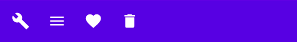
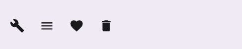

import { Tabs, TabItem } from "@astrojs/starlight/components";

| Material| Material 3| 
| :----------------: | :------: |
|

`BottomAppBar` es una barra inferior que nos proporciona funciones de navegación y acciones. Suele ir dentro de un `Scaffold`.

## Implementación

### Definición del componente

<Tabs>
<TabItem label="Material">

```kotlin frame="terminal"
@Composable
fun BottomAppBar(
    modifier: Modifier = Modifier,
    backgroundColor: Color = MaterialTheme.colors.primarySurface,
    contentColor: Color = contentColorFor(backgroundColor),
    cutoutShape: Shape? = null,
    elevation: Dp = AppBarDefaults.BottomAppBarElevation,
    contentPadding: PaddingValues = AppBarDefaults.ContentPadding,
    content: @Composable RowScope.() -> Unit
)
```

Atributo | Descripción
------ | -----------
modifier | Modificador que implementará el composable (_Opcional_).
backgroundColor | El color del fondo del componente.
contentColor | Color del contenido.
cutoutShape | Recorte que tendrá la `BottomAppBar` si lo combinamos en un [`Scaffold`]() con un [`floatingActionButton`](/buttons/floating-action-button/).
elevation | Permite modificar la elevación del componente.
contentPadding | El padding aplicado al contenido del `BottomAppBar`.
content | Contenido que almacenará la `BottomAppBar`.

</TabItem>

<TabItem label="Material 3">

:::note[Diferentes implementaciones]
`BottomAppBar` en Material 3 dispone de dos implementaciones distintas.
:::

```kotlin frame="terminal"
@Composable
fun BottomAppBar(
    modifier: Modifier = Modifier,
    containerColor: Color = BottomAppBarDefaults.containerColor,
    contentColor: Color = contentColorFor(containerColor),
    tonalElevation: Dp = BottomAppBarDefaults.ContainerElevation,
    contentPadding: PaddingValues = BottomAppBarDefaults.ContentPadding,
    windowInsets: WindowInsets = BottomAppBarDefaults.windowInsets,
    content: @Composable RowScope.() -> Unit
) 
```

Atributo | Descripción
------ | -----------
modifier | Modificador que implementará el composable (_Opcional_).
containerColor | El color del fondo del componente.
contentColor | Color del contenido.
tonalElevation | Añade un color de elevacíon en relación al color del `containerColor`.
contentPadding | El padding aplicado al contenido del `BottomAppBar`.
windowInsets | El espacio que respetará de bordes sobre la pantalla del móvil. Más información en la [documentación oficial](https://developer.android.com/jetpack/compose/layouts/insets?hl=es-419).
content | Contenido que almacenará la `BottomAppBar`.

```kotlin frame="terminal"
@Composable
fun BottomAppBar(
    actions: @Composable RowScope.() -> Unit,
    modifier: Modifier = Modifier,
    floatingActionButton: @Composable (() -> Unit)? = null,
    containerColor: Color = BottomAppBarDefaults.containerColor,
    contentColor: Color = contentColorFor(containerColor),
    tonalElevation: Dp = BottomAppBarDefaults.ContainerElevation,
    contentPadding: PaddingValues = BottomAppBarDefaults.ContentPadding,
    windowInsets: WindowInsets = BottomAppBarDefaults.windowInsets,
)
```

Atributo | Descripción
------ | -----------
actions | Contenido que almacenará la `BottomAppBar`.
modifier | Modificador que implementará el composable (_Opcional_).
floatingActionButton | [`floatingActionButton`](/buttons/floating-action-button/) opcional que aparecerá en la parte final del componente.
containerColor | El color del fondo del componente.
contentColor | Color del contenido.
tonalElevation | Añade un color de elevacíon en relación al color del `containerColor`.
contentPadding | El padding aplicado al contenido del `BottomAppBar`.
windowInsets | El espacio que respetará de bordes sobre la pantalla del móvil. Más información en la [documentación oficial](https://developer.android.com/jetpack/compose/layouts/insets?hl=es-419).
</TabItem>
</Tabs>


:::tip[Fuente]
Puedes acceder a la documentación oficial de Google
[desde aquí](https://developer.android.com/reference/kotlin/androidx/compose/runtime/package-summary).
:::

### Ejemplos

<Tabs>
<TabItem label="Material">

<center></center>

```kotlin frame="terminal"
@Composable
fun BottomAppBarExample() {
    BottomAppBar {
        IconButton(onClick = { print("Build") }) {
            Icon(Icons.Filled.Build, contentDescription = "Build description")
        }
        IconButton(onClick = { print("Menu") }) {
            Icon(
                Icons.Filled.Menu,
                contentDescription = "Menu description",
            )
        }
        IconButton(onClick = { print("Favorite") }) {
            Icon(
                Icons.Filled.Favorite,
                contentDescription = "Favorite description",
            )
        }
        IconButton(onClick = { print("Delete") }) {
            Icon(
                Icons.Filled.Delete,
                contentDescription = "Delete description",
            )
        }
    }

}
```

</TabItem>
<TabItem label="Material 3">

<center></center>
```kotlin frame="terminal"
@Composable
fun BottomAppBarExample() {
    BottomAppBar(actions = {
        IconButton(onClick = { print("Build") }) {
            Icon(Icons.Filled.Build, contentDescription = "Build description")
        }
        IconButton(onClick = { print("Menu") }) {
            Icon(
                Icons.Filled.Menu,
                contentDescription = "Menu description",
            )
        }
        IconButton(onClick = { print("Favorite") }) {
            Icon(
                Icons.Filled.Favorite,
                contentDescription = "Favorite description",
            )
        }
        IconButton(onClick = { print("Delete") }) {
            Icon(
                Icons.Filled.Delete,
                contentDescription = "Delete description",
            )
        }
    })
}
```

</TabItem>
</Tabs>
