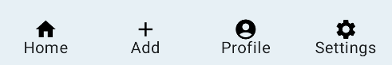

import { Tabs, TabItem } from '@astrojs/starlight/components';

| Material| Material 3| 
| :----------------: | :------: |
|

BottomNavigation permite la navegación entre pantallas principales en una aplicación. 

BottomNavigation debería contener varios `BottomNavigationItem` que reprensentarían cada una de las pantallas principales.

## Implementación

### Definición del componente


<Tabs>
<TabItem label="Material">

:::note[Diferentes implementaciones]
`BottomNavigation` en Material dispone de dos implementaciones distintas.
:::

```kotlin frame="terminal"
@Composable
fun BottomNavigation(
    modifier: Modifier = Modifier,
    backgroundColor: Color = MaterialTheme.colors.primarySurface,
    contentColor: Color = contentColorFor(backgroundColor),
    elevation: Dp = BottomNavigationDefaults.Elevation,
    content: @Composable RowScope.() -> Unit
)
```

Atributo | Descripción
------ | -----------
modifier | Modificador que implementará el composable (_Opcional_).
backgroundColor | El color del fondo del componente.
contentColor | Color del contenido.
elevation | Permite modificar la elevación del componente.
content | Destinos dentro de este BottomNavigation, esto debe contener múltiples `BottomNavigationItem`s.


```kotlin frame="terminal"
@Composable
fun BottomNavigation(
    windowInsets: WindowInsets,
    modifier: Modifier = Modifier,
    backgroundColor: Color = MaterialTheme.colors.primarySurface,
    contentColor: Color = contentColorFor(backgroundColor),
    elevation: Dp = BottomNavigationDefaults.Elevation,
    content: @Composable RowScope.() -> Unit
)
```
Esta segunda opción proporciona la capacidad de especificar `WindowInsets`. Valores recomendados se pueden encontrar en [`BottomNavigationDefaults.windowInsets`](https://developer.android.com/reference/kotlin/androidx/compose/material/BottomNavigationDefaults#windowInsets())

Atributo | Descripción
------ | -----------
windowInsets | Proporciona información sobre la IU del sistema para garantizar que tu app se dibuje en el área correcta. Mas información en la [documentación oficial](https://developer.android.com/jetpack/compose/layouts/insets?hl=es-419).
modifier | Modificador que implementará el composable (_Opcional_).
backgroundColor | El color del fondo del componente.
contentColor | Color del contenido.
elevation | Permite modificar la elevación del componente.
content | Destinos dentro de este BottomNavigation, esto debe contener múltiples `BottomNavigationItem`.

:::tip[Fuente]
Puedes acceder a la documentación oficial de Google
[desde aquí](https://developer.android.com/reference/kotlin/androidx/compose/material/package-summary#BottomNavigation(androidx.compose.ui.Modifier,androidx.compose.ui.graphics.Color,androidx.compose.ui.graphics.Color,androidx.compose.ui.unit.Dp,kotlin.Function1)).
:::

</TabItem>

<TabItem label="Material 3">

:::note[Cambio de nombre]
`BottomNavigation` en Material 3 cambia de nombre a `NavigationBar`.
:::

```kotlin frame="terminal"
@Composable
fun NavigationBar(
    modifier: Modifier = Modifier,
    containerColor: Color = NavigationBarDefaults.containerColor,
    contentColor: Color = MaterialTheme.colorScheme.contentColorFor(containerColor),
    tonalElevation: Dp = NavigationBarDefaults.Elevation,
    windowInsets: WindowInsets = NavigationBarDefaults.windowInsets,
    content: @Composable RowScope.() -> Unit
): Unit
```

Atributo | Descripción
------ | -----------
modifier | Modificador que implementará el composable (_Opcional_).
containerColor | El color del fondo del componente. Usar `Color.Transparent` para quitar el color.
contentColor | Color del contenido.
tonalElevation | Añade un color de elevacíon en relación al color del `containerColor`.
windowInsets | El espacio que respetará de bordes sobre la pantalla del móvil. Más información en la [documentación oficial](https://developer.android.com/jetpack/compose/layouts/insets?hl=es-419).
content | Contenido que almacenará la `NavigationBar`, nomrmalmente 3-5 `NavigationBarItem`.

:::tip[Fuente]
Puedes acceder a la documentación oficial de Google
[desde aquí](https://developer.android.com/reference/kotlin/androidx/compose/material3/package-summary#navigationbar).
:::
</TabItem>
</Tabs>


### Ejemplos

<Tabs>
<TabItem label="Material">

<center></center>

```kotlin frame="terminal"
@Composable
fun BottomNavigationExample() {
    BottomNavigation(){
        BottomNavigationItem(
            selected = true,
            onClick = { /*TODO*/ },
            icon = { Icon( Icons.Filled.Favorite, null) },
            label = { Text(text = "Aris")}
        )
        BottomNavigationItem(
            selected = false,
            onClick = { /*TODO*/ },
            icon = { Icon( Icons.Filled.Favorite, null) },
            label = { Text(text = "Aris")}
        )
        BottomNavigationItem(
            selected = false,
            onClick = { /*TODO*/ },
            icon = { Icon( Icons.Filled.Favorite, null) },
            label = { Text(text = "Aris")}
        )
        BottomNavigationItem(
            selected = true,
            onClick = { /*TODO*/ },
            icon = { Icon( Icons.Filled.Favorite, null) },
            label = { Text(text = "Aris")}
        )
    }
}
```

</TabItem>
<TabItem label="Material 3">

<center></center>
```kotlin frame="terminal"
@Composable
fun NavigationBarExample() {
    NavigationBar( windowInsets = NavigationBarDefaults.windowInsets ){
        BottomNavigationItem(
            selected = true,
            onClick = { /*TODO*/ },
            icon = { Icon( Icons.Filled.Favorite, null) },
            label = { Text(text = "Aris")}
        )
        BottomNavigationItem(
            selected = false,
            onClick = { /*TODO*/ },
            icon = { Icon( Icons.Filled.Favorite, null) },
            label = { Text(text = "Aris")}
        )
        BottomNavigationItem(
            selected = false,
            onClick = { /*TODO*/ },
            icon = { Icon( Icons.Filled.Favorite, null) },
            label = { Text(text = "Aris")}
        )
        BottomNavigationItem(
            selected = true,
            onClick = { /*TODO*/ },
            icon = { Icon( Icons.Filled.Favorite, null) },
            label = { Text(text = "Aris")}
        )
    }
}
```

</TabItem>
</Tabs>
