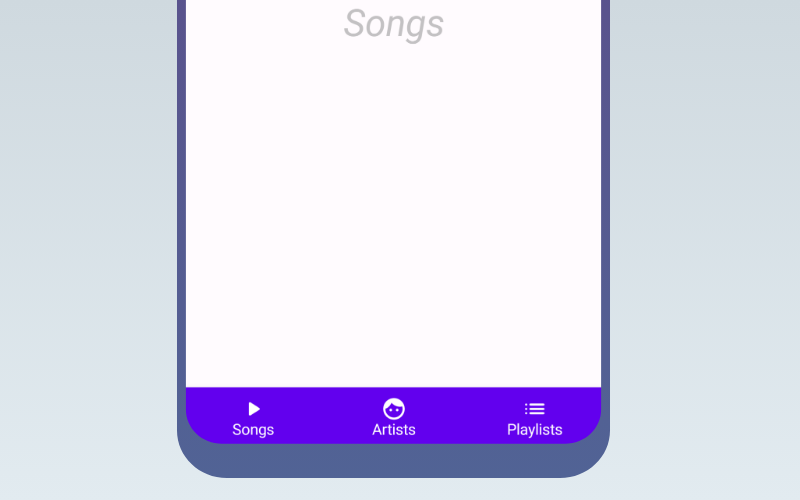

import { Tabs, TabItem } from '@astrojs/starlight/components';

[comment]: <> (La ruta siempre será assets/nombreComponente/componente-header.webp)

| Material Design| Material Design 3| 
| :----------------: | :------: |
|  |  | 

`BottomNavigation`, un componente esencial en Material Design, facilita la navegación entre las áreas principales de una aplicación de manera intuitiva y accesible. Este componente se sitúa estratégicamente en la parte inferior de la pantalla, permitiendo a los usuarios cambiar rápidamente entre diferentes secciones sin interrumpir su flujo de trabajo. En la evolución del diseño de interfaces, `BottomNavigation` se ha mantenido como una opción clásica en las versiones originales de Material Design. Sin embargo, con la introducción de Material Design 3, este componente ha evolucionado hacia `NavigationBar`. `NavigationBar` conserva la funcionalidad principal de `BottomNavigation`, pero se alinea con los principios actualizados de Material Design 3, ofreciendo un diseño más moderno y opciones de personalización ampliadas. 

## Implementación

### Definición del componente

[comment]: <> (Añade un ``TabItem`` por cada tipo de implementación que tenga)

<Tabs>
<TabItem label="Material">

```kotlin frame="terminal"
@Composable
fun BottomNavigation(
    modifier: Modifier = Modifier,
    backgroundColor: Color = MaterialTheme.colors.primarySurface,
    contentColor: Color = contentColorFor(backgroundColor),
    elevation: Dp = BottomNavigationDefaults.Elevation,
    content: @Composable RowScope.() -> Unit
) 
```

Atributo | Descripción
------ | -----------
modifier | Modificador opcional para personalizar el `BottomNavigation`.
backgroundColor | El color de fondo del `BottomNavigation`.
contentColor | El color preferido para el contenido proporcionado por este `BottomNavigation` a sus hijos. Por defecto, es el color de contenido que coincide con `backgroundColor`, o si `backgroundColor` no es un color del tema, este mantendrá el mismo valor establecido sobre este `BottomNavigation`.
elevation | La elevación del `BottomNavigation`. Determina la sombra que se muestra debajo del componente.
content | Los destinos dentro de este `BottomNavigation`. Debería contener múltiples `BottomNavigationItems`.

```kotlin frame="terminal"
@Composable
fun RowScope.BottomNavigationItem(
    selected: Boolean,
    onClick: () -> Unit,
    icon: @Composable () -> Unit,
    modifier: Modifier = Modifier,
    enabled: Boolean = true,
    label: @Composable (() -> Unit)? = null,
    alwaysShowLabel: Boolean = true,
    interactionSource: MutableInteractionSource = remember { MutableInteractionSource() },
    selectedContentColor: Color = LocalContentColor.current,
    unselectedContentColor: Color = selectedContentColor.copy(alpha = ContentAlpha.medium)
)
```
Atributo | Descripción
------ | -----------
selected | Indica si este ítem está seleccionado.
onClick | La función que se invoca cuando este ítem es seleccionado.
icon | Icono para este ítem, normalmente será un `Icon`.
modifier | Modificador opcional para personalizar este ítem.
enabled | Controla el estado activado de este ítem. Si es falso, este ítem no será clickeable y aparecerá desactivado para los servicios de accesibilidad.
label | Etiqueta de texto opcional para este ítem.
alwaysShowLabel | Indica si siempre se debe mostrar la etiqueta de este ítem. Si es falso, la etiqueta solo se mostrará cuando este ítem esté seleccionado.
interactionSource | `MutableInteractionSource` que representa el flujo de Interacciones para este `BottomNavigationItem`. Puedes crear y pasar tu propio `MutableInteractionSource` recordado si deseas observar las Interacciones y personalizar la apariencia / comportamiento de este `BottomNavigationItem` en diferentes Interacciones.
selectedContentColor | El color de la etiqueta de texto y el icono cuando este ítem está seleccionado, así como el color del efecto ripple.
unselectedContentColor | El color de la etiqueta de texto y el icono cuando este ítem no está seleccionado.


[comment]: <> (No modifiques el tip)

:::tip[Fuente]
Puedes acceder a la documentación oficial de Google
[desde aquí](https://developer.android.com/reference/kotlin/androidx/compose/material/package-summary#BottomNavigation(androidx.compose.ui.Modifier,androidx.compose.ui.graphics.Color,androidx.compose.ui.graphics.Color,androidx.compose.ui.unit.Dp,kotlin.Function1))).
:::

</TabItem>
<TabItem label="Material 3">

```kotlin frame="terminal"
@Composable
fun NavigationBar(
    modifier: Modifier = Modifier,
    containerColor: Color = NavigationBarDefaults.containerColor,
    contentColor: Color = MaterialTheme.colorScheme.contentColorFor(containerColor),
    tonalElevation: Dp = NavigationBarDefaults.Elevation,
    windowInsets: WindowInsets = NavigationBarDefaults.windowInsets,
    content: @Composable RowScope.() -> Unit
)
```

Atributo | Descripción
------ | -----------
modifier | El `Modifier` que se aplicará a esta barra de navegación.
containerColor | El color utilizado para el fondo de esta barra de navegación. Usa `Color.Transparent` para no tener color.
contentColor | El color preferido para el contenido dentro de esta barra de navegación. Por defecto, es el color de contenido que coincide con `containerColor`, o si `containerColor` no es un color del tema, será el `LocalContentColor` actual.
tonalElevation | Cuando `containerColor` es `ColorScheme.surface`, se aplica una superposición de color primario translúcido encima del contenedor. Un valor más alto de elevación tonal resultará en un color más oscuro en el tema claro y un color más claro en el tema oscuro. Ver también: `Surface`.
windowInsets | Los insets de ventana de la barra de navegación.
content | El contenido de esta barra de navegación, típicamente 3-5 `NavigationBarItems`.

```kotlin frame="terminal"
@Composable
fun RowScope.NavigationBarItem(
    selected: Boolean,
    onClick: () -> Unit,
    icon: @Composable () -> Unit,
    modifier: Modifier = Modifier,
    enabled: Boolean = true,
    label: @Composable (() -> Unit)? = null,
    alwaysShowLabel: Boolean = true,
    colors: NavigationBarItemColors = NavigationBarItemDefaults.colors(),
    interactionSource: MutableInteractionSource = remember { MutableInteractionSource() }
)
```
Atributo | Descripción
------ | -----------
selected | Indica si este ítem está seleccionado.
onClick | Función que se llama cuando se hace clic en este ítem.
icon | Icono para este ítem, típicamente un `Icon`.
modifier | El `Modifier` que se aplicará a este ítem.
enabled | Controla el estado activo de este ítem. Cuando es falso, este componente no responderá a la entrada del usuario, y aparecerá visualmente desactivado y desactivado para los servicios de accesibilidad.
label | Etiqueta de texto opcional para este ítem.
alwaysShowLabel | Indica si siempre se debe mostrar la etiqueta de este ítem. Si es falso, la etiqueta solo se mostrará cuando este ítem esté seleccionado.
colors | `NavigationBarItemColors` que se utilizará para resolver los colores utilizados para este ítem en diferentes estados. Ver `NavigationBarItemDefaults.colors`.
interactionSource | El `MutableInteractionSource` que representa el flujo de interacciones para este ítem. Puedes crear y pasar tu propia instancia recordada para observar las interacciones y personalizar la apariencia/comportamiento de este ítem en diferentes estados.


[comment]: <> (No modifiques el tip)

:::tip[Fuente]
Puedes acceder a la documentación oficial de Google
[desde aquí](https://developer.android.com/reference/kotlin/androidx/compose/material3/package-summary#navigationbar).
:::

</TabItem>
</Tabs>


### Ejemplos 

<Tabs>
<TabItem label="Material">

<center></center>

```kotlin frame="terminal"

class MainActivity : ComponentActivity() {
    @OptIn(ExperimentalMaterial3Api::class)
    @SuppressLint("UnusedMaterial3ScaffoldPaddingParameter")
    override fun onCreate(savedInstanceState: Bundle?) {
        super.onCreate(savedInstanceState)
        setContent {
            val navController = rememberNavController()
            Scaffold(
                bottomBar = { BottomNavigationSample(navController) }
            ) {
                MainScreen(navController)
            }
        }
    }
}


@Composable
fun BottomNavigationSample(navController: NavController) {
    val items = listOf(ScreenRouter.Songs, ScreenRouter.Artists, ScreenRouter.Playlists)

    BottomNavigation {
        val currentRoute = currentRoute(navController)
        items.forEachIndexed { index, screen ->
            BottomNavigationItem(
                icon = { Icon(screen.icon, contentDescription = screen.route, tint = Color.White) },
                label = { Text(screen.label,color=Color.White) },
                selected = currentRoute == screen.route,
                onClick = {
                    // Aquí manejas el cambio de ruta
                    if (currentRoute != screen.route) {
                        navController.navigate(screen.route) {
                            popUpTo(navController.graph.startDestinationId)
                            launchSingleTop = true
                        }
                    }
                }
            )
        }
    }
}


sealed class ScreenRouter(val route: String,val icon: ImageVector, val label: String) {
    object Songs : ScreenRouter("songs", Icons.Rounded.PlayArrow, "Songs")
    object Artists : ScreenRouter("artists", Icons.Rounded.Face, "Artists")
    object Playlists : ScreenRouter("playlists", Icons.Rounded.List, "Playlists")
}

@Composable
fun MainScreen(navController: NavHostController) {
    NavHost(navController = navController, startDestination = "songs") {
        composable("songs") { SongsScreen() }
        composable("artists") { ArtistsScreen() }
        composable("playlists") { PlaylistsScreen() }
    }
}


@Composable
fun currentRoute(navController: NavController): String? {
    val navBackStackEntry by navController.currentBackStackEntryAsState()
    return navBackStackEntry?.destination?.route
}

@Composable
fun SongsScreen() {
    /* Contenido de la pantalla de songs */
    Box(
        contentAlignment = Alignment.Center,
        modifier = Modifier.fillMaxSize()
    ) {
        Text(
            text = "Songs",
            color = Color.Gray.copy(alpha = 0.5f),
            fontSize = 35.sp,
            fontStyle = FontStyle.Italic
        )
    }
}

@Composable
fun ArtistsScreen() {
    /* Contenido de la pantalla de artistas */
    Box(
        contentAlignment = Alignment.Center,
        modifier = Modifier.fillMaxSize()
    ) {
        Text(
            text = "Artists",
            color = Color.Gray.copy(alpha = 0.5f),
            fontSize = 35.sp,
            fontStyle = FontStyle.Italic
        )
    }
}

@Composable
fun PlaylistsScreen() {
    /* Contenido de la pantalla de playlists */
    Box(
        contentAlignment = Alignment.Center,
        modifier = Modifier.fillMaxSize()
    ) {
        Text(
            text = "Playlists",
            color = Color.Gray.copy(alpha = 0.5f),
            fontSize = 35.sp,
            fontStyle = FontStyle.Italic
        )
    }
}

```

</TabItem>
<TabItem label="Material 3">

<center></center>

```kotlin frame="terminal"
class MainActivity : ComponentActivity() {
    @OptIn(ExperimentalMaterial3Api::class)
    @SuppressLint("UnusedMaterial3ScaffoldPaddingParameter")
    override fun onCreate(savedInstanceState: Bundle?) {
        super.onCreate(savedInstanceState)
        setContent {
            val navController = rememberNavController()
            Scaffold(
                bottomBar = { NavigationBarSample(navController) }
            ) {
                MainScreen(navController)
            }
        }
    }
}

@Composable
fun NavigationBarSample(navController: NavController) {
    val items = listOf(ScreenRouter.Songs, ScreenRouter.Artists, ScreenRouter.Playlists)
    NavigationBar {
        val currentRoute = currentRoute(navController)
        items.forEachIndexed { index, screen ->
            NavigationBarItem(
                icon = { Icon(screen.icon, contentDescription = screen.route) },
                label = { Text(screen.label) },
                selected = currentRoute == screen.route,
                onClick = {
                    // Aquí manejas el cambio de ruta
                    if (currentRoute != screen.route) {
                        navController.navigate(screen.route) {
                            popUpTo(navController.graph.startDestinationId)
                            launchSingleTop = true
                        }
                    }
                }
            )
        }
    }
}


sealed class ScreenRouter(val route: String,val icon: ImageVector, val label: String) {
    object Songs : ScreenRouter("songs", Icons.Rounded.PlayArrow, "Songs")
    object Artists : ScreenRouter("artists", Icons.Rounded.Face, "Artists")
    object Playlists : ScreenRouter("playlists", Icons.Rounded.List, "Playlists")
}

@Composable
fun MainScreen(navController: NavHostController) {
    NavHost(navController = navController, startDestination = "songs") {
        composable("songs") { SongsScreen() }
        composable("artists") { ArtistsScreen() }
        composable("playlists") { PlaylistsScreen() }
    }
}


@Composable
fun currentRoute(navController: NavController): String? {
    val navBackStackEntry by navController.currentBackStackEntryAsState()
    return navBackStackEntry?.destination?.route
}

@Composable
fun SongsScreen() {
    /* Contenido de la pantalla de songs */
    Box(
        contentAlignment = Alignment.Center,
        modifier = Modifier.fillMaxSize()
    ) {
        Text(
            text = "Songs",
            color = Color.Gray.copy(alpha = 0.5f),
            fontSize = 35.sp,
            fontStyle = FontStyle.Italic
        )
    }
}

@Composable
fun ArtistsScreen() {
    /* Contenido de la pantalla de artistas */
    Box(
        contentAlignment = Alignment.Center,
        modifier = Modifier.fillMaxSize()
    ) {
        Text(
            text = "Artists",
            color = Color.Gray.copy(alpha = 0.5f),
            fontSize = 35.sp,
            fontStyle = FontStyle.Italic
        )
    }
}

@Composable
fun PlaylistsScreen() {
    /* Contenido de la pantalla de playlists */
    Box(
        contentAlignment = Alignment.Center,
        modifier = Modifier.fillMaxSize()
    ) {
        Text(
            text = "Playlists",
            color = Color.Gray.copy(alpha = 0.5f),
            fontSize = 35.sp,
            fontStyle = FontStyle.Italic
        )
    }
}
```

</TabItem>
</Tabs>