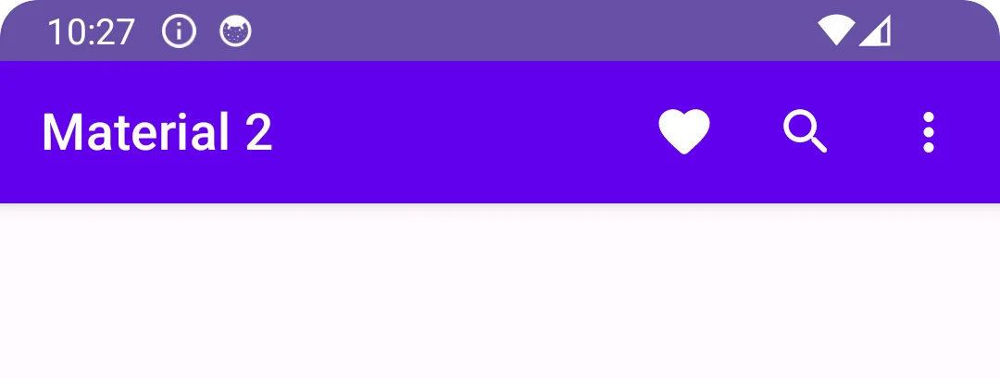
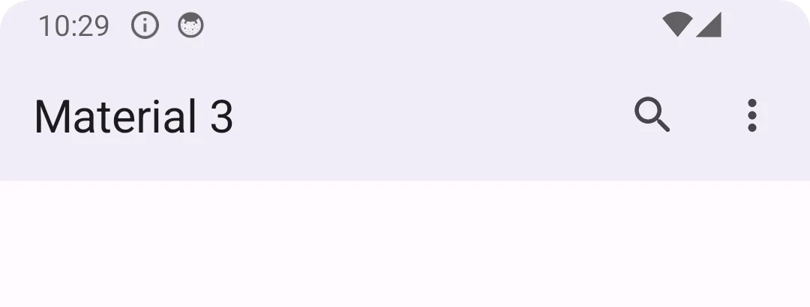
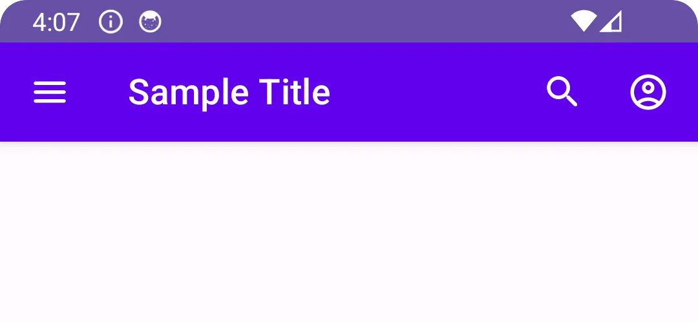
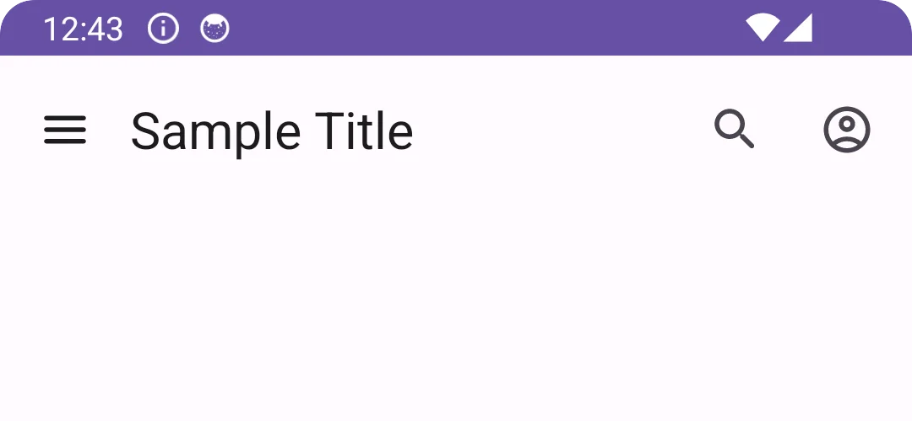

import { Tabs, TabItem } from '@astrojs/starlight/components';

[comment]: <> (La ruta siempre será assets/nombeComponente/componente-header.webp)

| Material| Material 3| 
| :----------------: | :------: |
|


La `TopAppBar` muestra información y acciones relacionadas con la pantalla actual.

Tiene ranuras para un título, un icono de navegación y acciones. La ranura del título esta insertada desde el principio por defecto.

## Implementación

### Definición del componente

[comment]: <> (Añade un ``TabItem`` por cada tipo de implementación que tenga)

<Tabs>
<TabItem label="Material">

```kotlin frame="terminal"
@Composable
fun TopAppBar(
    title: @Composable () -> Unit,
    modifier: Modifier = Modifier,
    navigationIcon: @Composable (() -> Unit)? = null,
    actions: @Composable RowScope.() -> Unit = {},
    backgroundColor: Color = MaterialTheme.colors.primarySurface,
    contentColor: Color = contentColorFor(backgroundColor),
    elevation: Dp = AppBarDefaults.TopAppBarElevation
)
```
Atributo | Descripción
-----|-----
title | El título que se mostrará en la `TopAppBar`.
modifier | El modificador permite personalizar el composable.
navigationIcon | El icono que se muestra al principio, normalmente debería ser un `IconButton` o un `IconToggleButton`.
actions | Las acciones mostradas al final, suelen ser `IconButton`. Por defecto es un `RowScope`, por lo que los iconos dentro se colocarán horizontalmente.
backgroundColor | El color de fondo.
contentColor | El color del contenido.
elevation | Elevación del componente.

</TabItem>
<TabItem label="Material 3">

```kotlin frame="terminal"
@Composable
fun TopAppBar(
    title: @Composable () -> Unit,
    modifier: Modifier = Modifier,
    navigationIcon: @Composable () -> Unit = {},
    actions: @Composable RowScope.() -> Unit = {},
    windowInsets: WindowInsets = TopAppBarDefaults.windowInsets,
    colors: TopAppBarColors = TopAppBarDefaults.topAppBarColors(),
    scrollBehavior: TopAppBarScrollBehavior? = null
)
```

Atributo | Descripción
-----|-----
title | El título que se mostrará en el composable.
modifier | El modificador permite personalizar el composable.
navigationIconss | El icono de navegación que se muestra al principio. usualmente debería ser un `IconButton` o un `IconToggleButton`.
actions | Las acciones mostradas al final del composable, El diseño por defecto es un `RowScope`, por lo que los iconos dentro se colocarán horizontalmente.
windowInsets | Espacios reservados para la interfaz que la `TopAppBar` respetará.
colors | Se utiliza para resolver los colores utilizados para este composable en diferentes estados. Ver `TopAppBarDefaults.topAppBarColors`.
scrollBehavior | Estados de desplazamiento que serán aplicados por la `TopAppBar`. Está diseñado para funcionar junto con un contenido desplazado para cambiar el aspecto de la `TopAppBar` a medida que se desplaza el contenido. Véase `TopAppBarScrollBehavior.nestedScrollConnection`.

</TabItem>
</Tabs>

[comment]: <> (No modifiques el tip)

:::tip[Fuente]
Puedes acceder a la documentación oficial de Google
[desde aquí](https://developer.android.com/reference/kotlin/androidx/compose/runtime/package-summary).
:::

### Ejemplos

<Tabs>
<TabItem label="Material">



```kotlin frame="terminal"
import androidx.compose.material.ContentAlpha
import androidx.compose.material.Icon
import androidx.compose.material.IconButton
import androidx.compose.material.LocalContentAlpha
import androidx.compose.material.Text
import androidx.compose.material.TopAppBar
import androidx.compose.material.icons.Icons
import androidx.compose.material.icons.outlined.AccountCircle
import androidx.compose.material.icons.rounded.Menu
import androidx.compose.material.icons.rounded.Search
import androidx.compose.runtime.Composable
import androidx.compose.runtime.CompositionLocalProvider

@Composable
fun TopAppBarSample() {
    TopAppBar(
        navigationIcon = {
            IconButton(onClick = { /*TODO*/ }) {
                Icon(imageVector = Icons.Rounded.Menu, contentDescription = null)
            }
        },
        title = { Text(text = "Sample Title") },
        actions = {
            CompositionLocalProvider(LocalContentAlpha provides ContentAlpha.high) {
                IconButton(onClick = { /*TODO*/ }) {
                    Icon(
                        imageVector = Icons.Rounded.Search,
                        contentDescription = null
                    )
                }
                IconButton(onClick = { /*TODO*/ }) {
                    Icon(
                        imageVector = Icons.Outlined.AccountCircle,
                        contentDescription = null
                    )
                }
            }
        })
}
```

</TabItem>
<TabItem label="Material 3">



```kotlin frame="terminal"
import androidx.compose.material.icons.Icons
import androidx.compose.material.icons.outlined.AccountCircle
import androidx.compose.material.icons.rounded.Menu
import androidx.compose.material.icons.rounded.Search
import androidx.compose.material3.ExperimentalMaterial3Api
import androidx.compose.material3.Icon
import androidx.compose.material3.IconButton
import androidx.compose.material3.Text
import androidx.compose.material3.TopAppBar
import androidx.compose.runtime.Composable

@OptIn(ExperimentalMaterial3Api::class)
@Composable
fun TopAppBarSample() {
    TopAppBar(
        navigationIcon = {
            IconButton(onClick = { /*TODO*/ }) {
                Icon(imageVector = Icons.Rounded.Menu, contentDescription = null)
            }
        },
        title = { Text(text = "Sample Title") },
        actions = {
            IconButton(onClick = { /*TODO*/ }) {
                Icon(
                    imageVector = Icons.Rounded.Search,
                    contentDescription = null
                )
            }
            IconButton(onClick = { /*TODO*/ }) {
                Icon(
                    imageVector = Icons.Outlined.AccountCircle,
                    contentDescription = null
                )
            }
        }
    )
}
```

</TabItem>
</Tabs>