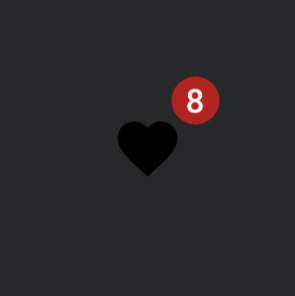

import { Tabs, TabItem } from "@astrojs/starlight/components";

| Material| Material 3| 
| :----------------: | :------: |
|

`BadgedBox` es el componente que nos permitirá gestionar de una forma sencilla la clásica vista de notificaciones. Su implementación es muy fácil y personalizable por lo que podemos usarlo tanto para avisar al usuario de alguna novedad o como por ejemplo para mostrar el clásico carrito de compra con el número de productos.

## Implementación

### Definición del componente

<Tabs>
<TabItem label="Material">

```kotlin frame="terminal"
@Composable
fun BadgeBox(
    modifier: Modifier = Modifier,
    backgroundColor: Color = MaterialTheme.colors.error,
    contentColor: Color = contentColorFor(backgroundColor),
    badgeContent: @Composable (RowScope.() -> Unit)? = null,
    content: @Composable BoxScope.() -> Unit,
)
```

Atributo | Descripción
------ | -----------
modifier | Modificador que implementará el composable (_Opcional_).
backgroundColor | El color del fondo del componente.
contentColor | Color del contenido. 
badgeContent | El contenido a mostrar en el `badge`.
content | Contenido que tendrá el badge en la parte superior.

</TabItem>

<TabItem label="Material 3">

```kotlin frame="terminal"
@ExperimentalMaterial3Api
@Composable
fun BadgedBox(
    badge: @Composable BoxScope.() -> Unit,
    modifier: Modifier = Modifier,
    content: @Composable BoxScope.() -> Unit,
)
```

- **badge**: El badged a mostrar - normalmente se usa un componente [Badge](/badges/badge/).
- **modifier**: Modificador que implementará el composable (_Opcional_).
- **content**: Contenido que tendrá el badge en la parte superior.

</TabItem>
</Tabs>


:::tip[Fuente]
Puedes acceder a la documentación oficial de Google
[desde aquí](https://developer.android.com/reference/kotlin/androidx/compose/runtime/package-summary).
:::

### Ejemplos

<Tabs>
<TabItem label="Material">

<center></center>

```kotlin frame="terminal"
@OptIn(ExperimentalMaterialApi::class)
@Composable
fun BadgedBoxExample() {
    Box(Modifier.size(100.dp), contentAlignment = Alignment.Center) {
        BadgeBox(content = {
            Icon(
                Icons.Filled.Favorite, contentDescription = "Favorite"
            )
        }, badgeContent = {
            Text("8")
        })
    }
}
```

</TabItem>
<TabItem label="Material 3">

<center></center>

```kotlin frame="terminal"
@OptIn(ExperimentalMaterial3Api::class)
@Composable
fun BadgedBoxExample() {
    Box(Modifier.size(100.dp), contentAlignment = Alignment.Center) {
        BadgedBox(badge = { Badge { Text("8") } }) {
            Icon(
                Icons.Filled.Favorite,
                contentDescription = "Favorite"
            )
        }
    }
}
```

</TabItem>
</Tabs>