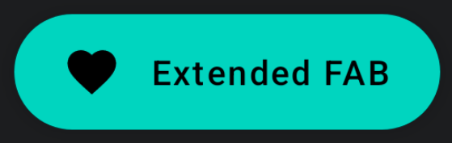
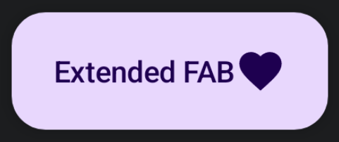

import { Tabs, TabItem } from '@astrojs/starlight/components';

[comment]: <> (La ruta siempre será assets/nombeComponente/componente-header.webp)

| Material| Material 3| 
| :----------------: | :------: |
|               |  | 

Los `ExtendedFloatingActionButton` representan la acción más importante de la pantalla. Como norma general están situados en la parte inferior derecha. A diferencia de los otros [FloatingActionButtons](/buttons/floating-action-button/) este componente está destinado a tener un texto además de un icono.

## Implementación

### Definición del componente

[comment]: <> (Añade un ``TabItem`` por cada tipo de implementación que tenga)

<Tabs>
<TabItem label="Material">

```kotlin frame="terminal"
@Composable
fun ExtendedFloatingActionButton(
    text: @Composable () -> Unit,
    onClick: () -> Unit,
    modifier: Modifier = Modifier,
    icon: @Composable (() -> Unit)? = null,
    interactionSource: MutableInteractionSource = remember { MutableInteractionSource() },
    shape: Shape = MaterialTheme.shapes.small.copy(CornerSize(percent = 50)),
    backgroundColor: Color = MaterialTheme.colors.secondary,
    contentColor: Color = contentColorFor(backgroundColor),
    elevation: FloatingActionButtonElevation = FloatingActionButtonDefaults.elevation()
)
```
Atributo | Descripción
------ | -----------
text | Composable que mostrará al lado izquierdo del botón (En teoría debería ser un [Text](/texts/text/) pero vale cualquiera).
onClick | Función lambda que se ejecutará cuando el usuario pulse el botón.
modifier | Modificador que implementará el composable.
icon | Composable que mostrará al lado derecho del botón (En teoría debería ser un [Icon](/images/icon/) pero vale cualquiera).
interactionSource | Representa un `stream` de interacciones del botón lo que nos permite modificar su diseño o comportamiento. Por ejemplo que mientras el botón esté pulsado, este encoja.
shape | Define la forma del `FloatingActionButton` y su sombra.
backgroundColor | El color del fondo del componente.
contentColor | Color del contenido.
elevation | Permite modificar la elevación del componente en sus distintos estados con el objeto `FloatingActionButtonElevation`.

</TabItem>
<TabItem label="Material 3">

```kotlin frame="terminal"
@Composable
fun ExtendedFloatingActionButton(
    onClick: () -> Unit,
    modifier: Modifier = Modifier,
    shape: Shape = FloatingActionButtonDefaults.extendedFabShape,
    containerColor: Color = FloatingActionButtonDefaults.containerColor,
    contentColor: Color = contentColorFor(containerColor),
    elevation: FloatingActionButtonElevation = FloatingActionButtonDefaults.elevation(),
    interactionSource: MutableInteractionSource = remember { MutableInteractionSource() },
    content: @Composable RowScope.() -> Unit,
) 
```

Atributo | Descripción
------ | -----------
onClick | Función lambda que se ejecutará cuando el usuario pulse el botón.
modifier | Modificador que implementará el composable.
shape | Define la forma del `FloatingActionButton` y su sombra.
containerColor | El color del fondo del componente.
contentColor | Color del contenido.
elevation | Permite modificar la elevación del componente en sus distintos estados con el objeto `FloatingActionButtonElevation`.
interactionSource | Representa un `stream` de interacciones del botón lo que nos permite modificar su diseño o comportamiento. Por ejemplo que mientras el botón esté pulsado, este encoja.
content | Contenido a mostrar dentro del `ExtendedFloatingActionButton`. El contenido tiene un `RowScope` lo que significa que todo lo que añadas aquí estará en una fila, por eso es muy importante el orden.

</TabItem>
</Tabs>

[comment]: <> (No modifiques el tip)

:::tip[Fuente]
Puedes acceder a la documentación oficial de Google
[desde aquí](https://developer.android.com/reference/kotlin/androidx/compose/runtime/package-summary).
:::

### Ejemplos 

<Tabs>
<TabItem label="Material">

<center></center>

```kotlin frame="terminal"
@Composable
fun ExtendedFloatingActionButtonExample() {
    ExtendedFloatingActionButton(onClick = { print("Hello") },
        text = { Text(text = "Extended FAB") },
        icon = { Icon(Icons.Filled.Favorite, "Floating action button.") })
}
```

</TabItem>
<TabItem label="Material 3">

<center></center>

```kotlin frame="terminal"
@Composable
fun ExtendedFloatingActionButtonExample() {
    ExtendedFloatingActionButton(onClick = { print("Hello") }) {
        Text(text ="Extended FAB")
        Icon(Icons.Filled.Favorite, "Floating action button.")
    }
}
```

</TabItem>
</Tabs>