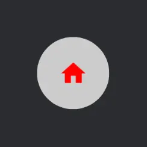

import { Tabs, TabItem } from '@astrojs/starlight/components';

[comment]: <> (La ruta siempre será assets/nombeComponente/componente-header.webp)

Material | Material3
------ | -----------
![Imagen del componente [IconButton]](../../../assets/buttons/iconbutton/iconbutton-m-default.webp)|![Imagen del componente [IconButton]](../../../assets/buttons/iconbutton/iconbutton-m3-default.webp)|

El componente `IconButton` permite que un ícono actúe como un `Button`, ejecuta una acción cuando el usuario hace click en este componente. Es usado cuando se requiere un botón compacto, como en `TopAppBar`.

## Implementación

### Definición del componente

[comment]: <> (Añade un ``TabItem`` por cada tipo de implementación que tenga)

<Tabs>
<TabItem label="Material">

```kotlin frame="terminal"
@Composable
fun IconButton(
    onClick: () -> Unit,
    modifier: Modifier = Modifier,
    enabled: Boolean = true,
    interactionSource: MutableInteractionSource = remember { MutableInteractionSource() },
    content: @Composable () -> Unit
)
```

Atributo | Descripción
------ | -----------
onClick | Función lambda que es llamada cuando el botón es presionado.
modifier | Modificador que implementará el composable (_Opcional_).
enabled | Controla el estado del componente. Sí el valor es falso, entonces el componente no responderá a la acción de click, también se mostrará como deshabilitado visualmente.
interactionSource | Representa una serie de interacciones para este componente. Se puede crear un objeto personalizado a través de `remember { MutableInteractionSource() }`.
content | Contenido que almacenará el `IconButton`, comúnmente es un `Icon`.

</TabItem>
<TabItem label="Material 3">

```kotlin frame="terminal"
@Composable
fun IconButton(
    onClick: () -> Unit,
    modifier: Modifier = Modifier,
    enabled: Boolean = true,
    colors: IconButtonColors = IconButtonDefaults.iconButtonColors(),
    interactionSource: MutableInteractionSource = remember { MutableInteractionSource() },
    content: @Composable () -> Unit
)
```

Atributo | Descripción
------ | -----------
onClick | Función lambda que es llamada cuando el botón es presionado.
modifier | Modificador que implementará el composable (_Opcional_).
enabled | Controla el estado del componente. Sí el valor es falso, entonces el componente no responderá a la acción de click, también se mostrará como deshabilitado visualmente.
colors | Contiene información sobre el color del `IconButton` a través de diferentes estados. Por defecto usa `IconButtonDefaults.iconButtonColors()`.
interactionSource | Representa una serie de interacciones para este componente. Se puede crear un objeto personalizado a través de `remember { MutableInteractionSource() }`.
content | Contenido que almacenará el `IconButton`, comúnmente es un `Icon`.

</TabItem>
</Tabs>

[comment]: <> (No modifiques el tip)

:::tip[Fuente]
Puedes acceder a la documentación oficial de Google
[desde aquí](https://developer.android.com/reference/kotlin/androidx/compose/runtime/package-summary).
:::

### Ejemplos

<Tabs>
<TabItem label="Material">

<center>

</center>

```kotlin frame="terminal"
import androidx.compose.material.icons.Icons
import androidx.compose.material.icons.filled.Settings

@Composable
fun MyIconButton() {
    IconButton(
        onClick = { /*TODO*/ },
        modifier = Modifier.size(60.dp),
    ){
        Icon(imageVector = Icons.Filled.Settings, contentDescription = "Settings")
    }
}
```

</TabItem>
<TabItem label="Material 3">

<center>

</center>

```kotlin frame="terminal"
import androidx.compose.material.icons.Icons
import androidx.compose.material.icons.filled.Home
import androidx.compose.material3.Icon
import androidx.compose.material3.IconButton
import androidx.compose.material3.IconButtonDefaults

@Composable
fun MyIconButton() {
    IconButton(
        onClick = { /*TODO*/ },
        modifier = Modifier.size(70.dp),
        colors = IconButtonDefaults.iconButtonColors(
            containerColor = Color.LightGray,
            contentColor = Color.Red
        )
    ) {
        Icon(imageVector = Icons.Filled.Home, contentDescription = "Home")
    }
}
```

</TabItem>
</Tabs>