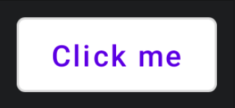
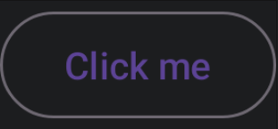

import { Tabs, TabItem } from '@astrojs/starlight/components';

[comment]: <> (La ruta siempre será assets/nombeComponente/componente-header.webp)

| Material| Material 3| 
| :----------------: | :------: |
|               |  | 

Los `OutlinedButton` son [botones](/buttons/button/) con un diseño menos llamativo ya que están diseñados para acciones importantes pero que no son TAN importantes como la acción primaria.

## Implementación

### Definición del componente

[comment]: <> (Añade un ``TabItem`` por cada tipo de implementación que tenga)

<Tabs>
<TabItem label="Material">

```kotlin frame="terminal"
@Composable
fun OutlinedButton(
    onClick: () -> Unit,
    modifier: Modifier = Modifier,
    enabled: Boolean = true,
    interactionSource: MutableInteractionSource = remember { MutableInteractionSource() },
    elevation: ButtonElevation? = null,
    shape: Shape = MaterialTheme.shapes.small,
    border: BorderStroke? = ButtonDefaults.outlinedBorder,
    colors: ButtonColors = ButtonDefaults.outlinedButtonColors(),
    contentPadding: PaddingValues = ButtonDefaults.ContentPadding,
    content: @Composable RowScope.() -> Unit
)
```
Atributo | Descripción
------ | -----------
onClick | Función lambda que se ejecutará cuando el usuario pulse el botón.
modifier | Modificador que implementará el composable.
enabled | Habilita o deshabilita el botón.
interactionSource | Representa un `stream` de interacciones del botón lo que nos permite modificar su diseño o comportamiento. Por ejemplo que mientras el botón esté pulsado, este encoja.
elevation | Permite modificar la elevación del componente en sus distintos estados con el objeto `ButtonElevation`.
shape | Define la forma del `Button` y su sombra.
border | Borde para el `Button`.
colors | Nos permite modificar el color del fondo del `Button` y el del contenido.
contentPadding | The spacing values to apply internally between the container and the content
content | Contenido a mostrar dentro del `Button`.

</TabItem>
<TabItem label="Material 3">

```kotlin frame="terminal"
@Composable
fun OutlinedButton(
    onClick: () -> Unit,
    modifier: Modifier = Modifier,
    enabled: Boolean = true,
    shape: Shape = ButtonDefaults.outlinedShape,
    colors: ButtonColors = ButtonDefaults.outlinedButtonColors(),
    elevation: ButtonElevation? = null,
    border: BorderStroke? = ButtonDefaults.outlinedButtonBorder,
    contentPadding: PaddingValues = ButtonDefaults.ContentPadding,
    interactionSource: MutableInteractionSource = remember { MutableInteractionSource() },
    content: @Composable RowScope.() -> Unit
)
```

Atributo | Descripción
------ | -----------
onClick | Función lambda que se ejecutará cuando el usuario pulse el botón.
modifier | Modificador que implementará el composable.
enabled | Habilita o deshabilita el botón.
shape | Define la forma del `Button` y su sombra.
colors | Nos permite modificar el color del fondo del `Button` y el del contenido.
elevation | Permite modificar la elevación del componente en sus distintos estados con el objeto `ButtonElevation`.
border | Borde para el `Button`.
contentPadding | The spacing values to apply internally between the container and the content
interactionSource | Representa un `stream` de interacciones del botón lo que nos permite modificar su diseño o comportamiento. Por ejemplo que mientras el botón esté pulsado, este encoja.
content | Contenido a mostrar dentro del `Button`.

</TabItem>
</Tabs>

[comment]: <> (No modifiques el tip)

:::tip[Fuente]
Puedes acceder a la documentación oficial de Google
[desde aquí](https://developer.android.com/reference/kotlin/androidx/compose/runtime/package-summary).
:::

### Ejemplos 

<Tabs>
<TabItem label="Material">

<center></center>

```kotlin frame="terminal"
@Composable
fun OutlinedButtonExample() {
    OutlinedButton(onClick = { print("Hello") }) {
        Text(text = "Click me")
    }
}
```

</TabItem>
<TabItem label="Material 3">

<center></center>

```kotlin frame="terminal"
@Composable
fun OutlinedButtonExample() {
    OutlinedButton(onClick = { print("Hello") }) {
        Text(text = "Click me")
    }
}
```

</TabItem>
</Tabs>