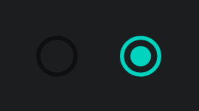
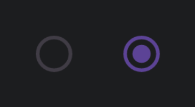
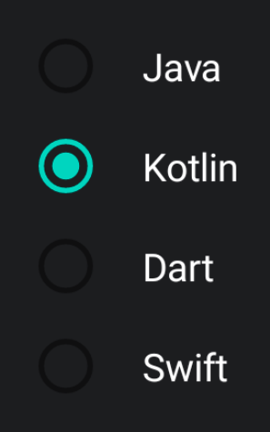
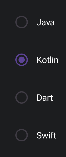

import { Tabs, TabItem } from '@astrojs/starlight/components';

[comment]: <> (La ruta siempre será assets/nombeComponente/componente-header.webp)

| Material| Material 3| 
| :----------------: | :------: |
|               |  | 

Los `RadioButton` se utilizan para mostrar un listado de opciones donde SOLO debería poder seleccionarse uno.

## Implementación

### Definición del componente

[comment]: <> (Añade un ``TabItem`` por cada tipo de implementación que tenga)

<Tabs>
<TabItem label="Material">

```kotlin frame="terminal"
@Composable
fun RadioButton(
    selected: Boolean,
    onClick: (() -> Unit)?,
    modifier: Modifier = Modifier,
    enabled: Boolean = true,
    interactionSource: MutableInteractionSource = remember { MutableInteractionSource() },
    colors: RadioButtonColors = RadioButtonDefaults.colors()
) 
```
Atributo | Descripción
------ | -----------
selected | Determina el estado del botón, si está seleccionado o no.
onClick | Función lambda que se ejecutará cuando el usuario pulse el botón.
modifier | Modificador que implementará el composable.
enabled | Permite habilitar o deshabilitar (que no se pueda pulsar) el botón.
interactionSource | Representa un `stream` de interacciones del botón lo que nos permite modificar su diseño o comportamiento. Por ejemplo que mientras el botón esté pulsado, este encoja.
colors | Objeto `RadioButtonColors` que determina los colores para todos los distintos estados del componente.

</TabItem>
<TabItem label="Material 3">

```kotlin frame="terminal"
@Composable
fun RadioButton(
    selected: Boolean,
    onClick: (() -> Unit)?,
    modifier: Modifier = Modifier,
    enabled: Boolean = true,
    colors: RadioButtonColors = RadioButtonDefaults.colors(),
    interactionSource: MutableInteractionSource = remember { MutableInteractionSource() }
)
```

Atributo | Descripción
------ | -----------
selected | Determina el estado del botón, si está seleccionado o no.
onClick | Función lambda que se ejecutará cuando el usuario pulse el botón.
modifier | Modificador que implementará el composable.
enabled | Permite habilitar o deshabilitar (que no se pueda pulsar) el botón.
colors | Objeto `RadioButtonColors` que determina los colores para todos los distintos estados del componente.
interactionSource | Representa un `stream` de interacciones del botón lo que nos permite modificar su diseño o comportamiento. Por ejemplo que mientras el botón esté pulsado, este encoja.

</TabItem>
</Tabs>

[comment]: <> (No modifiques el tip)

:::tip[Fuente]
Puedes acceder a la documentación oficial de Google
[desde aquí](https://developer.android.com/reference/kotlin/androidx/compose/runtime/package-summary).
:::

### Ejemplos 

<Tabs>
<TabItem label="Material">

<center></center>

```kotlin frame="terminal"
@Composable
fun FloatingActionButtonExample() {
    FloatingActionButton(onClick = { print("Hello") }) {
        Icon(Icons.Filled.Favorite, "Floating action button.")
    }
}
```

<center></center>

```kotlin frame="terminal"
enum class ProgrammingLanguage {
    Java,
    Kotlin,
    Dart,
    Swift
}

@Preview
@Composable
fun RadioButtonListExample() {
    val programmingLanguageList = listOf(Java, Kotlin, Dart, Swift)
    var selectedLanguage by remember { mutableStateOf(Kotlin) }
    Column(Modifier.padding(6.dp)) {
        programmingLanguageList.forEach { language ->
            Row(Modifier.padding(6.dp), verticalAlignment = Alignment.CenterVertically) {
                RadioButton(
                    selected = selectedLanguage == language,
                    onClick = { selectedLanguage = language }
                )
                Text(text = language.name, color = Color.White, modifier = Modifier.padding(start = 16.dp))
            }
        }
    }
}
```

</TabItem>
<TabItem label="Material 3">

<center></center>

```kotlin frame="terminal"
@Composable
fun FloatingActionButtonExample() {
    FloatingActionButton(onClick = { print("Hello") }) {
        Icon(Icons.Filled.Favorite, "Floating action button.")
    }
}
```

<center></center>

```kotlin frame="terminal"
enum class ProgrammingLanguage {
    Java,
    Kotlin,
    Dart,
    Swift
}

@Composable
fun RadioButtonListExample() {
    val programmingLanguageList = listOf(Java, Kotlin, Dart, Swift)
    var selectedLanguage by remember { mutableStateOf(Kotlin) }
    Column(Modifier.padding(6.dp)) {
        programmingLanguageList.forEach { language ->
            Row(Modifier.padding(6.dp), verticalAlignment = Alignment.CenterVertically) {
                RadioButton(
                    selected = selectedLanguage == language,
                    onClick = { selectedLanguage = language }
                )
                Text(text = language.name, color = Color.White)
            }
        }
    }
}
```

</TabItem>
</Tabs>