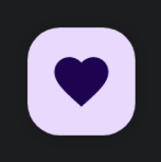

import { Tabs, TabItem } from '@astrojs/starlight/components';

[comment]: <> (La ruta siempre será assets/nombeComponente/componente-header.webp)

| Material 3| 
| :------: |
|  | 

El componente `SmallFloatingActionButton` sigue las mismas reglas e implimentaciones que [FloatingActionButton](/buttons/floating-action-button/) pero con un diseño algo más pequeño.

## Implementación

### Definición del componente

[comment]: <> (Añade un ``TabItem`` por cada tipo de implementación que tenga)

<Tabs>
<TabItem label="Material 3">

```kotlin frame="terminal"
@Composable
fun SmallFloatingActionButton(
    onClick: () -> Unit,
    modifier: Modifier = Modifier,
    shape: Shape = FloatingActionButtonDefaults.smallShape,
    containerColor: Color = FloatingActionButtonDefaults.containerColor,
    contentColor: Color = contentColorFor(containerColor),
    elevation: FloatingActionButtonElevation = FloatingActionButtonDefaults.elevation(),
    interactionSource: MutableInteractionSource = remember { MutableInteractionSource() },
    content: @Composable () -> Unit,
)
```

Atributo | Descripción
------ | -----------
onClick | Función lambda que se ejecutará cuando el usuario pulse el botón.
modifier | Modificador que implementará el composable.
shape | Define la forma del `FloatingActionButton` y su sombra.
containerColor | El color del fondo del componente.
contentColor | Color del contenido.
elevation | Permite modificar la elevación del componente en sus distintos estados con el objeto `FloatingActionButtonElevation`.
interactionSource | Representa un `stream` de interacciones del botón lo que nos permite modificar su diseño o comportamiento. Por ejemplo que mientras el botón esté pulsado, este encoja.
content | Contenido a mostrar dentro del `FloatingActionButton`.

</TabItem>
</Tabs>

[comment]: <> (No modifiques el tip)

:::tip[Fuente]
Puedes acceder a la documentación oficial de Google
[desde aquí](https://developer.android.com/reference/kotlin/androidx/compose/runtime/package-summary).
:::

### Ejemplos 

<Tabs>
<TabItem label="Material 3">

<center></center>

```kotlin frame="terminal"
@Composable
fun SmallFloatingActionButtonExample() {
    SmallFloatingActionButton(onClick = { print("Hello") }) {
        Icon(Icons.Filled.Favorite, "Floating action button.")
    }
}
```

</TabItem>
</Tabs>