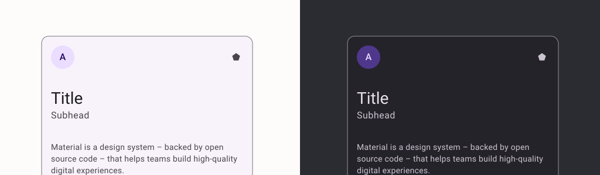
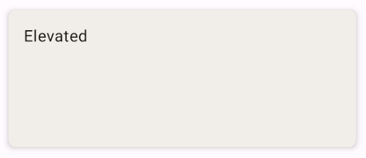

import { Tabs, TabItem } from '@astrojs/starlight/components';

| Material 3| 
| :----------------: |
| |

Las tarjetas elevadas contienen contenidos y acciones que relacionan información sobre un tema. Tienen una sombra que las separa más del fondo que las tarjetas con relleno, pero menos que las tarjetas con contorno.

## Implementación

### Defenición del componente

<Tabs>
<TabItem label="Material3">

```kotlin frame="terminal"
@Composable
fun ElevatedCard(
    onClick: () -> Unit,
    modifier: Modifier = Modifier,
    enabled: Boolean = true,
    shape: Shape = CardDefaults.elevatedShape,
    colors: CardColors = CardDefaults.elevatedCardColors(),
    elevation: CardElevation = CardDefaults.elevatedCardElevation(),
    interactionSource: MutableInteractionSource? = null,
    content: @Composable ColumnScope.() -> Unit
)
```

Atributo | Descripción
------ | -----------
onClick | cuando se hace clic en esta tarjeta
modifier | el [Modificador] que se aplicará a esta tarjeta
enabled | controla el estado activado de esta tarjeta. Cuando es falso, este componente no responderá a la entrada del usuario, y aparecerá visualmente desactivado y deshabilitado para los servicios de accesibilidad.
shape | define la forma del contenedor y la sombra de esta tarjeta (cuando se utiliza [elevación])
colors | [CardColors] que se utilizará para resolver el color o colores utilizados para esta tarjeta en diferentes estados. Véase [CardDefaults.elevatedCardElevation].
elevation | [CardElevation] utilizado para resolver la elevación de esta tarjeta en diferentes estados. Esto controla el tamaño de la sombra debajo de la tarjeta. Además, cuando el color del contenedor es [ColorScheme.surface], controla la cantidad de color primario aplicado como superposición. Véase también: [Superficie].
interactionSource | una [MutableInteractionSource] opcional para observar y emitir [Interaction]s para esta tarjeta. Puede utilizarlo para cambiar la apariencia de la tarjeta o previsualizarla en diferentes estados. Tenga en cuenta que si se proporciona null, las interacciones seguirán ocurriendo internamente.

</TabItem>
</Tabs>

[comment]: <> (No modifiques el tip)
:::tip[Fuente]
Puedes acceder a la documentación oficial de Google
[desde aquí](https://developer.android.com/reference/kotlin/androidx/compose/runtime/package-summary).
:::

### Ejemplo

<Tabs>
<TabItem label="Material3">

<center></center>

``` kotlin frame="terminal"
@Composable
fun ElevatedCardExample() {
    ElevatedCard(
        elevation = CardDefaults.cardElevation(
            defaultElevation = 6.dp
        ),
        modifier = Modifier
            .size(width = 240.dp, height = 100.dp)
    ) {
        Text(
            text = "Elevated",
            modifier = Modifier
                .padding(16.dp),
            textAlign = TextAlign.Center,
        )
    }
}
```

</TabItem>
</Tabs>