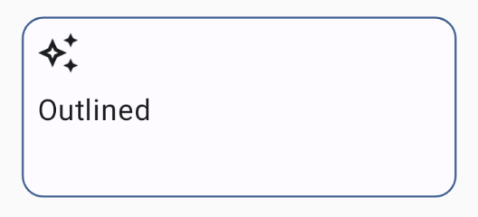

import { Tabs, TabItem } from '@astrojs/starlight/components';

[comment]: <> (La ruta siempre será assets/nombeComponente/componente-header.webp)

| Material 3| 
| :----------------: |
| |

La `OutlinedCard` es similar a `Card`, pero en lugar de tener un fondo sólido, tiene solo un contorno o borde alrededor del contenedor. No tiene sombreado por defecto y al igual que `Card`, puede contener otros elementos en su interior, como texto, imágenes, etc.

## Implementación

### Defenición del componente

<Tabs>
<TabItem label="Material3">

```kotlin frame="terminal"
@Composable
fun OutlinedCard(
    modifier: Modifier,
    shape: Shape = CardDefaults.outlinedShape,
    colors: CardColors = CardDefaults.outlinedCardColors(),
    elevation: CardElevation = CardDefaults.outlinedCardElevation(),
    border: BorderStroke = CardDefaults.outlinedCardBorder(),
    content: @Composable ColumnScope.() -> Unit
): Unit
```
Atributo | Descripción
------ | -----------
modifier | Modificador que implementará el composable.
shape | Define la forma del `OutlinedCard` y su sombra.
colors | Define el color del `OutlinedCard`, los colores del contenido, el color del `OutlinedCard` y su contenido cuando estan desactivado.
elevation | Permite modificar la elevación del componente en sus distintos estados.
border | Permite especificar el trazo con el que dibujar el borde.
content | Contenido a mostrar en el `OutlinedCard`.

</TabItem>
</Tabs>

[comment]: <> (No modifiques el tip)

:::tip[Fuente]
Puedes acceder a la documentación oficial de Google
[desde aquí](https://developer.android.com/reference/kotlin/androidx/compose/runtime/package-summary).
:::

### Ejemplo

<Tabs>
<TabItem label="Material3">

<center></center>

``` kotlin frame="terminal"
@Composable
fun OutlinedCardExample() {
    OutlinedCard(
        colors = CardDefaults.cardColors(
            containerColor = MaterialTheme.colorScheme.surface,
        ),
        border = BorderStroke(1.dp, MaterialTheme.colorScheme.primary),
        modifier = Modifier
            .size(width = 240.dp, height = 100.dp)
    ) {
        Icon(
            imageVector = Icons.Outlined.AutoAwesome,
            contentDescription = "example",
            modifier = Modifier.padding(start = 8.dp, top = 8.dp)
        )
        Text(
            text = "Outlined",
            modifier = Modifier
                .padding(start = 8.dp, top = 8.dp),
            textAlign = TextAlign.Center,
        )
    }
}
```
</TabItem>
</Tabs>