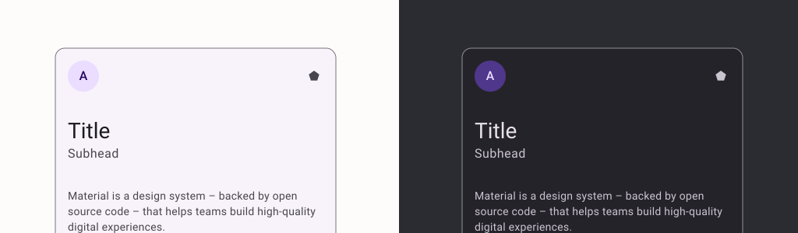

import { Tabs, TabItem } from '@astrojs/starlight/components';

<center></center>

El elemento `Card` componible actúa como un contenedor de Material Design para tu IU. En general, las tarjetas presentan un único contenido coherente.

## Implementación

### Definición del componente

<Tabs>
<TabItem label="Material">

```kotlin frame="terminal"
@Composable
fun Card(
    modifier: Modifier = Modifier,
    shape: Shape = MaterialTheme.shapes.medium,
    backgroundColor: Color = MaterialTheme.colors.surface,
    contentColor: Color = contentColorFor(backgroundColor),
    border: BorderStroke? = null,
    elevation: Dp = 1.dp,
    content: @Composable () -> Unit
): Unit
```

Atributo | Descripción
------ | -----------
modifier|Permite modificar el aspecto y comportamiento del Card que se aplicará a esta tarjeta.
shape|Define la forma del Card, como bordes redondeados o esquinas recortadas. Por defecto, utiliza la forma definida en CardDefaults.
backgroundColor|Especifica los colores del Card, incluyendo el color de fondo y el color del contenido. Utiliza los colores predeterminados de CardDefaults si no se especifica.
contentColor|El color de contenido preferido que proporciona esta tarjeta a sus hijos. El valor predeterminado es el color de contenido coincidente para , o si no es un color del tema, mantendrá el mismo valor establecido sobre esta
elevation|Controla la elevación del Card, que afecta la sombra y la profundidad visual. Por defecto, usa la elevación definida en CardDefaults.
border|Define el borde del Card, incluyendo el grosor y el color. Es opcional y por defecto no se aplica ningún borde.
content|Es una función composable que define el contenido del Card. Utiliza un ColumnScope para organizar los elementos dentro del Card.

</TabItem>
<TabItem label="Material 3">

```kotlin frame="terminal"
@Composable
public fun Card(
    modifier: Modifier = Modifier,
    shape: Shape = CardDefaults.shape,
    colors: CardColors = CardDefaults.cardColors(),
    elevation: CardElevation = CardDefaults.cardElevation(),
    border: BorderStroke? = null,
    content: @Composable() (ColumnScope.() -> Unit)
): Unit
```

Atributo | Descripción
------ | -----------
modifier|Permite modificar el aspecto y comportamiento del Card que se aplicará a esta tarjeta.
shape|Define la forma del Card, como bordes redondeados o esquinas recortadas. Por defecto, utiliza la forma definida en CardDefaults.
colors|Especifica los colores del Card, incluyendo el color de fondo y el color del contenido. Utiliza los colores predeterminados de CardDefaults si no se especifica.
elevation|Controla la elevación del Card, que afecta la sombra y la profundidad visual. Por defecto, usa la elevación definida en CardDefaults.
border|Define el borde del Card, incluyendo el grosor y el color. Es opcional y por defecto no se aplica ningún borde.
content|Es una función composable que define el contenido del Card. Utiliza un ColumnScope para organizar los elementos dentro del Card.

</TabItem>
</Tabs>

:::tip[Fuente]
Puedes acceder a la documentación oficial de Google
[Material](https://developer.android.com/reference/kotlin/androidx/compose/material/package-summary#Card(androidx.compose.ui.Modifier,androidx.compose.ui.graphics.Shape,androidx.compose.ui.graphics.Color,androidx.compose.ui.graphics.Color,androidx.compose.foundation.BorderStroke,androidx.compose.ui.unit.Dp,kotlin.Function0)).
[Material3](https://developer.android.com/reference/kotlin/androidx/compose/material3/package-summary#Card(androidx.compose.ui.Modifier,androidx.compose.ui.graphics.Shape,androidx.compose.material3.CardColors,androidx.compose.material3.CardElevation,androidx.compose.foundation.BorderStroke,kotlin.Function1))
:::

### Ejemplos

<Tabs>
<TabItem label="Material">

```kotlin frame="terminal"
@Composable
fun MaterialCardExample() {
    Card(
        modifier = Modifier.padding(16.dp),
        shape = MaterialTheme.shapes.medium,
        backgroundColor = MaterialTheme.colors.surface,
        elevation = 8.dp
    ) {
        Column(
            modifier = Modifier.padding(16.dp)
        ) {
            Text(text = "Título de la tarjeta", style = MaterialTheme.typography.h6)
            Spacer(modifier = Modifier.height(8.dp))
            Text(text = "Contenido de la tarjeta", style = MaterialTheme.typography.body2)
        }
    }
}
```

</TabItem>
<TabItem label="Material 3">

```kotlin frame="terminal"
@Composable
fun Material3CardExample() {
    Card(
        modifier = Modifier.padding(16.dp),
        shape = MaterialTheme.shapes.medium,
        colors = CardDefaults.cardColors(containerColor = MaterialTheme.colorScheme.surface),
        elevation = CardDefaults.cardElevation(defaultElevation = 8.dp)
    ) {
        Column(
            modifier = Modifier.padding(16.dp)
        ) {
            Text(text = "Título de la tarjeta", style = MaterialTheme.typography.titleLarge)
            Spacer(modifier = Modifier.height(8.dp))
            Text(text = "Contenido de la tarjeta", style = MaterialTheme.typography.bodyMedium)
        }
    }
}
```

</TabItem>

<center></center>

</Tabs>
