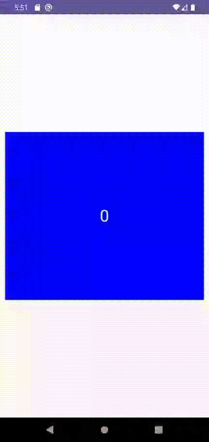

import { Tabs, TabItem } from "@astrojs/starlight/components";

|                                                            Material                                                             |
| :-----------------------------------------------------------------------------------------------------------------------------: |
|  |

## Implementación

### Definición del componente

```kotlin frame="terminal"

@Composable
@ExperimentalFoundationApi
fun HorizontalPager(
    state: PagerState,
    modifier: Modifier = Modifier,
    contentPadding: PaddingValues = PaddingValues(0.dp),
    pageSize: PageSize = PageSize.Fill,
    beyondBoundsPageCount: Int = PagerDefaults.BeyondBoundsPageCount,
    pageSpacing: Dp = 0.dp,
    verticalAlignment: Alignment.Vertical = Alignment.CenterVertically,
    flingBehavior: SnapFlingBehavior = PagerDefaults.flingBehavior(state = state),
    userScrollEnabled: Boolean = true,
    reverseLayout: Boolean = false,
    key: ((index: Int) -> Any)? = null,
    pageNestedScrollConnection: NestedScrollConnection = remember(state) {
        PagerDefaults.pageNestedScrollConnection(state, Orientation.Horizontal)
    },
    pageContent: @Composable PagerScope.(page: Int) -> Unit
)
```

| Atributo                   | Descripción                                                                                                                                                                                                                                                                                                                                                  |
| -------------------------- | ------------------------------------------------------------------------------------------------------------------------------------------------------------------------------------------------------------------------------------------------------------------------------------------------------------------------------------------------------------ |
| state                      | PagerState. Se utiliza para controlar el estado del carousel.                                                                                                                                                                                                                                                                                                |
| modifier                   | Modificador que implementará el _composable_.                                                                                                                                                                                                                                                                                                                |
| contentPadding             | El padding se aplicara a los elementos 'hijos' del `HorizontalPager` reduciendo su tamaño en relación al tamaño del propio `HorizontalPager`                                                                                                                                                                                                                 |
| pageSize                   | Sirve para modificar el aspecto que tendrá cada elemento del carousel. El valor por defecto `PageSize.Fill` indica que cada elemento ocupará lo máximo posible en relación con el tamaño asignado al `HorizontalPager`.                                                                                                                                      |
| beyondBoundsPageCount      | Este valor indica el número de elementos no visibles que se deben cargar. Por defecto está en 0, lo que indica que solo se cargarán los elementos que estén visibles en pantalla. Puede ser útil si los elementos realizan una acción asíncrona y se quiere precargar el siguiente que puede ver el usuario.                                                 |
| pageSpacing                | Define el espacio que se tendrá entre los elementos del carousel.                                                                                                                                                                                                                                                                                            |
| verticalAlignment          | Alineación vertical entre cada elemento del carousel.                                                                                                                                                                                                                                                                                                        |
| flingBehavior              | Recibe una instancia de SnapFlingBehavior, con la que podremos controlar el número máximo de elementos que se pueden desplazar en el carousel con el gesto de deslizar. Por defecto es de 1.                                                                                                                                                                 |
| userScrollEnabled          | Indica si se permite el desplazamiento a través de gestos del usuario o acciones de accesibilidad. El carousel aún puede desplazarse mediante programación usando `PagerState.scroll`, incluso cuando esté deshabilitado.                                                                                                                                    |
| reverseLayout              | Si está en true, invierte el orden de los elementos.                                                                                                                                                                                                                                                                                                         |
| key                        | Función lambda que debe retornar un identificador único por elemento. Si se envía null, se tomará como clave la posición en la lista. Tener una clave única permite que el carousel se mantenga centrado en el mismo elemento, incluso si se agregan otros elementos que afecten la posición de la lista de referencia. De lo contrario, podría desplazarse. |
| pageNestedScrollConnection | Conexión de desplazamiento anidado, que se utiliza para manejar eventos de desplazamiento anidado, como cuando el HorizontalPager está dentro de un componente desplazable más grande. El valor predeterminado crea una conexión que responde a desplazamientos horizontales. \* **revisar**                                                                 |
| pageContent                | Función lambda que recibe el número de página del carousel. Esta función debe retornar un composable para representar el contenido de cada página.                                                                                                                                                                                                           |

#### PagerState

Para iniciar el componente por lo general iniciaremos el `state` con la función `rememberPagerState`. Esta función regresa una instancia del PagerState que persistira a re-renderizaciones del componente.

```kotlin frame="terminal"
@ExperimentalFoundationApi
@Composable
fun rememberPagerState(
    initialPage: Int = 0,
    initialPageOffsetFraction: Float = 0f,
    pageCount: () -> Int
): PagerState
```

| Atributo                  | Descripción                                                                                                                                                  |
| ------------------------- | ------------------------------------------------------------------------------------------------------------------------------------------------------------ |
| initialPage               | Es el número de elemento en el que comenzará el carousel.                                                                                                    |
| initialPageOffsetFraction | Se utiliza para indicar qué tan desplazada está la página inicial en relación con su posición original.                                                      |
| pageCount                 | Función lambda que devuelve el número total de items que tendrá el carousel. Es una función para soportar casos donde se agreguen más elementos al carousel. |

## Ejemplos

### Carousel Simple


```kotlin frame="terminal"

@OptIn(ExperimentalFoundationApi::class)
@Composable
fun CarouselHorizontalExample() {

    var pager = rememberPagerState(
        initialPage = 0,
        pageCount = { 5 },
        initialPageOffsetFraction = 0f
    )


    HorizontalPager(
        state = pager,
        modifier = Modifier.height(350.dp)
    ) { page ->
        Box(
            modifier =
            Modifier
                .padding(10.dp)
                .background(Color.Blue)
                .fillMaxSize()
                .aspectRatio(0.5f),
            contentAlignment = Alignment.Center
        ) {
            Text(text = page.toString(), fontSize = 32.sp, color = Color.White)
        }
    }
}

```

### Carousel con controles


Se puede modificar el estado del `HorizontalPager` con código, para animar la función de movimiento es una `coroutine` y debe ejecutarse dentro del `coroutineScope`

```kotlin frame="terminal"
@OptIn(ExperimentalFoundationApi::class)
@Composable
fun CarouselHorizontalExample() {

    var pager = rememberPagerState(
        initialPage = 0,
        pageCount = { 5 },
        initialPageOffsetFraction = 0f
    )

    val coroutineScope = rememberCoroutineScope()

    Column {
        HorizontalPager(
            state = pager,
            modifier = Modifier.height(350.dp)
        ) { page ->
            Box(
                modifier =
                Modifier
                    .padding(10.dp)
                    .background(Color.Blue)
                    .fillMaxSize()
                    .aspectRatio(0.5f),
                contentAlignment = Alignment.Center
            ) {
                Text(text = page.toString(), fontSize = 32.sp, color = Color.White)
            }
        }
        Row(
            modifier = Modifier.fillMaxWidth(),
            horizontalArrangement = Arrangement.Center
        ) {
            Button(onClick = { coroutineScope.launch { pager.animateScrollToPage(pager.currentPage - 1) } }) {
                Text(text = "Anterior")
            }
            Button(onClick = { coroutineScope.launch { pager.animateScrollToPage(pager.currentPage + 1) } }) {
                Text(text = "Siguiente")
            }
        }
    }
}
```

### Carousel con indicadores


```kotlin frame="terminal"
@OptIn(ExperimentalFoundationApi::class)
@Composable
fun CarouselHorizontalExample() {

    var pager = rememberPagerState(
        initialPage = 0,
        pageCount = { 5 },
        initialPageOffsetFraction = 0f
    )

    Column {
        HorizontalPager(
            state = pager,
            modifier = Modifier.height(350.dp)
        ) { page ->
            Box(
                modifier =
                Modifier
                    .padding(10.dp)
                    .background(Color.Blue)
                    .fillMaxSize()
                    .aspectRatio(0.5f),
                contentAlignment = Alignment.Center
            ) {
                Text(text = page.toString(), fontSize = 32.sp, color = Color.White)
            }
        }
        Row(
            modifier = Modifier
                .wrapContentHeight()
                .fillMaxWidth()
                .padding(bottom = 8.dp),
            horizontalArrangement = Arrangement.Center
        ) {
            repeat(pager.pageCount) { iteration ->
                val color = if (pager.currentPage == iteration) Color.DarkGray else Color.LightGray
                Box(
                    modifier = Modifier
                        .padding(2.dp)
                        .clip(CircleShape)
                        .background(color)
                        .size(16.dp)
                )
            }
        }
    }
}
```
