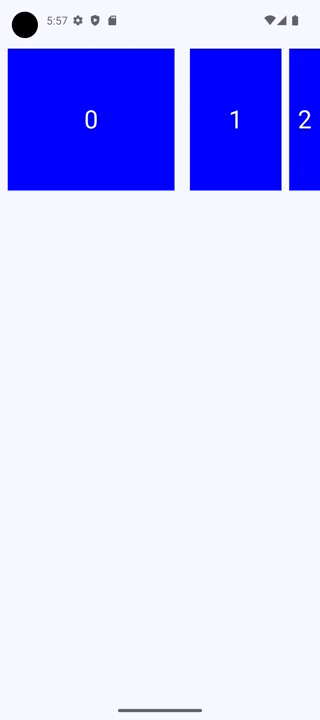

|                                                                    Material 3                                                                    |
| :----------------------------------------------------------------------------------------------------------------------------------------------: |
|  |

## Implementación

A partir de la versión `1.3.0` de _compose_ podemos hacer uso del `HorizontalMultiBrowseCarousel`, un nuevo elemento que permite tener un carrusel con múltiples ítems. Este componente resalta algunos elementos con mayor tamaño.

### Definición del componente

```kotlin frame="terminal"
@ExperimentalMaterial3Api
@Composable
fun HorizontalMultiBrowseCarousel(
    state: CarouselState,
    preferredItemWidth: Dp,
    modifier: Modifier = Modifier,
    itemSpacing: Dp = 0.dp,
    flingBehavior: TargetedFlingBehavior =
        CarouselDefaults.singleAdvanceFlingBehavior(state = state),
    minSmallItemWidth: Dp = CarouselDefaults.MinSmallItemSize,
    maxSmallItemWidth: Dp = CarouselDefaults.MaxSmallItemSize,
    contentPadding: PaddingValues = PaddingValues(0.dp),
    content: @Composable CarouselItemScope.(itemIndex: Int) -> Unit
)
```

| Atributo           | Descripción                                                                                                                                                                                                                                                                                                                  |
| ------------------ | ---------------------------------------------------------------------------------------------------------------------------------------------------------------------------------------------------------------------------------------------------------------------------------------------------------------------------- |
| state              | CarouselState. Se utiliza para controlar el estado del componente.                                                                                                                                                                                                                                                           |
| preferredItemWidth | Es el ancho aproximado que deben tener los ítems completamente desplegados. Este ancho se ajustará según el espacio disponible y los demás elementos. El componente ajusta primero los ítems más comprimidos (estos se pueden ajustar con las propiedades de minSmallItemWidth y maxSmallItemWidth), y luego los "medianos". |
| modifier           | Modificador que aplicará al composable.                                                                                                                                                                                                                                                                                      |
| itemSpacing        | Es el espacio que existirá entre cada ítem.                                                                                                                                                                                                                                                                                  |
| flingBehavior      | TargetedFlingBehavior. Es la clase que define el comportamiento del desplazamiento.                                                                                                                                                                                                                                          |
| minSmallItemWidth  | El ancho mínimo permitido para los ítems que visualmente están comprimidos.                                                                                                                                                                                                                                                  |
| maxSmallItemWidth  | El ancho máximo permitido para los ítems que visualmente están comprimidos.                                                                                                                                                                                                                                                  |
| contentPadding     | Es el espacio que se agregará alrededor del contenido, puede ser usado para agregar espacio antes del primer ítem y después del último.                                                                                                                                                                                      |

#### CarouselState

```kotlin frame="terminal"
@ExperimentalMaterial3Api
@Composable
fun rememberCarouselState(
    initialItem: Int = 0,
    itemCount: () -> Int,
)
```

| Atributo    | Descripción                                                                                                                                              |
| ----------- | -------------------------------------------------------------------------------------------------------------------------------------------------------- |
| initialItem | Es el número del ítem en el que comenzará el carrusel.                                                                                                   |
| itemCount   | Función lambda que devuelve el número total de ítems que tendrá el carrusel. Es una función para soportar casos donde se agreguen más ítems al carrusel. |

### Ejemplos


Demostración de un HorizontalMultiBrowseCarousel

```kotlin frame="terminal"
@ExperimentalMaterial3Api
@Composable
fun CarouselHorizontalExample() {
    val state = rememberCarouselState(itemCount = { 5 }, initialItem = 0)

    Column(verticalArrangement = Arrangement.Center) {
        HorizontalMultiBrowseCarousel(
            state = state,
            preferredItemWidth = 250.dp,
            modifier = Modifier.height(200.dp),
            itemSpacing = 10.dp
        ) { page ->
            Box(
                modifier =
                Modifier
                    .padding(10.dp)
                    .background(Color.Blue)
                    .fillMaxSize()
                    .aspectRatio(0.5f),
                contentAlignment = Alignment.Center
            ) {
                Text(text = page.toString(), fontSize = 32.sp, color = Color.White)
            }
        }
    }
}
```
