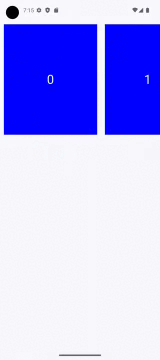

|                                                                   Material 3                                                                    |
| :---------------------------------------------------------------------------------------------------------------------------------------------: |
|  |

## Implementación

A partir de la versión `1.3.0` de _compose_ podemos hacer uso del `HorizontalUncontainedCarousel`, un nuevo elemento que permite tener un carrusel con múltiples ítems.

### Definición del componente

```kotlin frame="terminal"
@ExperimentalMaterial3Api
@Composable
fun HorizontalUncontainedCarousel(
    state: CarouselState,
    itemWidth: Dp,
    modifier: Modifier = Modifier,
    itemSpacing: Dp = 0.dp,
    flingBehavior: TargetedFlingBehavior = CarouselDefaults.noSnapFlingBehavior(),
    contentPadding: PaddingValues = PaddingValues(0.dp),
    content: @Composable CarouselItemScope.(itemIndex: Int) -> Unit
)
```

| Atributo       | Descripción                                                                                                                             |
| -------------- | --------------------------------------------------------------------------------------------------------------------------------------- |
| state          | CarouselState. Se utiliza para controlar el estado del componente.                                                                      |
| itemWidth      | El ancho de cada ítem del carrusel.                                                                                                     |
| modifier       | Modificador que aplicará al composable.                                                                                                 |
| itemSpacing    | Es el espacio que existirá entre cada ítem.                                                                                             |
| flingBehavior  | TargetedFlingBehavior. Es la clase que define el comportamiento del desplazamiento.                                                     |
| contentPadding | Es el espacio que se agregará alrededor del contenido. Puede ser usado para agregar espacio antes del primer ítem y después del último. |

#### CarouselState

```kotlin frame="terminal"
@ExperimentalMaterial3Api
@Composable
fun rememberCarouselState(
    initialItem: Int = 0,
    itemCount: () -> Int,
)

```

### Ejemplos


Demostración de un HorizontalUncontainedCarousel

```kotlin frame="terminal"
HorizontalUncontainedCarousel(
        state = state,
        itemWidth = 250.dp,
        itemSpacing = 10.dp,
        modifier = Modifier.height(300.dp)
    ) { page ->
        Box(
            modifier =
            Modifier
                .padding(10.dp)
                .background(Color.Blue)
                .fillMaxSize()
                .height(100.dp),
            contentAlignment = Alignment.Center
        ) {
            Text(text = page.toString(), fontSize = 32.sp, color = Color.White)
        }
    }
```
