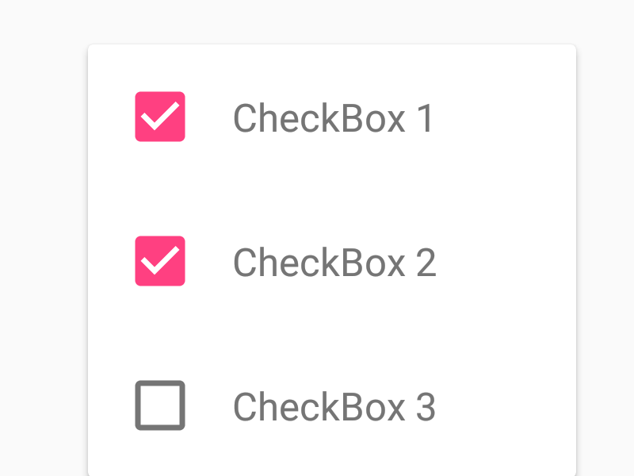

import { Tabs, TabItem } from "@astrojs/starlight/components";

| Material| Material 3|
| :----------------: | :------: |
|               |  |

Los `checkbox` permiten a los usuarios seleccionar uno o más elementos de un conjunto. Los `checkbox` pueden activar o desactivar una opción.

Utilice los `checkbox` para:

- Seleccione una o más opciones de una lista
- Presentar una lista que contenga subselecciones
- Activar o desactivar un elemento en un entorno de escritorio

## Implementación

### Definición del componente

<Tabs>
<TabItem label="Material">

```kotlin frame="terminal"
@Composable
fun Checkbox(
    checked: Boolean,
    onCheckedChange: ((Boolean) -> Unit)?,
    modifier: Modifier = Modifier,
    enabled: Boolean = true,
    interactionSource: MutableInteractionSource = remember { MutableInteractionSource() },
    colors: CheckboxColors = CheckboxDefaults.colors()
): Unit
```
Atributo | Descripción
------ | -----------
checked | Si este `checkbox` está marcado o desactivado.
onCheckedChange | devolución de llamada que se invocará cuando se haga clic en el `checkbox`, por lo tanto, se solicita el cambio de estado comprobado. Si es nulo, es pasivo y depende completamente de un componente de nivel superior para controlar el estado "comprobado".
modifier | Modificador a aplicar a este `checkbox`.
enabled | si el componente está habilitado o atenuado.
interactionSource | MutableInteractionSource que representa el flujo de interacciones para este `checkbox`. Puede crear y pasar su propio MutableInteractionSource recordado si desea observar las interacciones y personalizar la apariencia / comportamiento de este `checkbox` en diferentes interacciones.
colors | Colores del `checkbox` que se utilizarán para determinar el color de la marca de verificación / casilla / borde en diferentes estados. Consulte CheckboxDefaults.colors.

</TabItem>

<TabItem label="Material 3">

```kotlin frame="terminal"
@Composable
fun Checkbox(
    checked: Boolean,
    onCheckedChange: ((Boolean) -> Unit)?,
    modifier: Modifier = Modifier,
    enabled: Boolean = true,
    colors: CheckboxColors = CheckboxDefaults.colors(),
    interactionSource: MutableInteractionSource = remember { MutableInteractionSource() }
): Unit
```
Atributo | Descripción
------ | -----------
checked | Si este `checkbox` está marcado o desactivado.
onCheckedChange | Se llama cuando se hace clic en este `checkbox`. Si es nulo, este `checkbox` no será interactivo, a menos que otra cosa controle sus eventos de entrada y actualice su estado.
modifier | Modificador a aplicar a este `checkbox`.
enabled | Controla el estado habilitado de este `checkbox`. Cuando es false, este componente no responderá a la entrada del usuario y aparecerá visualmente deshabilitado y deshabilitado para los servicios de accesibilidad.
colors | Colores del `checkbox` que se usarán para resolver los colores utilizados para este `checkbox` en diferentes estados. Consulte CheckboxDefaults.colors.
interactionSource | la MutableInteractionSource representa la secuencia de interacciones para este `checkbox`. Puede crear y pasar su propia instancia recordada para observar las interacciones y personalizar la apariencia / comportamiento de este `checkbox` en diferentes estados.

</TabItem>
</Tabs>

:::tip[Fuente]
Puedes acceder a la documentación oficial del componente
[desde aquí (M2)](https://developer.android.com/reference/kotlin/androidx/compose/material/package-summary#Checkbox(kotlin.Boolean,kotlin.Function1,androidx.compose.ui.Modifier,kotlin.Boolean,androidx.compose.foundation.interaction.MutableInteractionSource,androidx.compose.material.CheckboxColors))
o [desde aquí (M3)](https://developer.android.com/reference/kotlin/androidx/compose/material3/package-summary#Checkbox(kotlin.Boolean,kotlin.Function1,androidx.compose.ui.Modifier,kotlin.Boolean,androidx.compose.material3.CheckboxColors,androidx.compose.foundation.interaction.MutableInteractionSource)).
:::

### Ejemplos

<Tabs>
<TabItem label="Material">

<center></center>

```kotlin "androidx.compose.material.Checkbox" title="CheckboxM2Default" frame="terminal"
import androidx.compose.material.Checkbox
@Composable
fun CheckboxDefault() {
    val checkedState = remember { mutableStateOf(true) }
    Checkbox(
        checked = checkedState.value,
        onCheckedChange = { checkedState.value = it }
    )
}
```
</TabItem>

<TabItem label="Material 3">

<center></center>

```kotlin "androidx.compose.material3.Checkbox" title="CheckboxM3Default" frame="terminal"
import androidx.compose.material3.Checkbox
@Composable
fun CheckboxDefault() {
    val checkedState = remember { mutableStateOf(true) }
    Checkbox(
        checked = checkedState.value,
        onCheckedChange = { checkedState.value = it }
    )
}
```

</TabItem>
</Tabs>