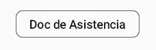

import { Tabs, TabItem } from '@astrojs/starlight/components';

[comment]: <> (La ruta siempre será assets/nombeComponente/componente-header.webp)

| Material 3| 
| :------: |
|  | 

El componente `AssistChip` tiene como propósito principal orientar al usuario mientras realiza una tarea en la interfaz. Su apariencia se caracteriza por ser temporal y surge en respuesta a las acciones del usuario. Un ejemplo típico de uso incluye guiar al usuario a lo largo de un flujo de trabajo o proporcionar información relevante en un contexto específico. En resumen, el AssistChip mejora la experiencia del usuario al ofrecer orientación y respuesta contextual durante la interacción.

## Implementación

### Definición del componente

[comment]: <> (Añade un ``TabItem`` por cada tipo de implementación que tenga)

<Tabs>
<TabItem label="Material 3">

```kotlin frame="terminal"
@ExperimentalMaterial3Api
@Composable
@ComposableInferredTarget
public fun AssistChip(
    onClick: () -> Unit,
    label: @Composable () -> Unit,
    modifier: Modifier,
    enabled: Boolean,
    leadingIcon: @Composable() (() -> Unit)?,
    trailingIcon: @Composable() (() -> Unit)?,
    shape: Shape,
    colors: ChipColors,
    elevation: ChipElevation?,
    border: ChipBorder?,
    interactionSource: MutableInteractionSource
): Unit
```

Atributo | Descripción
------ | -----------
onClick | Se llama cuando se hace clic en el chip.
label | El contenido del chip definido como un composable.
modifier | Modificador que se aplicará al chip.
enabled | Cuando está deshabilitado, el chip no responderá a la entrada del usuario. También aparecerá visualmente deshabilitado y desactivado para los servicios de accesibilidad.
leadingIcon | Icono opcional que se mostrará al principio del chip, antes del texto de contenido.
trailingIcon | Icono opcional que se mostrará al final del chip, después del texto de contenido.
shape | La forma del chip, que puede ser un rectángulo, un círculo, etc.
colors | ChipColors que se utilizarán para determinar el color de fondo y contenido para este chip en diferentes estados. Consulta ChipDefaults.chipColors.
elevation | La elevación del chip, que afecta su sombra.
border | Borde que se dibujará alrededor del chip. Pasa null aquí para no tener borde.
interactionSource | La MutableInteractionSource representa el flujo de interacciones para este chip. Puedes crear y pasar tu propia MutableInteractionSource si deseas observar interacciones y personalizar la apariencia/comportamiento de este componente en diferentes interacciones.

</TabItem>
</Tabs>

[comment]: <> (No modifiques el tip)

:::tip[Fuente]
Puedes acceder a la documentación oficial de AssistChip de material 3:
[desde aquí ](https://developer.android.com/jetpack/compose/components/chip?hl=es-419#assist)
:::

### Ejemplo de Assist Chip 

<Tabs>

<TabItem label="Material 3">

<center></center>

```kotlin frame="terminal"
@OptIn(ExperimentalMaterial3Api::class)
@Composable
fun exampleAssistChip() {
    AssistChip(
        modifier = Modifier.padding(20.dp),
        onClick = { Log.d("Assist chip", "Hi from assist chip") },
        label = { Text("Doc de Asistencia") },
        )
}
```

</TabItem>
</Tabs>