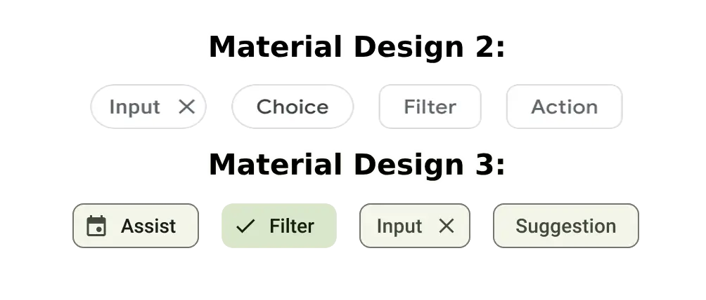
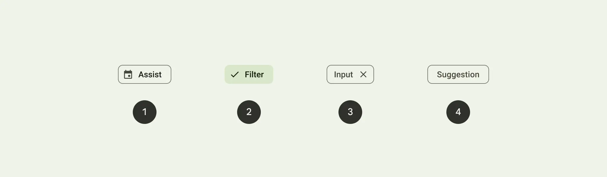
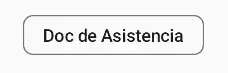
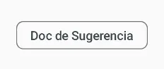

import { Tabs, TabItem } from '@astrojs/starlight/components';



El Chip es un elemento visual compacto y interactivo que representa entidades como contactos o etiquetas. Puede ser marcado, descartado o clicado. Aquí te presento cuatro tipos de chips y sus usos.

## Implementación

### Definición del componente

A continuación, se presenta la implementación del composable `Chip`.

<Tabs>
<TabItem label="Material">

```kotlin frame="terminal"
@ExperimentalMaterialApi
@Composable
fun Chip(
    onClick: () -> Unit,
    modifier: Modifier = Modifier,
    enabled: Boolean = true,
    interactionSource: MutableInteractionSource = remember { MutableInteractionSource() },
    shape: Shape = MaterialTheme.shapes.small.copy(CornerSize(percent = 50)),
    border: BorderStroke? = null,
    colors: ChipColors = ChipDefaults.chipColors(),
    leadingIcon: @Composable (() -> Unit)? = null,
    content: @Composable RowScope.() -> Unit
)
```

Atributo | Descripción
------ | -----------
onClick | Se llama cuando se hace clic en el chip.
modifier | Modificador que se aplicará al chip.
enabled | Cuando está deshabilitado, el chip no responderá a la entrada del usuario. También aparecerá visualmente deshabilitado y desactivado para los servicios de accesibilidad.
interactionSource | La MutableInteractionSource representa el flujo de interacciones para este chip. Puedes crear y pasar tu propia MutableInteractionSource si deseas observar interacciones y personalizar la apariencia/comportamiento de este componente en diferentes interacciones.
border | Borde que se dibujará alrededor del chip. Pasa null aquí para no tener borde.
colors | ChipColors que se utilizarán para determinar el color de fondo y contenido para este chip en diferentes estados. Consulta ChipDefaults.chipColors.
leadingIcon | Icono opcional al principio del chip, antes del texto de contenido.
content | El contenido de este chip.


</TabItem>
<TabItem label="Material 3">

```kotlin frame="terminal"
@ExperimentalMaterialApi
@Composable
fun Chip(
    onClick: () -> Unit,
    modifier: Modifier = Modifier,
    enabled: Boolean = true,
    interactionSource: MutableInteractionSource = remember { MutableInteractionSource() },
    shape: Shape = MaterialTheme.shapes.small.copy(CornerSize(percent = 50)),
    border: BorderStroke? = null,
    colors: ChipColors = ChipDefaults.chipColors(),
    leadingIcon: @Composable (() -> Unit)? = null,
    content: @Composable RowScope.() -> Unit
)
```

Atributo | Descripción
------ | -----------
onClick | Se llama cuando se hace clic en el chip.
modifier | Modificador que se aplicará al chip.
enabled | Cuando está deshabilitado, el chip no responderá a la entrada del usuario. También aparecerá visualmente deshabilitado y desactivado para los servicios de accesibilidad.
interactionSource | La MutableInteractionSource representa el flujo de interacciones para este chip. Puedes crear y pasar tu propia MutableInteractionSource si deseas observar interacciones y personalizar la apariencia/comportamiento de este componente en diferentes interacciones.
border | Borde que se dibujará alrededor del chip. Pasa null aquí para no tener borde.
colors | ChipColors que se utilizarán para determinar el color de fondo y contenido para este chip en diferentes estados. Consulta ChipDefaults.chipColors.
leadingIcon | Icono opcional al principio del chip, antes del texto de contenido.
content | El contenido de este chip.

</TabItem>
</Tabs>

:::tip[Fuente]
Puedes acceder a la documentación oficial de Google
[desde aquí](https://developer.android.com/jetpack/compose/components/chip?hl=es-419s).
:::

## El composable `Chip` se divide en cuatro tipos distintos, cada uno diseñado con un propósito específico:



### 1 Assist Chip (Chip de Asistencia)

<center></center>

- **Propósito:** Orienta al usuario durante una tarea.
- **Apariencia:** Suelen ser elementos temporales que aparecen en respuesta a las acciones del usuario.
- **Ejemplo de Uso:** Guiar al usuario a través de un flujo de trabajo o proporcionar información relevante en un contexto específico.

```kotlin frame="terminal"
@ExperimentalMaterial3Api
@Composable
@ComposableInferredTarget
public fun AssistChip(
    onClick: () -> Unit,
    label: @Composable () -> Unit,
    modifier: Modifier,
    enabled: Boolean,
    leadingIcon: @Composable() (() -> Unit)?,
    trailingIcon: @Composable() (() -> Unit)?,
    shape: Shape,
    colors: ChipColors,
    elevation: ChipElevation?,
    border: ChipBorder?,
    interactionSource: MutableInteractionSource
): Unit
```

Atributo | Descripción
------ | -----------
onClick | Se llama cuando se hace clic en el chip.
label | El contenido del chip definido como un composable.
modifier | Modificador que se aplicará al chip.
enabled | Cuando está deshabilitado, el chip no responderá a la entrada del usuario. También aparecerá visualmente deshabilitado y desactivado para los servicios de accesibilidad.
leadingIcon | Icono opcional que se mostrará al principio del chip, antes del texto de contenido.
trailingIcon | Icono opcional que se mostrará al final del chip, después del texto de contenido.
shape | La forma del chip, que puede ser un rectángulo, un círculo, etc.
colors | ChipColors que se utilizarán para determinar el color de fondo y contenido para este chip en diferentes estados. Consulta ChipDefaults.chipColors.
elevation | La elevación del chip, que afecta su sombra.
border | Borde que se dibujará alrededor del chip. Pasa null aquí para no tener borde.
interactionSource | La MutableInteractionSource representa el flujo de interacciones para este chip. Puedes crear y pasar tu propia MutableInteractionSource si deseas observar interacciones y personalizar la apariencia/comportamiento de este componente en diferentes interacciones.

### Ejemplo de Assist Chip

<Tabs>
<TabItem label="Material">

<center></center>

```kotlin frame="terminal"

```

</TabItem>
<TabItem label="Material 3">

<center></center>

```kotlin frame="terminal"
@OptIn(ExperimentalMaterial3Api::class)
@Composable
fun exampleAssistChip() {
    AssistChip(
        modifier = Modifier.padding(20.dp),
        onClick = { Log.d("Assist chip", "Hi from assist chip") },
        label = { Text("Doc de Asistencia") },
        )
}
```

</TabItem>
</Tabs>


### 2 Filter Chip (Chip de Filtro)

<center></center>

- **Propósito:** Permite a los usuarios refinar el contenido de un conjunto de opciones.
- **Interactividad:** Pueden ser seleccionados o deseleccionados.
- **Características:** Algunos pueden incluir un ícono de marca de verificación para indicar la selección.
- **Ejemplo de Uso:** Filtrar resultados en una lista o conjunto de datos.

### 3 Input Chip (Chip de Entrada)

<center></center>

- **Propósito:** Representa la información proporcionada por el usuario.
- **Contenido:** Puede incluir un ícono y texto.
- **Funcionalidad:** Ofrece la posibilidad de eliminar el chip, a menudo con un botón "X".
- **Ejemplo de Uso:** Mostrar las selecciones de un menú o etiquetar contenido.

```kotlin frame="terminal"
@ExperimentalMaterial3Api
@Composable
@ComposableInferredTarget
public fun InputChip(
    selected: Boolean,
    onClick: () -> Unit,
    label: @Composable () -> Unit,
    modifier: Modifier,
    enabled: Boolean,
    leadingIcon: @Composable() (() -> Unit)?,
    avatar: @Composable() (() -> Unit)?,
    trailingIcon: @Composable() (() -> Unit)?,
    shape: Shape,
    colors: SelectableChipColors,
    elevation: SelectableChipElevation?,
    border: SelectableChipBorder?,
    interactionSource: MutableInteractionSource
): Unit
```

Atributo | Descripción
------ | -----------
selected | Indica si el chip está seleccionado o no.
onClick | Se llama cuando se hace clic en el chip.
label | El contenido del chip definido como un composable.
modifier | Modificador que se aplicará al chip.
enabled | Cuando está deshabilitado, el chip no responderá a la entrada del usuario. También aparecerá visualmente deshabilitado y desactivado para los servicios de accesibilidad.
leadingIcon | Icono opcional que se mostrará al principio del chip, antes del texto de contenido.
avatar | Avatar opcional que se mostrará en el chip.
trailingIcon | Icono opcional que se mostrará al final del chip, después del texto de contenido.
shape | La forma del chip, que puede ser un rectángulo, un círculo, etc.
colors | SelectableChipColors que se utilizarán para determinar el color de fondo y contenido para este chip en diferentes estados. Consulta ChipDefaults.selectableChipColors.
elevation | La elevación del chip, que afecta su sombra en estados seleccionados.
border | Borde que se dibujará alrededor del chip en estados seleccionados. Pasa null aquí para no tener borde.
interactionSource | La MutableInteractionSource representa el flujo de interacciones para este chip. Puedes crear y pasar tu propia MutableInteractionSource si deseas observar interacciones y personalizar la apariencia/comportamiento de este componente en diferentes interacciones.

### Ejemplo de Input Chip

<Tabs>
<TabItem label="Material">

<center></center>

```kotlin frame="terminal"

```

</TabItem>
<TabItem label="Material 3">

<center></center>

```kotlin frame="terminal"
@OptIn(ExperimentalMaterial3Api::class)
@Composable
fun exampleInputChip() {
    val isChipEnable by remember { mutableStateOf(true) }

    InputChip(
        modifier = Modifier.padding(20.dp),
        onClick = { Log.d("Input chip", "Hi from input chip") },
        label = { Text("Doc de Entrada") },
        selected = isChipEnable
        )
}
```

</TabItem>
</Tabs>

### 4 Suggestion Chip (Chip de Sugerencia)

<center></center>

- **Propósito:** Proporciona recomendaciones al usuario basadas en su actividad o entradas recientes.
- **Ubicación:** Suelen aparecer debajo de un campo de entrada, sugiriendo acciones al usuario.
- **Ejemplo de Uso:** Ofrecer opciones sugeridas mientras el usuario escribe en un cuadro de búsqueda.

```kotlin frame="terminal"
@ExperimentalMaterial3Api
@Composable
@ComposableInferredTarget
public fun SuggestionChip(
    onClick: () -> Unit,
    label: @Composable () -> Unit,
    modifier: Modifier,
    enabled: Boolean,
    icon: @Composable() (() -> Unit)?,
    shape: Shape,
    colors: ChipColors,
    elevation: ChipElevation?,
    border: ChipBorder?,
    interactionSource: MutableInteractionSource
): Unit
```

Atributo | Descripción
------ | -----------
onClick | Se llama cuando se hace clic en el chip.
label | El contenido del chip definido como un composable.
modifier | Modificador que se aplicará al chip.
enabled | Cuando está deshabilitado, el chip no responderá a la entrada del usuario. También aparecerá visualmente deshabilitado y desactivado para los servicios de accesibilidad.
icon | Icono opcional que se mostrará dentro del chip, definido como un composable.
shape | La forma del chip, que puede ser un rectángulo, un círculo, etc.
colors | `ChipColors` que se utilizarán para determinar el color de fondo y contenido para este chip en diferentes estados. Consulta `ChipDefaults.chipColors`.
elevation | La elevación del chip, que afecta su sombra.
border | Borde que se dibujará alrededor del chip. Pasa null aquí para no tener borde.
interactionSource | La `MutableInteractionSource` representa el flujo de interacciones para este chip. Puedes crear y pasar tu propia `MutableInteractionSource` si deseas observar interacciones y personalizar la apariencia/comportamiento de este componente en diferentes interacciones.

### Ejemplo de Suggestion Chip

<Tabs>
<TabItem label="Material">

<center></center>

```kotlin frame="terminal"

```

</TabItem>
<TabItem label="Material 3">

<center></center>

```kotlin frame="terminal"
@OptIn(ExperimentalMaterial3Api::class)
@Composable
fun exampleSuggestionChip() {
    SuggestionChip(
        modifier = Modifier.padding(20.dp),
        onClick = { Log.d("Suggestion chip", "Hi from suggestion chip") },
        label = { Text("Doc de Sugerencia") }
    )
}
```

</TabItem>
</Tabs>

Estos tipos de chips brindan versatilidad al composable `Chip`, permitiendo su adaptación a diversos escenarios y necesidades de diseño en una interfaz de usuario.

## Diferencias de Material Design 3 respecto a Material Design 2

- Color: Nuevos mapeos de colores y compatibilidad con colores dinámicos.
- Forma: Rectángulo redondeado.
- Tipos: Las action chips se han separado en assist chips y suggestion chips. Choice chips ahora son un subconjunto de filter chips.