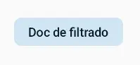

import { Tabs, TabItem } from '@astrojs/starlight/components';

[comment]: <> (La ruta siempre será assets/nombeComponente/componente-header.webp)

| Material 3| 
| :------: |
|  | 

El componente `FilterChip` tiene como propósito permitir a los usuarios refinar el contenido de un conjunto de opciones según sus preferencias. En términos de interactividad, los usuarios pueden seleccionar o deseleccionar estas opciones según sus necesidades. Además, algunas de estas opciones pueden incluir un ícono de marca de verificación para indicar su selección. Un ejemplo práctico de uso sería emplear este componente para filtrar resultados en una lista o conjunto de datos, ofreciendo a los usuarios la capacidad de personalizar y enfocar la información según sus criterios específicos.

## Implementación

### Definición del componente

[comment]: <> (Añade un ``TabItem`` por cada tipo de implementación que tenga)

<Tabs>
<TabItem label="Material 3">

```kotlin frame="terminal"
@ExperimentalMaterial3Api
@Composable
@ComposableInferredTarget
public fun FilterChip(
    selected: Boolean,
    onClick: () -> Unit,
    label: @Composable () -> Unit,
    modifier: Modifier,
    enabled: Boolean,
    leadingIcon: @Composable() (() -> Unit)?,
    trailingIcon: @Composable() (() -> Unit)?,
    shape: Shape,
    colors: SelectableChipColors,
    elevation: SelectableChipElevation?,
    border: SelectableChipBorder?,
    interactionSource: MutableInteractionSource
): Unit
```

Atributo | Descripción
------ | -----------
selected | Indica si el chip está seleccionado o no.
onClick | Se llama cuando se hace clic en el chip.
label | El contenido del chip definido como un composable.
modifier | Modificador que se aplicará al chip.
enabled | Cuando está deshabilitado, el chip no responderá a la entrada del usuario. También aparecerá visualmente deshabilitado y desactivado para los servicios de accesibilidad.
leadingIcon | Icono opcional que se mostrará al principio del chip, antes del texto de contenido.
trailingIcon | Icono opcional que se mostrará al final del chip, después del texto de contenido.
shape | La forma del chip, que puede ser un rectángulo, un círculo, etc.
colors | `SelectableChipColors` que se utilizarán para determinar el color de fondo y contenido para este chip en diferentes estados. Consulta `ChipDefaults.selectableChipColors`.
elevation | La elevación del chip, que afecta su sombra en estados seleccionados.
border | Borde que se dibujará alrededor del chip en estados seleccionados. Pasa null aquí para no tener borde.
interactionSource | La `MutableInteractionSource` representa el flujo de interacciones para este chip. Puedes crear y pasar tu propia `MutableInteractionSource` si deseas observar interacciones y personalizar la apariencia/comportamiento de este componente en diferentes interacciones.

</TabItem>
</Tabs>

[comment]: <> (No modifiques el tip)

:::tip[Fuente]
Puedes acceder a la documentación oficial de FilterChip de material 3:
[desde aquí](https://developer.android.com/jetpack/compose/components/chip?hl=es-419#filter).
:::

### Ejemplo de Filter Chip

<Tabs>
<TabItem label="Material 3">

<center></center>

```kotlin frame="terminal"
@OptIn(ExperimentalMaterial3Api::class)
@Composable
fun exampleFilterChip() {
    FilterChip(
        modifier = Modifier.padding(20.dp),
        onClick = { Log.d("Filter chip", "Hi from filter chip") },
        label = { Text("Doc de filtrado") },
        selected = true
    )
}
```

</TabItem>
</Tabs>