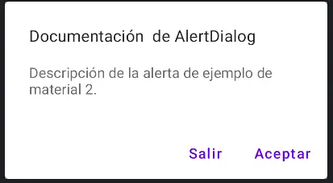
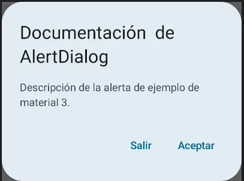

import { Tabs, TabItem } from '@astrojs/starlight/components';

| Material| Material 3| 
| :----------------: | :------: |
|  |  | 

El composable `AlertDialog` proporciona una API conveniente para crear un diálogo con el tema de Material Design. A continuación, se describen los parámetros específicos que controlan elementos particulares del diálogo:


## Implementación

### Definición del componente

<Tabs>
<TabItem label="Material">
```kotlin frame="terminal"
    @Composable
    fun AlertDialog(
        onDismissRequest: () -> Unit,
        confirmButton: @Composable () -> Unit,
        modifier: Modifier = Modifier,
        dismissButton: (@Composable () -> Unit)? = null,
        title: (@Composable () -> Unit)? = null,
        text: (@Composable () -> Unit)? = null,
        shape: Shape = MaterialTheme.shapes.medium,
        backgroundColor: Color = MaterialTheme.colors.surface,
        contentColor: Color = contentColorFor(backgroundColor),
        properties: DialogProperties = DialogProperties()
    ): Unit
```

| Atributo             | Descripción                                                                       |
| -------------------- | ---------------------------------------------------------------------------------- |
| **onDismissRequest** | Callback que se llamará cuando el usuario cierra el diálogo.                       |
| **confirmButton** | Elemento componible que funciona como botón de confirmación.                          |
| **modifier**         | Modificador que se aplicará al diseño del diálogo.                                 |
| **dismissButton** | Elemento componible que funciona como botón para descartar.                        |
| **title**            | El título del diálogo que debe especificar el propósito del diálogo.               |
| **text**             | El texto que presenta los detalles sobre el propósito del diálogo.                 |
| **shape**            | Define la forma del diálogo.                                                       |
| **backgroundColor**  | El color de fondo del diálogo.                                                     |
| **contentColor**     | El color de contenido preferido proporcionado por este diálogo a sus hijos.         |
| **properties**       | Normalmente, propiedades específicas de la plataforma para configurar aún más el diálogo  |
</TabItem>

<TabItem label="Material 3">

```kotlin frame="terminal"
    @Composable
    fun AlertDialog(
        onDismissRequest: () -> Unit,
        confirmButton: @Composable () -> Unit,
        modifier: Modifier = Modifier,
        dismissButton: @Composable (() -> Unit)? = null,
        icon: @Composable (() -> Unit)? = null,
        title: @Composable (() -> Unit)? = null,
        text: @Composable (() -> Unit)? = null,
        shape: Shape = AlertDialogDefaults.shape,
        containerColor: Color = AlertDialogDefaults.containerColor,
        iconContentColor: Color = AlertDialogDefaults.iconContentColor,
        titleContentColor: Color = AlertDialogDefaults.titleContentColor,
        textContentColor: Color = AlertDialogDefaults.textContentColor,
        tonalElevation: Dp = AlertDialogDefaults.TonalElevation,
        properties: DialogProperties = DialogProperties()
    )
```

| Atributo             | Descripción                                                                       |
| --------------------- | ---------------------------------------------------------------------------------- |
| **onDismissRequest**  | Función llamada cuando el usuario descarta el diálogo, por ejemplo, al presionar fuera de él. |
| **confirmButton**     | Elemento componible que funciona como botón de confirmación.                       |
| **modifier**          | Modificador para personalizar la apariencia y el comportamiento del diálogo.       |
| **dismissButton**     | Elemento componible opcional que funciona como botón para descartar.               |
| **icon**              | Gráfico opcional que aparece en la parte superior del diálogo.                     |
| **title**             | Texto opcional que aparece en la parte superior del diálogo.                       |
| **text**              | Texto opcional que aparece centrado en el diálogo.                                 |
| **shape**             | Forma del diálogo, por defecto es la forma predeterminada de AlertDialog.          |
| **containerColor**    | Color del fondo del diálogo.                                                       |
| **iconContentColor**  | Color del gráfico (icono) en el diálogo.                                           |
| **titleContentColor** | Color del texto en la parte superior del diálogo.                                  |
| **textContentColor**  | Color del texto centrado en el diálogo.                                            |
| **tonalElevation**    | Elevación del diálogo en términos de sombras.                                      |
| **properties**        | Propiedades del diálogo (por defecto, DialogProperties).                           |

</TabItem>

</Tabs>

[comment]: <> (No modifiques el tip)


<Tabs>
<TabItem label="Material">
:::tip[Fuente]
Puedes acceder a la documentación oficial de Google de material:
[desde aquí ](https://developer.android.com/reference/kotlin/androidx/compose/material/package-summary?_gl=1*19tuy8v*_ga*MzIxMzM0MzIxLjE2ODQxODE4MTQ.*_ga_QPQ2NRV856*MTcwMjY5MzE5MC4xOC4xLjE3MDI2OTMxOTcuMC4wLjA.#AlertDialog(kotlin.Function0,kotlin.Function0,androidx.compose.ui.Modifier,kotlin.Function0,kotlin.Function0,kotlin.Function0,androidx.compose.ui.graphics.Shape,androidx.compose.ui.graphics.Color,androidx.compose.ui.graphics.Color,androidx.compose.ui.window.DialogProperties))
:::
</TabItem>
<TabItem label="Material 3">

:::tip[Fuente]
Puedes acceder a la documentación oficial de Google de material 3:
[desde aquí ](https://developer.android.com/jetpack/compose/components/dialog?hl=es-419)
:::

</TabItem>
</Tabs>

### Ejemplos 
En el siguiente ejemplo, se implementan dos botones en un diálogo de alerta: uno para salir del diálogo y otro para aceptar la solicitud

<Tabs>
<TabItem label="Material">

<center></center>

```kotlin frame="terminal"
@Composable
fun alertDialogDoc() {
    val openDialog = remember { mutableStateOf(true) }

    if (openDialog.value) {
        AlertDialog(
            onDismissRequest = {
                openDialog.value = false
            },
            title = {
                Text(text = "Documentación  de AlertDialog")
            },
            text = {
                Text(
                    "Descripción de la alerta de ejemplo de material 2."
                )
            },
            confirmButton = {
                TextButton(
                    onClick = {
                        openDialog.value = false
                    }
                ) {
                    Text("Aceptar")
                }
            },
            dismissButton = {
                TextButton(
                    onClick = {
                        openDialog.value = false
                    }
                ) {
                    Text("Salir")
                }
            }
        )
    }
}
```

</TabItem>
<TabItem label="Material 3">

<center></center>

```kotlin frame="terminal"
@Composable
fun alertDialogDoc() {
    val openDialog = remember { mutableStateOf(true) }

    if (openDialog.value) {
        AlertDialog(
            onDismissRequest = {
                openDialog.value = false
            },
            title = {
                Text(text = "Documentación  de AlertDialog")
            },
            text = {
                Text(
                    "Descripción de la alerta de ejemplo de material 2."
                )
            },
            confirmButton = {
                TextButton(
                    onClick = {
                        openDialog.value = false
                    }
                ) {
                    Text("Aceptar")
                }
            },
            dismissButton = {
                TextButton(
                    onClick = {
                        openDialog.value = false
                    }
                ) {
                    Text("Salir")
                }
            }
        )
    }
}
```

</TabItem>
</Tabs>