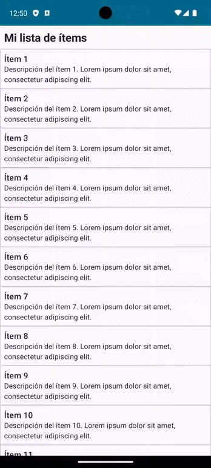

import { Tabs, TabItem } from "@astrojs/starlight/components";

El componente LazyColumn de Jetpack Compose es una alternativa eficiente a RecyclerView para manejar listas verticales. Pero a diferencia de éste, que carga todas las vistas necesarias para llenar la pantalla inicialmente, LazyColumn solo carga los elementos visibles, optimizando así el rendimiento al manejar grandes conjuntos de datos. Además, ofrece una gran flexibilidad y simplicidad, debido a que solo necesitas pasar tus datos y una función que describe cómo se debe dibujar cada elemento. No hay necesidad de definir adaptadores ni de inflar layouts XML, lo que simplifica enormemente el código y aumenta la legibilidad.

{/*Una de las características destacadas de LazyColumn es su capacidad para controlar la posición de desplazamiento. Con **[LazyListState](https://developer.android.com/reference/kotlin/androidx/compose/foundation/lazy/LazyListState)**, puedes obtener la posición de desplazamiento actual, guardarla y recuperarla posteriormente, lo que es útil para mantener el estado de la lista entre diferentes sesiones de la aplicación. Además, puedes usar la función `scrollToItem()` para desplazarte a una posición específica en la lista.

Otra ventaja de LazyColumn es que proporciona un control detallado sobre el comportamiento de desplazamiento. Por ejemplo, puedes personalizar el comportamiento de flotamiento mediante la propiedad `flingBehavior` y controlar la alineación de los elementos con la propiedad alignment.*/}

## Implementación

### Definición del componente

```kotlin 
@Composable
fun LazyColumn(
    modifier: Modifier = Modifier,
    state: LazyListState = rememberLazyListState(),
    contentPadding: PaddingValues = PaddingValues(0.dp),
    reverseLayout: Boolean = false,
    verticalArrangement: Arrangement.Vertical = if (!reverseLayout) Arrangement.Top else Arrangement.Bottom,
    horizontalAlignment: Alignment.Horizontal = Alignment.Start,
    flingBehavior: FlingBehavior = ScrollableDefaults.flingBehavior(),
    userScrollEnabled: Boolean = true,
    content: LazyListScope.() -> Unit
): Unit
```

Atributo | Descripción 
---------|-------------
modifier | El modificador a aplicar a este diseño. <a style="text-decoration: none;" href="https://developer.android.com/reference/kotlin/androidx/compose/ui/Modifier">🔗</a> 
state | El objeto de estado utilizado para controlar o observar el estado de la lista. <a style="text-decoration: none;" href="https://developer.android.com/reference/kotlin/androidx/compose/foundation/lazy/LazyListState">🔗</a>
contentPadding | Un padding alrededor de todo el contenido. Se utiliza para agregar un padding antes del primer elemento o después del último. Si se quiere agregar un espaciado entre cada elemento, se debe usar `verticalArrangement`. <a style="text-decoration: none;" href="https://developer.android.com/reference/kotlin/androidx/compose/foundation/layout/PaddingValues">🔗</a>
reverseLayout | Invierte la dirección de desplazamiento y diseño. Cuando es verdadero, los elementos se colocan en orden inverso. <a style="text-decoration: none;" href="https://developer.android.com/reference/kotlin/androidx/compose/foundation/lazy/package-summary#LazyColumn(androidx.compose.ui.Modifier,androidx.compose.foundation.lazy.LazyListState,androidx.compose.foundation.layout.PaddingValues,kotlin.Boolean,androidx.compose.foundation.layout.Arrangement.Vertical,androidx.compose.ui.Alignment.Horizontal,androidx.compose.foundation.gestures.FlingBehavior,kotlin.Boolean,kotlin.Function1))">🔗</a> 
verticalArrangement | La disposición vertical de los hijos del diseño. Permite agregar un espaciado entre los elementos y especificar la disposición de los elementos cuando no hay suficientes para llenar el tamaño mínimo completo. <a style="text-decoration: none;" href="https://developer.android.com/reference/kotlin/androidx/compose/foundation/layout/Arrangement.Vertical">🔗</a> 
horizontalAlignment | La alineación horizontal aplicada a los elementos. <a style="text-decoration: none;" href="https://developer.android.com/reference/kotlin/androidx/compose/foundation/layout/Alignment.Horizontal">🔗</a> 
flingBehavior | Lógica que describe el comportamiento de flotamiento. <a style="text-decoration: none;" href="https://developer.android.com/reference/kotlin/androidx/compose/foundation/gestures/FlingBehavior">🔗</a> 
userScrollEnabled | Determina si se permite el desplazamiento a través de los gestos del usuario o las acciones de accesibilidad. Aún se puede desplazar programáticamente usando el estado incluso cuando está deshabilitado. <a style="text-decoration: none;" href="https://developer.android.com/reference/kotlin/androidx/compose/foundation/gestures/ScrollableState">🔗</a> 
content | Un bloque que describe el contenido. Dentro de este bloque, se pueden usar métodos como `LazyListScope.item` para agregar un único elemento o `LazyListScope.items` para agregar una lista de elementos. <a style="text-decoration: none;" href="https://developer.android.com/jetpack/compose/lists">🔗</a> 

[comment]: <> (No modifiques el tip)

:::tip[Fuente]
Puedes acceder a la documentación oficial de Google
[desde aquí](https://developer.android.com/reference/kotlin/androidx/compose/foundation/lazy/package-summary#LazyColumn(androidx.compose.ui.Modifier,androidx.compose.foundation.lazy.LazyListState,androidx.compose.foundation.layout.PaddingValues,kotlin.Boolean,androidx.compose.foundation.layout.Arrangement.Vertical,androidx.compose.ui.Alignment.Horizontal,androidx.compose.foundation.gestures.FlingBehavior,kotlin.Boolean,kotlin.Function1)).
:::

### Ejemplos 

<Tabs>
<TabItem label="LazyColumn">

<center></center>
```kotlin frame="terminal"
data class Item(val title: String, val description: String)

@Composable
fun LazyColumnExample() {
    LazyColumn(
        flingBehavior = ScrollableDefaults.flingBehavior(),
        state = rememberLazyListState(),
        horizontalAlignment = Alignment.CenterHorizontally,
        content = {
            item {
                Text(
                    modifier = Modifier
                        .fillMaxWidth()
                        .padding(8.dp),
                    text = "Mi lista de ítems",
                    style = MaterialTheme.typography.titleLarge,
                    fontWeight = FontWeight.Bold,
                    textAlign = TextAlign.Start
                )
            }
            val myList = (0..25).map {
                Item(
                    title = "Ítem ${it + 1}",
                    description = "Descripción del ítem ${it + 1}. Lorem ipsum dolor sit amet, consectetur adipiscing elit. ",
                )
            }
            items(myList) {
                Row(
                    verticalAlignment = Alignment.CenterVertically,
                    modifier = Modifier
                        .fillMaxSize()
                        .border(
                            width = 1.dp,
                            color = Color.LightGray,
                        ),
                ) {
                    Column(
                        modifier = Modifier.padding(8.dp)
                    ) {
                        Text(text = it.title, style = MaterialTheme.typography.titleMedium)
                        Text(text = it.description, style = MaterialTheme.typography.bodyMedium)
                    }
                }
            }
        }
    )
}
```

</TabItem>

<TabItem label="LazyColumn con cabecera">
<center></center>
```kotlin frame="terminal"
data class Item(val title: String, val description: String, val index: Int = 0)

@OptIn(ExperimentalFoundationApi::class)
@Composable
fun LazyColumnExample() {
    Column {
        Text(
            modifier = Modifier
                .fillMaxWidth()
                .padding(4.dp),
            text = "Mi lista de ítems",
            style = MaterialTheme.typography.titleLarge,
            fontWeight = FontWeight.Bold,
            textAlign = TextAlign.Start
        )
        LazyColumn(
            flingBehavior = ScrollableDefaults.flingBehavior(),
            state = rememberLazyListState(),
            horizontalAlignment = Alignment.CenterHorizontally,
            content = {
                val myList = (1..50).map {
                    Item(
                        title = "Ítem ${it}",
                        description = "Descripción del ítem ${it}. Lorem ipsum dolor sit amet, consectetur adipiscing elit. ",
                        index = it
                    )
                }.groupBy { (it.index - 1) / 10 + 1 }

                myList.entries.forEach { entry ->
                    stickyHeader {
                        Row(
                            modifier = Modifier
                                .fillMaxWidth()
                                .background(Color.LightGray)
                                .padding(6.dp)
                        ) {
                            Text(
                                text = "Del ${entry.key * 10 - 9} al ${entry.key * 10}",
                                style = MaterialTheme.typography.titleMedium,
                            )
                        }
                    }

                    items(entry.value) { item ->
                        Row(
                            verticalAlignment = Alignment.CenterVertically,
                            modifier = Modifier
                                .fillMaxSize()
                                .border(
                                    width = 1.dp,
                                    color = Color.LightGray,
                                ),
                        ) {
                            Column(
                                modifier = Modifier.padding(6.dp)
                            ) {
                                Text(
                                    text = item.title,
                                    style = MaterialTheme.typography.titleMedium
                                )
                                Text(
                                    text = item.description,
                                    style = MaterialTheme.typography.bodyMedium
                                )
                            }
                        }
                    }
                }
            }
        )
    }
}
```

</TabItem>
</Tabs>


