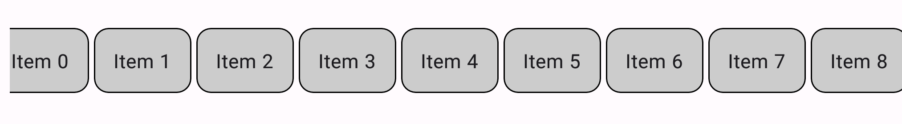
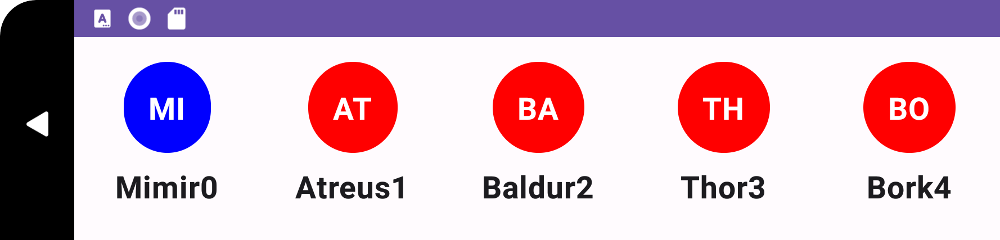
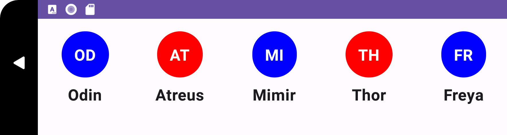

import { Tabs, TabItem } from '@astrojs/starlight/components';

| Material | 
| :----------------: |
|                     |


El `LazyRow` es un componente que crea y dispone los elementos que están visibles en el viewport del mismo, produciendo un desplazamiento horizontal, este sigue los principios de un `RecyclerView`
los cuales son --reciclar-- los elementos individuales, reutilizar la vista para los elementos nuevos que se desplazaron y permitir mostrarlos. 

El primer `LazyRow` estable se añadió en la versión 1.2 de Jetpack Compose, antes de este existió el `ScrollableRow` pero este ha sido removido de toda documentación oficial
por el mismo motivo de incentivar/obligar el uso de su reemplazo `LazyRow`, previo a 1.2 existen referencias de este como un componente en desarrollo, cabe mencionar que `LazyRow` no pertenece a **material.io** por lo que sus variantes han sido las funciones de extensión que este permite
 y ciertas mejoras en su comportamiento/procesamiento, para saber más sobre por qué `ScrollableRow` fue reemplazado por `LazyRow` visita el commit ofical de AOSP [aquí.](https://android-review.googlesource.com/c/platform/frameworks/support/+/1530328)

## Implementación

### Definición del componente

El componente se ha mantenido igual desde su versión en Jetpack Compose [1.2](https://developer.android.com/jetpack/androidx/releases/compose-foundation?hl=es-419#1.2.0)

<Tabs>
<TabItem label="Foundation">

```kotlin frame="terminal"
@Composable
fun LazyRow(
    modifier: Modifier = Modifier,
    state: LazyListState = rememberLazyListState(),
    contentPadding: PaddingValues = PaddingValues(0.dp),
    reverseLayout: Boolean = false,
    horizontalArrangement: Arrangement.Horizontal = if (!reverseLayout) Arrangement.Start else Arrangement.End,
    verticalAlignment: Alignment.Vertical = Alignment.Top,
    flingBehavior: FlingBehavior = ScrollableDefaults.flingBehavior(),
    userScrollEnabled: Boolean = true,
    content: LazyListScope.() -> Unit
)
```

Atributo | Descripción
------ | -----------
modifier | Modificador que implementará el composable (_Opcional_).
state | Un objeto de estado que puede ser alojado para controlar y observar el desplazamiento (_Opcional_).
contentPadding | Añade un espaciado de manera interna a lo largo de los lados del componente (_Opcional_).
reverseLayout | Invertir la dirección de desplazamiento y diseño. Cuando es verdadero, los elementos se presentan en orden inverso (_Opcional_).
horizontalArrangement | La disposición horizontal de los componentes hijos, permitiendo agregar espacios (_Opcional_).
verticalAlignment | Aliniar los elementos verticalment (_Opcional_).
flingBehavior | Lógica para personalizar el comportamiento del desplazamiento (_Opcional_).
userScrollEnabled |  Permite el desplazamiento a través de los gestos del usuario o las acciones de accesibilidad (_Opcional_).
content | El contenido de la lista.

</TabItem>
</Tabs>

:::tip[Fuente]
Puedes acceder a la documentación oficial de Google
[desde aquí](https://developer.android.com/reference/kotlin/androidx/compose/foundation/lazy/package-summary#LazyRow(androidx.compose.ui.Modifier,androidx.compose.foundation.lazy.LazyListState,androidx.compose.foundation.layout.PaddingValues,kotlin.Boolean,androidx.compose.foundation.layout.Arrangement.Horizontal,androidx.compose.ui.Alignment.Vertical,androidx.compose.foundation.gestures.FlingBehavior,kotlin.Boolean,kotlin.Function1)).
:::

### Ejemplos
Existen tres formas para añadir elementos en `LazyRow` mediante sus funciones de extensión:

<Tabs>
<TabItem label="Foundation">

##### LazyRow con item

Usando `item` para definir el elemento que será renderizarado en la pantalla, puedes declarar elemento por elemento simplemente instanciando un nuevo `item` en el contenido de `LazyRow`.

<center>

</center>

```kotlin frame="terminal"
LazyRow(
    modifier = Modifier.padding(top = 16.dp)
) {
    contacts.forEach {
        item(it){
            Avatar(name = it, isFriend = Random.nextBoolean())
        }
    }
}
```

##### LazyRow con items

Con `items` debes definir el número total de elementos, consecuentemente la invocación lambda proporcionará el index de cada elemento con el nombre de `it`,
esto parece ser lo mismo que un forEach como el ejemplo anterior pero difieren en sintaxis y método de iteración, el forEach itera directamente sobre los elementos de la lista mientras que `items` es más conciso y se basa en índices.

<center>

</center>

```kotlin frame="terminal"
LazyRow(
    modifier = Modifier.padding(top = 16.dp)
) {
    items(contacts.size) { it ->
        Avatar(name = contacts[it] + it, isFriend = Random.nextBoolean())
    }
}
```

##### LazyRow con itemsIndexed

El uso de `itemsIndexed` permite acceder tanto al índice como al valor de cada elemento directamente dentro de la función Composable, lo que brinda más flexibilidad en la creación de elementos según la posición dentro de la lista.

<center>

</center>

```kotlin frame="terminal"
LazyRow(
    modifier = Modifier.padding(top = 16.dp)
) {
    itemsIndexed(contacts) { index, contact ->
        Avatar(name = contact, isFriend = index % 2 == 0)
    }
}
```

:::note[Nota]
Puedes combinar el uso de `item`, `items` e `itemsIndexed`, ¡En la misma `LazyRow`!
:::
</TabItem>
</Tabs>

:::tip[Fuente]
Para saber más de estas funciones de extensión no dudes visitar la documentacion oficial [aquí](https://developer.android.com/reference/kotlin/androidx/compose/foundation/lazy/package-summary#extension-functions)
:::