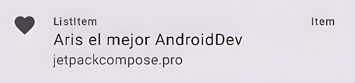
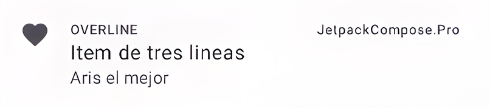

import { Tabs, TabItem } from "@astrojs/starlight/components";

| Material| Material 3| 
| :----------------: | :------: |
|

El componente `ListItem` es un componente de `Jetpack Compose` que se utiliza para representar un elemento de una lista. Puede ser utilizado en cualquier tipo de lista, ya sea una lista vertical o horizontal.

Cada elemento de la lista se muestra como una entidad independiente, con su propio conjunto de atributos, como texto, iconos e imágenes.

Las listas tienden a tener una estructura más jerárquica, donde cada elemento de la lista ocupa su propio espacio y tiene el mismo peso visual.
## Implementación

### Definición del componente:
<Tabs>
<TabItem label="Material">

```kotlin frame="terminal"
@Composable
fun ListItem(
    text: String,
    modifier: Modifier = Modifier,
    onClick: () -> Unit = {},
)
```
#### Los parámetros del componente en Material son los siguientes:
En Material, el componente List item se implementa como un componente independiente. Tiene los siguientes atributos:

Atributo | Descripción
------ | -----------
text | El texto que se mostrará en el elemento de la lista.
modifier | El modifier que se aplicará al elemento de la lista.
onClick | Una función que se ejecutará cuando el elemento de la lista sea tocado.

</TabItem>

<TabItem label="Material 3">

En Material 3 los `ListItem` son increíblemente fácil e intuitivos. Para comenzar, deberás agregar la `dependencia` Material 3 a tu proyecto y luego simplemente agregar un componente `ListItem`.

Uno de los principales beneficios de utilizar ListItem en Material 3 es que es increíblemente fácil de usar y personalizar. Esto lo convierte en un componente ideal para desarrolladores que desean crear listas hermosas y funcionales sin perder demasiado tiempo en la personalización.

```kotlin frame="terminal"
@Composable
fun ListItem(
    text: String,
    modifier: Modifier = Modifier,
    isChecked: Boolean,
    onClick: () -> Unit = {},
)

```
#### Los parámetros del componente en Material 3 son los siguientes:

Atributo | Descripción
------ | -----------
text | El texto que se mostrará en el elemento de la lista.
modifier | El modifier que se aplicará al elemento de la lista.
isChecked | Un booleano que indica si el elemento de la lista está seleccionado.
onClick | Una función que se ejecutará cuando el elemento de la lista sea tocado.


</TabItem>
</Tabs>


:::tip[Fuente]
Puedes acceder a la documentación oficial de Google
[desde aquí](https://developer.android.com/reference/kotlin/androidx/compose/runtime/package-summary).
:::

### Ejemplos

<Tabs>
<TabItem label="Material">

<center></center>

```kotlin frame="terminal"
@Composable
fun ItemOneLine() {
    ListItem(
        headlineContent = { Text("AristiDevs") },
        leadingContent = {
            Icon(
                Icons.Filled.Favorite,
                contentDescription = "Corazon icon",
            )
        }
    )
}

```

</TabItem>
<TabItem label="Material 3">

<center></center>
```kotlin frame="terminal"
@Composable
fun ItemMaterial3() {
    ListItem(
        headlineContent = { Text("Item de tres lineas") },
        overlineContent = { Text("OVERLINE") },
        supportingContent = { Text("Aris el mejor") },
        leadingContent = {
            Icon(
                Icons.Filled.Favorite,
                contentDescription = "Icono de corazon",
            )
        },
        trailingContent = { Text("JetpackCompose.Pro") }
    )
}
```

Utilizar ListItem en Material 3 es una excelente adición al desarrollo de aplicaciones de Android, ya que proporciona una forma sencilla y optimizada de crear listas además de LazyColumn o LazyRow.

Este nuevo componente es fácil de usar y personalizar, incluso podríamos utilizarlo como un `scaffold` u otro tipo de layout dedicado a otros componentes.

PD: ¡No tiene que usarse exclusivamente en un ListItem!

</TabItem>
</Tabs>
