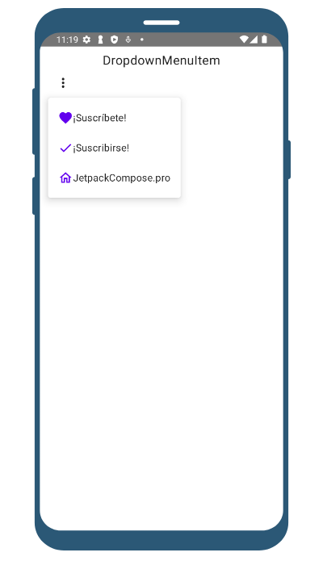
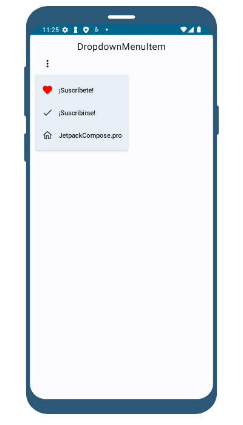

import { Tabs, TabItem } from '@astrojs/starlight/components';

| Material| Material 3| 
| :----------------: | :------: |
![Imagen del componente - Material [DropdownMenuItem]](../../../assets/menus/dropdownmenuitem/MaterialDesignCut.png)|![Imagen del componente - Material 3 [DropdownMenuItem]](../../../assets/menus/dropdownmenuitem/Material3.png)

Un `DropdownMenuItem` es un componente de Jetapack Compose que representa un elemento individual dentro de un menú desplegable.
Se utiliza dentro de un `DropdownMenu` para definir cada opción seleccionable en el menú.
Cada `DropdownMenuItem` puede contener cualquier contenido Compose, como texto, iconos o cualquier otro componente.
## Implementación
### Definición del componente

<Tabs>

<TabItem label="Material">

```kotlin frame="terminal"
@Composable
fun MaterialDropdownMenuItem(
    text: @Composable () -> Unit,
    onClick: () -> Unit,
    modifier: Modifier = Modifier,
    leadingIcon: @Composable (() -> Unit)? = null,
    trailingIcon: @Composable (() -> Unit)? = null,
    enabled: Boolean = true,
    colors: MenuItemColors = MenuDefaults.itemColors(),
    contentPadding: PaddingValues = MenuDefaults.DropdownMenuItemContentPadding,
    interactionSource: MutableInteractionSource = remember { MutableInteractionSource() },
)
```
#### Los parámetros del componente en Material son los siguientes:

Atributo | Descripción
------ | -----------
text | Es el nombre del Item.
modifier | El modifier que se aplicará al elemento.
onClick | Es llamado cuando el item del DropdownMenu es clickeado.
leadingIcon | Icono principal opcional que se mostrará al principio del texto del elemento.
trailingIcon | Icono final opcional que se mostrará al final del texto del elemento.
enabled | Si el elemento está habilitado o no. Cuando es falso, este componente no responderá a la entrada del usuario y aparecerá visualmente deshabilitado y deshabilitado para los servicios de accesibilidad.
colors | Colores del Item del menu en diferentes estados.
interactionSource | Podemos ver y customizar a nuestro gusto la interaccion con el Icon, por ejemplo podemos activar o desactivar el efecto domino (ripple effect).

</TabItem>

<TabItem label="Material 3">

```kotlin frame="terminal"
@Composable
fun DropdownMenuItem(
    text: @Composable () -> Unit,
    onClick: () -> Unit,
    modifier: Modifier = Modifier,
    leadingIcon: @Composable (() -> Unit)? = null,
    trailingIcon: @Composable (() -> Unit)? = null,
    enabled: Boolean = true,
    colors: MenuItemColors = MenuDefaults.itemColors(),
    contentPadding: PaddingValues = MenuDefaults.DropdownMenuItemContentPadding,
    interactionSource: MutableInteractionSource = remember { MutableInteractionSource() },     
)
```
#### Los parámetros del componente DropdownMenuItem:

Atributo | Descripción
------ | -----------
text | Es el nombre del Item.
modifier | El modifier que se aplicará al elemento.
onClick | Es llamado cuando el item del DropdownMenu es clickeado.
leadingIcon | Icono principal opcional que se mostrará al principio del texto del elemento.
trailingIcon | Icono final opcional que se mostrará al final del texto del elemento.
enabled | Si el elemento está habilitado o no. Cuando es falso, este componente no responderá a la entrada del usuario y aparecerá visualmente deshabilitado y deshabilitado para los servicios de accesibilidad.
colors | Colores del Item del menu en diferentes estados.
interactionSource | Podemos ver y customizar a nuestro gusto la interaccion con el Icon, por ejemplo podemos activar o desactivar el efecto domino (ripple effect).

</TabItem>

</Tabs>

[comment]: <> (No modifiques el tip)

:::tip[Fuente]
Puedes acceder a la documentación oficial de Google
[desde aquí](https://developer.android.com/reference/kotlin/androidx/compose/runtime/package-summary).
:::

### Ejemplos

<Tabs>

<TabItem label="Material">

<center></center>

```kotlin frame="terminal"
@Composable
fun DropDownMenuItem() {
    var expanded by remember { mutableStateOf(false) }
    val contextForToast = LocalContext.current.applicationContext

    Column(
        modifier = Modifier
            .fillMaxSize(),
        horizontalAlignment = Alignment.CenterHorizontally
    ) {
        Text(text = "DropdownMenuItem", Modifier.padding(top = 10.dp), fontSize = 20.sp)

        Box(
            modifier = Modifier
                .fillMaxSize()
                .padding(start = 15.dp)
                .wrapContentSize(align = Alignment.TopStart),
            contentAlignment = Alignment.Center
        ) {
            IconButton(
                onClick = {
                    expanded = true
                }
            ) {
                Icon(
                    imageVector = Icons.Default.MoreVert,
                    contentDescription = "Open Menu"
                )
            }
            DropdownMenu(
                expanded = expanded,
                onDismissRequest = { expanded = false }
            ) {
                DropdownMenuItem(
                    onClick = {
                        Toast.makeText(contextForToast, "¡Suscrito!", Toast.LENGTH_SHORT).show()
                        expanded = false
                    },
                ) {
                    Icon(
                        imageVector = Icons.Outlined.Favorite,
                        contentDescription = null,
                        tint = MaterialTheme.colors.primary
                    )
                    Text("¡Suscríbete!")
                }

                DropdownMenuItem(
                    onClick = {
                        Toast.makeText(contextForToast, "Suscribir", Toast.LENGTH_SHORT).show()
                        expanded = false
                    },
                ) {
                    Icon(
                        imageVector = Icons.Outlined.Check,
                        contentDescription = null,
                        tint = MaterialTheme.colors.primary
                    )
                    Text("¡Suscribirse!")
                }

                DropdownMenuItem(
                    onClick = {
                        Toast.makeText(contextForToast, "JetpackCompose.pro", Toast.LENGTH_SHORT)
                            .show()
                        expanded = false
                    },
                ) {
                    Icon(
                        imageVector = Icons.Outlined.Home,
                        contentDescription = null,
                        tint = MaterialTheme.colors.primary
                    )
                    Text("JetpackCompose.pro")
                }
            }
        }
    }
}

```

</TabItem>

<TabItem label="Material 3">

<center></center>

```kotlin frame="terminal"
@Composable
fun DropDownMenuItem() {
    var expanded by remember { mutableStateOf(false) }
    val contextForToast = LocalContext.current.applicationContext

    Column(
        modifier = Modifier
            .fillMaxSize(),
        horizontalAlignment = Alignment.CenterHorizontally
    ) {
        Text(text = "DropdownMenuItem", Modifier.padding(top = 10.dp), fontSize = 20.sp)

        Box(
            modifier = Modifier
                .fillMaxSize()
                .padding(start = 15.dp)
                .wrapContentSize(align = Alignment.TopStart),
            contentAlignment = Alignment.Center
        ) {
            IconButton(
                onClick = {
                    expanded = true
                }
            ) {
                Icon(
                    Icons.Default.MoreVert,
                    contentDescription = "Open Menu"
                )
            }
            DropdownMenu(
                expanded = expanded,
                onDismissRequest = { expanded = false }
            ) {
                DropdownMenuItem(
                    text = {
                        Text("¡Suscríbete!")
                    },
                    onClick = {
                        Toast.makeText(contextForToast, "¡Suscrito😎!", Toast.LENGTH_SHORT).show()
                        expanded = false
                    },
                    leadingIcon = {
                        Icon(
                            Icons.Outlined.Favorite,
                            contentDescription = null,
                            tint = androidx.compose.ui.graphics.Color.Red
                        )
                    }
                )

                DropdownMenuItem(
                    text = {
                        Text("¡Suscribirse!")
                    },
                    onClick = {
                        Toast.makeText(contextForToast, "Suscribir🙏", Toast.LENGTH_SHORT).show()
                        expanded = false
                    },
                    leadingIcon = {
                        Icon(
                            Icons.Outlined.Check,
                            contentDescription = null,
                            tint = androidx.compose.ui.graphics.Color.DarkGray
                        )
                    }
                )

                DropdownMenuItem(
                    text = {
                        Text("JetpackCompose.pro")
                    },
                    onClick = {
                        Toast.makeText(contextForToast, "JetpackCompose.pro", Toast.LENGTH_SHORT)
                            .show()
                        expanded = false
                    },
                    leadingIcon = {
                        Icon(
                            Icons.Outlined.Home,
                            contentDescription = null,
                            tint = androidx.compose.ui.graphics.Color.DarkGray
                        )
                    }
                )
            }
        }
    }
}
```

</TabItem>
</Tabs>

