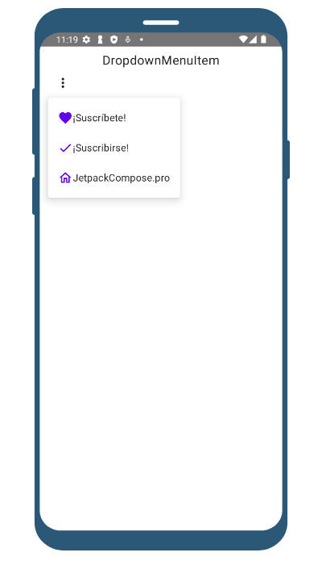
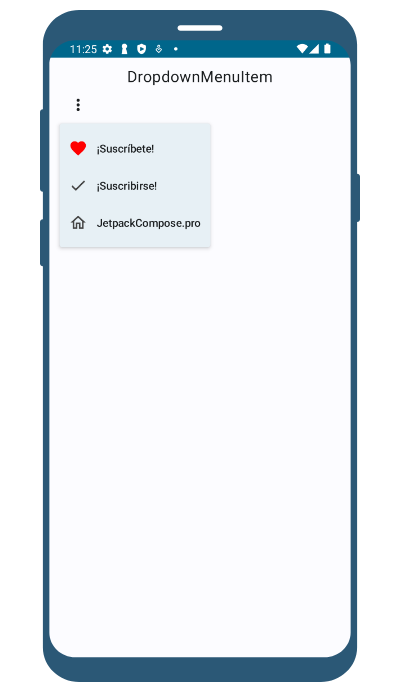

import { Tabs, TabItem } from '@astrojs/starlight/components';

| Material| Material 3| 
| :----------------: | :------: |
![Imagen del componente - Material [DropdownMenu]](../../../assets/menus/dropdownmenu/MaterialDesignCut.png)|![Imagen del componente - Material 3 [DropdownMenu]](../../../assets/menus/dropdownmenu/Material3.png)

Un DropdownMenu es un componente de Jetpack Compose que representa un menú desplegable. Se utiliza para definir cada opción seleccionable en el menú.
 Cada DropdownMenuItem puede contener cualquier contenido Compose, como texto, iconos o cualquier otro componente.
## Implementación
### Definición del componente

<Tabs>

<TabItem label="Material">

```kotlin frame="terminal"
@Composable
fun MaterialDropdownMenu(
    text: @Composable () -> Unit,
    onClick: () -> Unit,
    modifier: Modifier = Modifier,
    leadingIcon: @Composable (() -> Unit)? = null,
    trailingIcon: @Composable (() -> Unit)? = null,
    enabled: Boolean = true,
    colors: MenuItemColors = MenuDefaults.itemColors(),
    contentPadding: PaddingValues = MenuDefaults.DropdownMenuItemContentPadding,
    interactionSource: MutableInteractionSource = remember { MutableInteractionSource() },
)
```
#### Los parámetros del componente en Material son los siguientes:

Atributo | Descripción
------ | -----------
text | Es el nombre del DropdownMenu.
modifier | El modifier que se aplicará al DropdownMenu.
onClick | Es llamado cuando el item del DropdownMenu es clickeado.
leadingIcon | Icono principal opcional que se mostrará al principio del texto del DropdownMenu.
trailingIcon | Icono final opcional que se mostrará al final del texto del DropdownMenu.
colors | Colores del DropdownMenu en diferentes estados.
enabled | Si el DropdownMenu está habilitado o no. Cuando es falso, este componente no responderá a la entrada del usuario y aparecerá visualmente deshabilitado y deshabilitado para los servicios de accesibilidad.
interactionSource | Podemos ver y customizar a nuestro gusto la interaccion con el DropdownMenu, por ejemplo, podemos activar o desactivar el efecto domino (ripple effect).

</TabItem>

<TabItem label="Material 3">

```kotlin frame="terminal"
@Composable
fun DropdownMenu(
    text: @Composable () -> Unit,
    onClick: () -> Unit,
    modifier: Modifier = Modifier,
    leadingIcon: @Composable (() -> Unit)? = null,
    trailingIcon: @Composable (() -> Unit)? = null,
    enabled: Boolean = true,
    colors: MenuItemColors = MenuDefaults.itemColors(),
    contentPadding: PaddingValues = MenuDefaults.DropdownMenuItemContentPadding,
    interactionSource: MutableInteractionSource = remember { MutableInteractionSource() },     
)
```
#### Los parámetros del componente DropdownMenu:

Atributo | Descripción
------ | -----------
text | Es el nombre del DropdownMenu.
modifier | El modifier que se aplicará al DropdownMenu.
onClick | Es llamado cuando el item del DropdownMenu es clickeado.
leadingIcon | Icono principal opcional que se mostrará al principio del texto del DropdownMenu.
trailingIcon | Icono final opcional que se mostrará al final del texto del DropdownMenu.
colors | Colores del DropdownMenu en diferentes estados.
enabled | Si el DropdownMenu está habilitado o no. Cuando es falso, este componente no responderá a la entrada del usuario y aparecerá visualmente deshabilitado y deshabilitado para los servicios de accesibilidad.
interactionSource | Podemos ver y customizar a nuestro gusto la interaccion con el DropdownMenu, por ejemplo, podemos activar o desactivar el efecto domino (ripple effect).

</TabItem>

</Tabs>

[comment]: <> (No modifiques el tip)

:::tip[Fuente]
Puedes acceder a la documentación oficial de Google
[desde aquí](https://developer.android.com/reference/kotlin/androidx/compose/runtime/package-summary).
:::

### Ejemplos

<Tabs>

<TabItem label="Material">

<center></center>

```kotlin frame="terminal"
@Composable
fun DropDownMenu() {
    var expanded by remember { mutableStateOf(false) }
    val contextForToast = LocalContext.current.applicationContext

    Column(
        modifier = Modifier
            .fillMaxSize(),
        horizontalAlignment = Alignment.CenterHorizontally
    ) {
        Text(text = "DropdownMenu", Modifier.padding(top = 10.dp), fontSize = 20.sp)

        Box(
            modifier = Modifier
                .fillMaxSize()
                .padding(start = 15.dp)
                .wrapContentSize(align = Alignment.TopStart),
            contentAlignment = Alignment.Center
        ) {
            IconButton(
                onClick = {
                    expanded = true
                }
            ) {
                Icon(
                    imageVector = Icons.Default.MoreVert,
                    contentDescription = "Open Menu"
                )
            }
            DropdownMenu(
                expanded = expanded,
                onDismissRequest = { expanded = false }
            ) {
                DropdownMenuItem(
                    onClick = {
                        Toast.makeText(contextForToast, "¡Suscrito!", Toast.LENGTH_SHORT).show()
                        expanded = false
                    },
                ) {
                    Icon(
                        imageVector = Icons.Outlined.Favorite,
                        contentDescription = null,
                        tint = MaterialTheme.colors.primary
                    )
                    Text("¡Suscríbete!")
                }

                DropdownMenuItem(
                    onClick = {
                        Toast.makeText(contextForToast, "Suscribir", Toast.LENGTH_SHORT).show()
                        expanded = false
                    },
                ) {
                    Icon(
                        imageVector = Icons.Outlined.Check,
                        contentDescription = null,
                        tint = MaterialTheme.colors.primary
                    )
                    Text("¡Suscribirse!")
                }

                DropdownMenuItem(
                    onClick = {
                        Toast.makeText(contextForToast, "JetpackCompose.pro", Toast.LENGTH_SHORT)
                            .show()
                        expanded = false
                    },
                ) {
                    Icon(
                        imageVector = Icons.Outlined.Home,
                        contentDescription = null,
                        tint = MaterialTheme.colors.primary
                    )
                    Text("JetpackCompose.pro")
                }
            }
        }
    }
}

```
</TabItem>

<TabItem label="Material 3">

<center></center>

```kotlin frame="terminal"
@Composable
fun DropDownMenu() {
    var expanded by remember { mutableStateOf(false) }
    val contextForToast = LocalContext.current.applicationContext

    Column(
        modifier = Modifier
            .fillMaxSize(),
        horizontalAlignment = Alignment.CenterHorizontally
    ) {
        Text(text = "DropdownMenuItem", Modifier.padding(top = 10.dp), fontSize = 20.sp)

        Box(
            modifier = Modifier
                .fillMaxSize()
                .padding(start = 15.dp)
                .wrapContentSize(align = Alignment.TopStart),
            contentAlignment = Alignment.Center
        ) {
            IconButton(
                onClick = {
                    expanded = true
                }
            ) {
                Icon(
                    Icons.Default.MoreVert,
                    contentDescription = "Open Menu"
                )
            }
            DropdownMenu(
                expanded = expanded,
                onDismissRequest = { expanded = false }
            ) {
                DropdownMenuItem(
                    text = {
                        Text("¡Suscríbete!")
                    },
                    onClick = {
                        Toast.makeText(contextForToast, "¡Suscrito😎!", Toast.LENGTH_SHORT).show()
                        expanded = false
                    },
                    leadingIcon = {
                        Icon(
                            Icons.Outlined.Favorite,
                            contentDescription = null,
                            tint = androidx.compose.ui.graphics.Color.Red
                        )
                    }
                )

                DropdownMenuItem(
                    text = {
                        Text("¡Suscribirse!")
                    },
                    onClick = {
                        Toast.makeText(contextForToast, "Suscribir🙏", Toast.LENGTH_SHORT).show()
                        expanded = false
                    },
                    leadingIcon = {
                        Icon(
                            Icons.Outlined.Check,
                            contentDescription = null,
                            tint = androidx.compose.ui.graphics.Color.DarkGray
                        )
                    }
                )

                DropdownMenuItem(
                    text = {
                        Text("JetpackCompose.pro")
                    },
                    onClick = {
                        Toast.makeText(contextForToast, "JetpackCompose.pro", Toast.LENGTH_SHORT)
                            .show()
                        expanded = false
                    },
                    leadingIcon = {
                        Icon(
                            Icons.Outlined.Home,
                            contentDescription = null,
                            tint = androidx.compose.ui.graphics.Color.DarkGray
                        )
                    }
                )
            }
        }
    }
}
```

</TabItem>
</Tabs>

