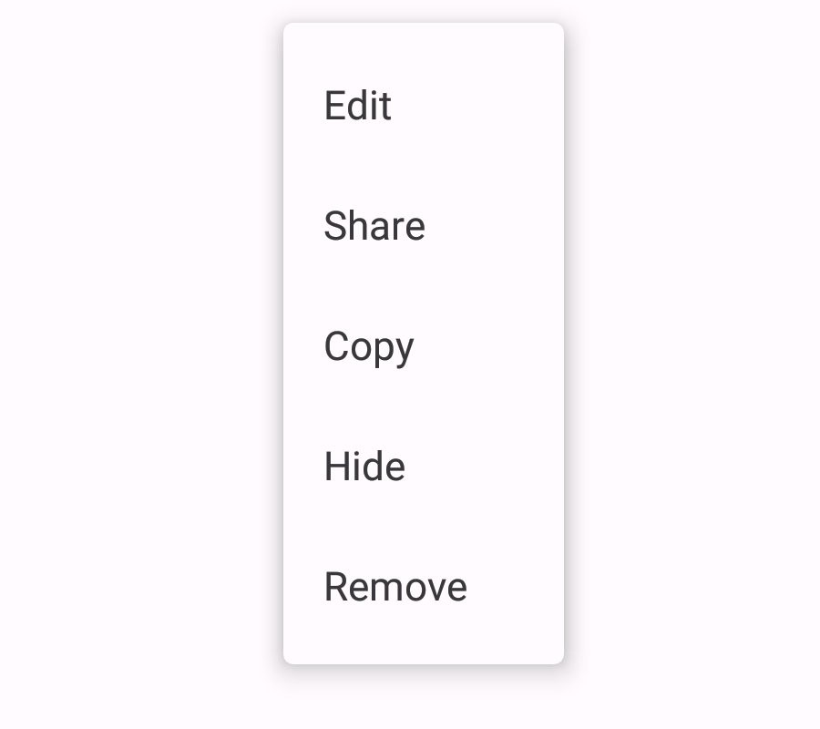

import { Tabs, TabItem } from '@astrojs/starlight/components';



El DropdownMenu es un componente que se comporta de manera similar al `Popup` en android, este utilizará la posición actual de su padre 
en el layout principal como una _ancla_ donde se desplegará el DropdownMenu, es importante recodar que el compinente no tomará ningun espacio adicional
en el layout ya que se despliega en una ventana separada especificamente desde el top del componente padre. 


## Implementación

### Definición del componente

<Tabs>
<TabItem label="Material">

```kotlin frame="terminal"
@Composable
fun DropdownMenu(
    expanded: Boolean,
    onDismissRequest: () -> Unit,
    focusable: Boolean = true,
    modifier: Modifier = Modifier,
    offset: DpOffset = DpOffset(0.dp, 0.dp),
    scrollState: ScrollState = rememberScrollState(),
    content: @Composable ColumnScope.() -> Unit
): Unit
```

- expanded: Permitir que se muestre.
- onDismissRequest: Callback cuando se hace tap fuera del menu.
- focusable: Perrmitir que pueda ser _"enfocado"_ por el `FocusManager` (_Opcional_).
- modifier:  Modificador que implementará el composable (_Opcional_).
- offset: Ajusta la posición del menú para los casos en que los límites de diseño de su padre no coincidan con sus límites visuales (_Opcional_).
- scrollState: Un controlador de estado para el desplazamiento vertical (_Opcional_).
- content: El contenido del menu usualmente una lista de `DropdownMenuItem`.

</TabItem>
<TabItem label="Material 3">

```kotlin frame="terminal"
@Composable
fun DropdownMenu(
    expanded: Boolean,
    onDismissRequest: () -> Unit,
    modifier: Modifier = Modifier,
    offset: DpOffset = DpOffset(0.dp, 0.dp),
    scrollState: ScrollState = rememberScrollState(),
    properties: PopupProperties = PopupProperties(focusable = true),
    content: @Composable ColumnScope.() -> Unit
): Unit
```
- expanded: Permitir que se muestre.
- onDismissRequest: Callback cuando se hace tap fuera del menu.
- modifier:  Modificador que implementará el composable (_Opcional_),
- offset: Ajusta la posición del menú para los casos en que los límites de diseño de su padre no coincidan con sus límites visuales (_Opcional_).
- scrollState: Un controlador de estado para el desplazamiento vertical (_Opcional_).
- properties: Añade propiedades extra para una mayor personalización del comportamiento de la ventana emergente (`Popup`) (_Opcional_).
- content: El contenido del menu usualmente una lista de `DropdownMenuItem`.

</TabItem>
</Tabs>

[comment]: <> (No modifiques el tip)

:::tip[Fuente]
Puedes acceder a la documentación oficial de Google
[desde aquí](https://developer.android.com/reference/kotlin/androidx/compose/material/package-summary#DropdownMenu(kotlin.Boolean,kotlin.Function0,kotlin.Boolean,androidx.compose.ui.Modifier,androidx.compose.ui.unit.DpOffset,androidx.compose.foundation.ScrollState,kotlin.Function1)).
:::

### Ejemplos

<Tabs>
<TabItem label="Material 3 - Boton Icono">

```kotlin frame="terminal"
IconButton(onClick = {isDropdownOpen = true}) {
    Icon(
        painter = painterResource(id = R.drawable.ic_dots),
        tint = Color.White,
        contentDescription = null
    )
      DropdownMenu(
        expanded = isDropdownOpen,
        modifier = Modifier.background(color = Color.Black),
        offset = DpOffset(0.dp, -20.dp), // aparece 20dp más arriba del IconButton
        properties = PopupProperties(dismissOnBackPress = true), // cerrar el menu si se navega hacia atrás
        onDismissRequest = { isDropdownOpen = false }
    ) {
        Text(text = "Edit") // Mejor usar DropdowMenuItem
        Text(text = "Share")
        Text(text = "Delete")
    }
}
```
<center>

</center>

</TabItem>
<TabItem label="Material 3 - Box">

```kotlin frame="terminal"
Box(modifier = Modifier
    .fillMaxSize()
    .wrapContentSize(Alignment.TopEnd)) {

    IconButton(onClick = { isDropdownOpen = true }) {
        Icon(
            painter = painterResource(id = R.drawable.ic_dots),
            tint = Color.LightGray,
            contentDescription = null
        )
    }
    DropdownMenu(
        expanded = isDropdownOpen,
        modifier = Modifier.background(color = Color.Black),
        offset = DpOffset(0.dp, -20.dp), // aparece 20dp más arriba de su posición en el Box
        properties = PopupProperties(dismissOnBackPress = true),
        onDismissRequest = { isDropdownOpen = false }
    ) {
        Text(text = "Edit") //  Mejor usar DropdowMenuItem
        Text(text = "Share")
        Text(text = "Delete")
    }
}
```
<center>

</center>
</TabItem>
</Tabs>