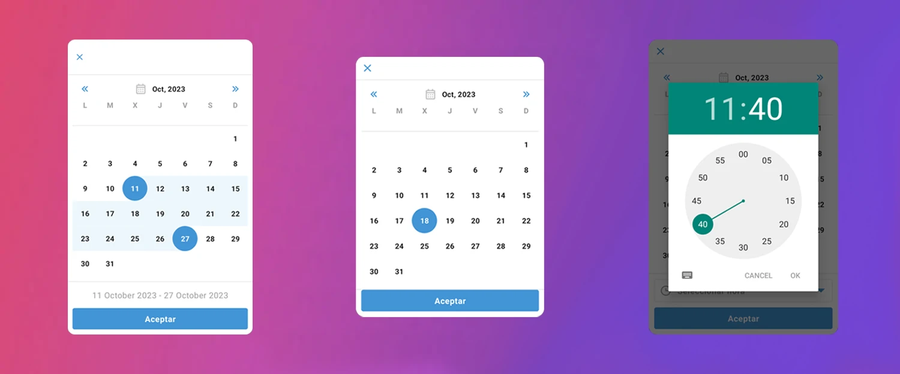

import { Tabs, TabItem } from "@astrojs/starlight/components";



Compose Calendar es una biblioteca que proporciona un conjunto de elementos de interfaz de usuario para seleccionar fechas y horas en Jetpack Compose.

## Implementación 

Agregue la siguiente dependencia al archivo `build.gradle` de su módulo: 

```groovy frame="terminal"
dependencies {
    implementation 'com.github.OrlanDroyd:ComposeCalendar:1.1.0'
}
```

Agregue el repositorio en su archivo `settings.gradle`:

```groovy frame="terminal"
dependencyResolutionManagement {
    repositories {
        ...
        maven { url 'https://jitpack.io' }
    }
}
```

### Definición del componente

<Tabs>
<TabItem label="DatePickerDlg">

```kotlin frame="terminal"
@Composable
fun DatePickerDlg(
    visible: Boolean,
    title: String = "",
    showSetHours: Boolean = false,
    titleColor: Color = Color(0xFF4395D6),
    dialogColor: Color = Color(0xB1000000),
    primaryColor: Color = Color(0xFF4395D6),
    primaryTextColor: Color = Color(0xFF1A1A1A),
    secondaryTextColor: Color = Color(0xFF9F9E9E),
    surfaceColor: Color = Color(0xFFFFFFFF),
    dividerColor: Color = Color(0xFFE2E2E2),
    iconsColor: Color = Color(0xFF9F9E9E),
    acceptTextColor: Color = Color(0xFFFFFFFF),
    accentColor: Color = Color(0xFF4395D6),
    acceptText: String = "Aceptar",
    messageFutureHours: String = "La hora debe estar en el futuro",
    messageSelectedHours: String = "Seleccionar hora",
    currentSelection: Date? = null,
    onDateSelected: (Date) -> Unit = {},
    onClose: () -> Unit = {},
)
```

- **visible**: El badged a mostrar - normalmente se usa un componente.
- **title**: Título (_Opcional_).
- **showSetHours**: Parámetro para definir si pedir solo fecha, o fecha y hora (_Opcional_).
- **titleColor**: Color del título (_Opcional_).
- **dialogColor**: Color del diálogo (_Opcional_).
- **primaryColor**: Color primario (_Opcional_).
- **primaryTextColor**: Color del texto primario (_Opcional_).
- **secondaryTextColor**: Color del texto secundario (_Opcional_).
- **surfaceColor**: Color de la superficie (_Opcional_).
- **dividerColor**: Color del divisor (_Opcional_).
- **iconsColor**: Color de los iconos (_Opcional_).
- **acceptTextColor**: Color del texto aceptar (_Opcional_).
- **accentColor**: Color de acentuación (_Opcional_).
- **acceptText**: Texto de confiración (_Opcional_).
- **messageFutureHours**: Mensaje de error en caso de seleccionar una hora pasada (_Opcional_).
- **messageSelectedHours**: Titulo del dialogo de selección de horas (_Opcional_).
- **currentSelection**: Fecha personalizada al iniciar la selección (_Opcional_).
- **onDateSelected**: Lambda que retorna la fecha seleccionada (_Opcional_).
- **onClose**: Lambda al cerrar el diálogo (_Opcional_).

</TabItem>

<TabItem label="DateRangePickerDlg">

```kotlin frame="terminal"
@Composable
fun DateRangePickerDlg(
    visible: Boolean,
    title: String = "",
    txtSelectHour: String = "Seleccionar hora",
    acceptText: String = "Aceptar",
    primaryColor: Color = Color(0xFF4395D6),
    surfaceColor: Color = Color(0xFFFFFFFF),
    dialogColor: Color = Color(0xB1000000),
    secondaryColor: Color = Color(0xFF9F9E9E),
    dividerColor: Color = Color(0xFFE2E2E2),
    secondaryTextColor: Color = Color(0xFF9F9E9E),
    accentColor: Color = Color(0xFF4395D6),
    acceptTextColor: Color = Color(0xFFFFFFFF),
    primaryTextColor: Color = Color(0xFF1A1A1A),
    currentSelection: Pair<Date, Date>? = null,
    onDatesSelected: (Pair<Date, Date>) -> Unit = {},
    onClearFilter: () -> Unit = {},
    onClose: () -> Unit = {},
)
```

- **visible**: Visibilidad del componente.
- **title**: Título (_Opcional_).
- **txtSelectHour**: Título del dialogo de selección de horas (_Opcional_).
- **acceptText**:  Texto de confiración (_Opcional_).
- **primaryColor**: Color primario (_Opcional_).
- **surfaceColor**: Color de la superficie (_Opcional_).
- **dialogColor**: Color del diálogo (_Opcional_).
- **secondaryColor**: Color secundario (_Opcional_).
- **dividerColor**: Color del divisor (_Opcional_).
- **secondaryTextColor**: Color del texto secundario (_Opcional_).
- **accentColor**: Color de acentuación (_Opcional_).
- **acceptTextColor**: Color del texto aceptar (_Opcional_).
- **primaryTextColor**: Color del texto primario (_Opcional_).
- **currentSelection**: Fecha personalizada al iniciar la selección (_Opcional_).
- **onDatesSelected**: Lambda que retorna la fecha seleccionada (_Opcional_).
- **onClearFilter**: Lambda al limpiar el filtro (_Opcional_).
- **onClose**: Lambda al cerrar el diálogo (_Opcional_).

</TabItem>

<TabItem label="MonthYearPickerDlg">

```kotlin frame="terminal"
@Composable
fun MonthYearPickerDlg(
    visible: Boolean,
    textTile: String = "Fecha de caducidad",
    dialogColor: Color = Color(0xB1000000),
    accentColor: Color = Color(0xFFF39D00),
    currentSelection: Date? = null,
    onDateSelected: (Date) -> Unit = {},
    onClose: () -> Unit = {},
)
```

- **visible**: Visibilidad del componente.
- **textTile**: Título (_Opcional_).
- **dialogColor**: Color del diálogo (_Opcional_).
- **accentColor**: Color de acentuación (_Opcional_).
- **currentSelection**: Fecha personalizada al iniciar la selección (_Opcional_).
- **onDateSelected**: Lambda que retorna la fecha seleccionada (_Opcional_).
- **onClose**: Lambda al cerrar el diálogo (_Opcional_).

</TabItem>

</Tabs>

:::tip[Fuente]
Puedes acceder a la documentación oficial del componente
[desde aquí](https://github.com/OrlanDroyd/ComposeCalendar).
:::

## Ejemplos

### Fecha específica

```kotlin frame="terminal"
var isVisible by remember { mutableStateOf(true) }
DatePickerDlg(    
    visible = isVisible,    
    onClose = { isVisible = false },    
    onDateSelected = { isVisible = false }
)
```

</img>

### Fecha y hora

```kotlin frame="terminal"
var isVisible by remember { mutableStateOf(true) }
DatePickerDlg(
        visible = isVisible,    
        showSetHours = true,    
        onClose = { isVisible = false },    
        onDateSelected = { isVisible = false }
)
```

</img>

### Rango de fechas

```kotlin frame="terminal"
var isVisible by remember { mutableStateOf(true) }
DateRangePickerDlg(    
    visible = isVisible,    
    onClose = { isVisible = false },    
    onDatesSelected = { isVisible = false }
)
```

</img>

### Solo mes y año

```kotlin frame="terminal"
var isVisible by remember { mutableStateOf(true) }
MonthYearPickerDlg(    
    visible = isVisible,    
    onClose = { isVisible = false },    
    onDateSelected = { isVisible = false }
)
```

</img>