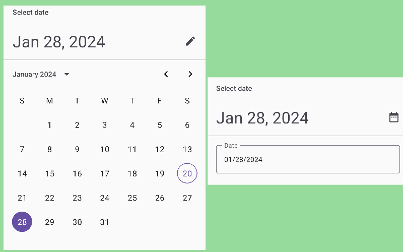

import { Tabs, TabItem } from "@astrojs/starlight/components";

[comment]: <> (La ruta siempre será assets/nombeComponente/componente-header.webp)

|                                              Material 3                                              |
| :--------------------------------------------------------------------------------------------------: |
|  |

Los DatePicker brindan al usuario la posibilidad de seleccionar una fecha, preferiblemente deben integrarse en un cuadro de diálogo, como un DatePickerDialog.

De forma predeterminada, los DatePicker permiten seleccionar la fecha a través de un calendario. Sin embargo, también permiten cambiar al modo de entrada de fecha para ingresar datos utilizando los números del teclado.

Este componente fue agregado en Material 3.

## Implementación

### Definición del componente

[comment]: <> (Añade un `TabItem` por cada tipo de implementación que tenga)

<Tabs>
<TabItem label="Material 3">

```kotlin frame="terminal"
@ExperimentalMaterial3Api
@Composable
fun DatePicker(
    state: DatePickerState,
    modifier: Modifier = Modifier,
    dateFormatter: DatePickerFormatter = remember { DatePickerDefaults.dateFormatter() },
    title: (@Composable () -> Unit)? = {
        DatePickerDefaults.DatePickerTitle(
            displayMode = state.displayMode,
            modifier = Modifier.padding(DatePickerTitlePadding)
        )
    },
    headline: (@Composable () -> Unit)? = {
        DatePickerDefaults.DatePickerHeadline(
            selectedDateMillis = state.selectedDateMillis,
            displayMode = state.displayMode,
            dateFormatter = dateFormatter,
            modifier = Modifier.padding(DatePickerHeadlinePadding)
        )
    },
    showModeToggle: Boolean = true,
    colors: DatePickerColors = DatePickerDefaults.colors()
): Unit
```

| Atributo       | Descripción                                                                                                                                                                                                                                                                                                                                                                         |
| -------------- | ----------------------------------------------------------------------------------------------------------------------------------------------------------------------------------------------------------------------------------------------------------------------------------------------------------------------------------------------------------------------------------- |
| state          | Estado de el selector de fechas. Utiliza [rememberDatePickerState](<https://developer.android.com/reference/kotlin/androidx/compose/material3/package-summary#rememberDateRangePickerState(kotlin.Long,kotlin.Long,kotlin.Long,kotlin.ranges.IntRange,androidx.compose.material3.DisplayMode,androidx.compose.material3.SelectableDates)>) para el estado de el selector de fechas. |
| modifier       | Modificador que se le aplicara a el `DatePicker`.                                                                                                                                                                                                                                                                                                                                   |
| dateFormatter  | Un `DatePickerFormatter` que proporciona esqueletos de formato para la visualización de fechas.                                                                                                                                                                                                                                                                                     |
| title          | Es el título que se mostrará en el `DatePicker`.                                                                                                                                                                                                                                                                                                                                    |
| headline       | Es el título que se mostrará en el selector de rango de fechas.                                                                                                                                                                                                                                                                                                                     |
| showModeToggle | Indica si este DateRangePicker debe mostrar una acción de alternancia de modo que lo transforma en una entrada de rango de fechas                                                                                                                                                                                                                                                   |
| colors         | [DatePickerColors](https://developer.android.com/reference/kotlin/androidx/compose/material3/DatePickerColors) son los coolores que con los que va a ser pintado el DatePicker, Ver [DatePickerDefaults.colors](<https://developer.android.com/reference/kotlin/androidx/compose/material3/DatePickerDefaults#colors()>) .                                                          |

</TabItem>
</Tabs>

[comment]: <> (No modifiques el tip)

:::tip[Fuente]
Puedes acceder a la documentación oficial de DatePicker de material 3:
[desde aquí](<https://developer.android.com/reference/kotlin/androidx/compose/material3/package-summary#DatePicker(androidx.compose.material3.DatePickerState,androidx.compose.ui.Modifier,androidx.compose.material3.DatePickerFormatter,kotlin.Function0,kotlin.Function0,kotlin.Boolean,androidx.compose.material3.DatePickerColors)>).
:::

### Ejemplo de DatePicker

<Tabs>
<TabItem label="Material 3">

<center>
  
</center>

```kotlin frame="terminal"
import androidx.compose.foundation.layout.Column
import androidx.compose.foundation.layout.fillMaxSize
import androidx.compose.material3.DatePicker
import androidx.compose.material3.ExperimentalMaterial3Api
import androidx.compose.material3.Text
import androidx.compose.material3.rememberDatePickerState
import androidx.compose.runtime.Composable
import androidx.compose.ui.Alignment
import androidx.compose.ui.Modifier

@OptIn(ExperimentalMaterial3Api::class)
@Composable
fun DatePickerScreen(
    modifier: Modifier = Modifier
) {
    val datePickerState = rememberDatePickerState()
    Column(
        modifier = modifier.fillMaxSize(),
        horizontalAlignment = Alignment.CenterHorizontally
    ) {
        DatePicker(state = datePickerState)
        Text(text = "Selected ${datePickerState.selectedDateMillis}")
    }
}
```

</TabItem>
</Tabs>

El DatePicker devuelve la fecha en milisegundos; debes utilizar un conversor para convertirlo al formato deseado.

:::tip
Puedes acceder a la implementación de date picker con su `DatePickerDialog`
[desde aquí](<https://developer.android.com/reference/kotlin/androidx/compose/material3/package-summary#DatePickerDialog(kotlin.Function0,kotlin.Function0,androidx.compose.ui.Modifier,kotlin.Function0,androidx.compose.ui.graphics.Shape,androidx.compose.ui.unit.Dp,androidx.compose.material3.DatePickerColors,androidx.compose.ui.window.DialogProperties,kotlin.Function1)>).
:::

[comment]: <> (Agregar la ruta de el DatePickerDialog, el link de arriba deberia redireccionar a esa documentacion de esta pagina)
