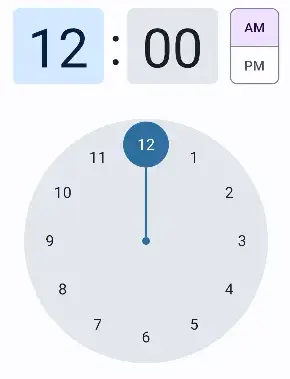
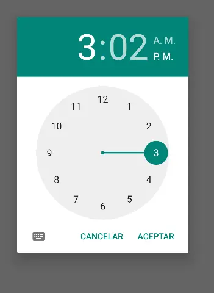

import { Tabs, TabItem } from '@astrojs/starlight/components';


[comment]: <> (La ruta siempre será assets/nombeComponente/componente-header.webp)

| Material2 | Material3 |
|-----------|-----------|
|   |   |

Time picker ayuda a los usuarios a seleccionar un hora, o establecer una hora determinada.

## Implementación

### Definición del componente

[comment]: <> (Añade un ``TabItem`` por cada tipo de implementación que tenga)

<Tabs>
<TabItem label="Material">

```kotlin frame="terminal"
@Composable
fun TimePickerDialog(
    context: Context,
    attrs: AttributeSet,
    initialHour: Int,
    initialMinute: Int,
    is24Hour: boolean
)
```
| Nombre    |   Descripción |
|-----------|---------------|
|   context         | Interfaz con información global sobre el entorno de una aplicación |
|   attrs           | Colección de atributos |
|   initialHour     | Esto representa la hora predeterminada para el time picker. El valor predeterminado es 0 y oscila entre 0 y 23 |
|   initialMinute   | Esto representa el minuto predeterminado para el time picker. El valor predeterminado es 0 y oscila entre 0 y 59 |
|   is24Hour        |   Espera un valor booleano donde "false" es para el formato de 12 horas y "true" es para el formato de 24 horas. El valor predeterminado se selecciona de la configuración de su sistema |
</TabItem>
<TabItem label="Material 3">

```kotlin frame="terminal"
@Composable
@ExperimentalMaterial3Api
fun TimePicker(
    state: TimePickerState,
    modifier: Modifier = Modifier,
    colors: TimePickerColors = TimePickerDefaults.colors(),
    layoutType: TimePickerLayoutType = TimePickerDefaults.layoutType(),
)
```
| Nombre| Descripción |
|----------|----------|
| state    | estado para este componente, permite suscribirse a cambios de TimePickerState.hour y TimePickerState.minute, y establecer la hora por defecto para este componente.  |
| modifiers| modificador que va a ser aplicado a este componente   |
| colors   | colores TimePickerColors que seran usados para resolver los colores de este time picker en diferentes estados. Ver TimePickerDefaults.colors.   |
|layoutType| los diferentes TimePickerLayoutType soportados por este time picker, cambiara la posicion y tamaño de diferentes componentes de el timepicker     |
</TabItem>
</Tabs>

#### Parametros


[comment]: <> (No modifiques el tip)

:::tip[Fuente]
Puedes acceder a la documentación oficial de Google
[desde aquí](https://developer.android.com/reference/kotlin/androidx/compose/runtime/package-summary).
:::

### Ejemplos
<Tabs>
<TabItem  label="Material">

```kotlin
@Composable
fun TimePicker(context: Context) {
    val calendar = Calendar.getInstance()
    val hour = calendar[Calendar.HOUR_OF_DAY]
    val minute = calendar[Calendar.MINUTE]
    val time = remember { mutableStateOf("") }
    val timePickerDialog = TimePickerDialog(
        context,
        { _, hour: Int, minute: Int ->
            time.value = "$hour:$minute"
        }, hour, minute, false
    )
    timePickerDialog.show()
}
```
</TabItem>
<TabItem label="Material3">

```kotlin frame="terminal"
@Composable
@ExperimentalMaterial3Api
fun MyTimePicker(){
    val state = rememberTimePickerState()
    TimePicker(
        state = state,
        modifier = Modifier.padding(15.dp),
        colors = TimePickerDefaults.colors(),
        layoutType = TimePickerDefaults.layoutType()
    )
    Text(text = "Hora seleccionada H:M = ${state.hour} : ${state.minute}")
}
```
</TabItem>
</Tabs>


## Diferencias con Material 2

 - Color: Nuevas asignaciones de color y compatibilidad con colores dinámicos
