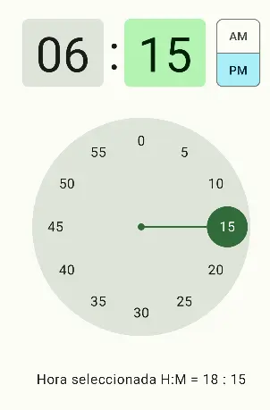

import { Tabs, TabItem } from '@astrojs/starlight/components';


[comment]: <> (La ruta siempre será assets/nombeComponente/componente-header.webp)

| Material3 |
|-----------|
|   |

`Timepicker` ayuda a los usuarios a seleccionar un hora, o establecer una hora determinada.

Muestra un selector que permite al usuario seleccionar la hora. Suscríbete a las actualizaciones a través de `TimePickerState`.

## Implementación

### Definición del componente

[comment]: <> (Añade un ``TabItem`` por cada tipo de implementación que tenga)

<Tabs>
<TabItem label="Material 3">

```kotlin frame="terminal"
@Composable
@ExperimentalMaterial3Api
fun TimePicker(
    state: TimePickerState,
    modifier: Modifier = Modifier,
    colors: TimePickerColors = TimePickerDefaults.colors(),
    layoutType: TimePickerLayoutType = TimePickerDefaults.layoutType(),
)
```

#### Parametros

| Nombre| Descripción |
|----------|----------|
| state    | Estado para este componente, permite suscribirse a cambios de `TimePickerState.hour` y `TimePickerState.minute`, y establecer la hora por defecto para este componente.  |
| modifiers| Modificador que va a ser aplicado a este componente   |
| colors   | Colores `TimePickerColors` que seran usados para resolver los colores de este timepicker en diferentes estados.  |
|layoutType| Los diferentes `TimePickerLayoutType` soportados por este time picker, cambiara la posicion y tamaño de diferentes componentes de el timepicker     |
</TabItem>
</Tabs>


[comment]: <> (No modifiques el tip)

:::tip[Fuente]
Puedes acceder a la documentación oficial de Google
[desde aquí](https://developer.android.com/reference/kotlin/androidx/compose/runtime/package-summary).
:::

### Ejemplos

<Tabs>
<TabItem label="Material3">



```kotlin frame="terminal"
@Composable
@ExperimentalMaterial3Api
fun MyTimePicker(){
    val state = rememberTimePickerState()
    TimePicker(
        state = state,
        modifier = Modifier.padding(15.dp),
        colors = TimePickerDefaults.colors(),
        layoutType = TimePickerDefaults.layoutType()
    )
    Text(text = "Hora seleccionada H:M = ${state.hour} : ${state.minute}")
}
```
</TabItem>
</Tabs>
