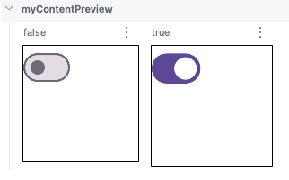

A menudo surge la necesidad de pasar un gran conjunto de datos a la vista previa componible. Para ello, basta con pasar datos de muestra a una función de vista previa componible añadiendo un parámetro con la anotación `@PreviewParameter`.

## Implementación

### Definición 

```kotlin frame="terminal"
@Preview(showBackground = true)
@Composable
fun myContentPreview(
    @PreviewParameter(StateProvider::class, limit = 2) state: State
) {
    myContent(state, {})
}
```

Para proporcionar los datos de muestra, crea una clase que implemente `PreviewParameterProvider y muestre los datos de muestra como una secuencia.

```kotlin frame="terminal"
class StateProvider : PreviewParameterProvider<State> {

    override val values = sequenceOf(
        State(isChecked = true),
        State(isChecked = false)
    )
}
```
Se renderizará una vista previa por elemento de datos en la secuencia:



:::tip[Fuente]
Puedes acceder a la documentación oficial de Google
[desde aquí](https://developer.android.com/develop/ui/compose/tooling/previews?hl=es-419#preview-data).
:::

### Ejemplos

Las vistas previas que usan `@PreviewParameter` se nombran de forma predeterminada con el índice del parámetro y el nombre de la propiedad (usuario 0, usuario 1, usuario 2, etcétera), lo que puede dificultar su diferenciación. Para mejorar la claridad de la vista previa, puedes proporcionar nombres visibles personalizados para cada vista previa anulando `getDisplayName()` en tu `PreviewParameterProvider. Esto ayuda a distinguir entre diferentes variaciones de datos o estados de la IU. Por ejemplo, puedes etiquetar las vistas previas según los datos de entrada:

```kotlin frame="terminal"
import androidx.compose.foundation.layout.Box
import androidx.compose.foundation.layout.size
import androidx.compose.material3.Switch
import androidx.compose.runtime.Composable
import androidx.compose.ui.Modifier
import androidx.compose.ui.tooling.preview.Preview
import androidx.compose.ui.tooling.preview.PreviewParameter
import androidx.compose.ui.tooling.preview.PreviewParameterProvider
import androidx.compose.ui.unit.dp

data class State(val isChecked: Boolean)

@Composable
fun myContent(state: State, onCheckedChange: (boolean: Boolean) -> Unit) {
    Box(
        modifier = Modifier.size(128.dp)
    ) {
        Switch(
            checked = state.isChecked,
            onCheckedChange = { onCheckedChange(it) }
        )
    }
}

@Preview(showBackground = true)
@Composable
fun myContentPreview(
    @PreviewParameter(StateProvider::class, limit = 2) state: State
) {
    myContent(state, {})
}

class StateProvider : PreviewParameterProvider<State> {
    private val stateList = listOf(
        State(isChecked = true),
        State(isChecked = false)
    )

    override val values = stateList.asSequence()

    override fun getDisplayName(index: Int): String {
        return stateList[index].isChecked.toString()
    }
}
```
