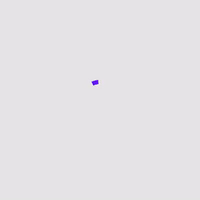
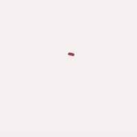
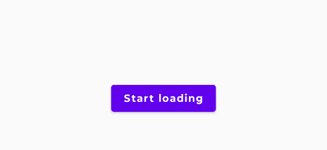
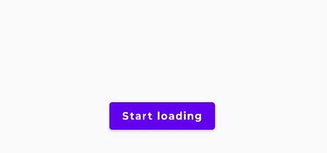
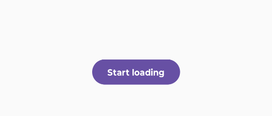
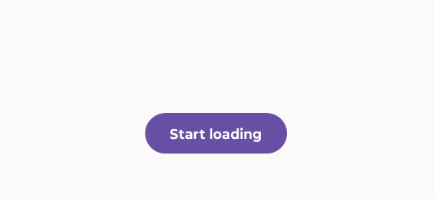

import { Tabs, TabItem } from '@astrojs/starlight/components';

[comment]: <> (La ruta siempre será assets/nombeComponente/componente-header.webp)

<center>
| Material| Material 3| 
| :----------------: | :------: |
|  |  | 
</center>


El `CircularProgressIndicator` es un componente definido como el trazo de un diámetro circular animado, es utilizado para representar visualmente el avance de una operación. 

También puede ser utilizado para indicar la ejecución de alguna tarea sin proporcionar indicios de que tan próxima esté a finalizar.


## Implementación

### Definición del componente

[comment]: <> (Añade un ``TabItem`` por cada tipo de implementación que tenga)

<Tabs>
<TabItem label="Material">

#### Indicador indeterminado

```kotlin frame="terminal"
@Composable
fun CircularProgressIndicator(
    modifier: Modifier = Modifier,
    color: Color = MaterialTheme.colors.primary,
    strokeWidth: Dp = ProgressIndicatorDefaults.StrokeWidth,
    backgroundColor: Color = Color.Transparent,
    strokeCap: StrokeCap = StrokeCap.Square
)
```

#### Indicador determinado

```kotlin frame="terminal"
@Composable
fun CircularProgressIndicator(
    progress: @FloatRange(from = 0.0, to = 1.0) Float,
    modifier: Modifier = Modifier,
    color: Color = MaterialTheme.colors.primary,
    strokeWidth: Dp = ProgressIndicatorDefaults.StrokeWidth,
    backgroundColor: Color = Color.Transparent,
    strokeCap: StrokeCap = StrokeCap.Butt
)
```

Atributo | Descripción
-------- | -----------
progress| `FloatRange` situado en el intervalo cerrado de `0.0` a `1.0`, donde `0.0` representa ningún progreso y `1.0` la finalización de éste. "*Los valores fuera del rango son forzados a entrar en él"*.
modifier| Modificador que implementará el composable.
color| Color del indicador de progreso.
strokeWidth| Ancho del trazo para el indicador de progreso.
backgroundColor| El color del recorrido sobre el que se dibuja el indicador.
strokeCap| Capa para usar en los extremos del indicador.


</TabItem>
<TabItem label="Material 3">

#### Indicador indeterminado

```kotlin frame="terminal"
@Composable
fun CircularProgressIndicator(
    modifier: Modifier = Modifier,
    color: Color = ProgressIndicatorDefaults.circularColor,
    strokeWidth: Dp = ProgressIndicatorDefaults.CircularStrokeWidth,
    trackColor: Color = ProgressIndicatorDefaults.circularTrackColor,
    strokeCap: StrokeCap = ProgressIndicatorDefaults.CircularIndeterminateStrokeCap
)
```

#### Indicador determinado

```kotlin frame="terminal"
@Composable
fun CircularProgressIndicator(
    progress: () -> Float,
    modifier: Modifier = Modifier,
    color: Color = ProgressIndicatorDefaults.circularColor,
    strokeWidth: Dp = ProgressIndicatorDefaults.CircularStrokeWidth,
    trackColor: Color = ProgressIndicatorDefaults.circularTrackColor,
    strokeCap: StrokeCap = ProgressIndicatorDefaults.CircularDeterminateStrokeCap
)
```
Atributo | Descripción
-------- | -----------
progress| Función que representa el progreso del indicador. La función debe de retornar un valor de tipo `Float`, el valor debe estar en el intervalo cerrado de `0.0` a `1.0`, donde `0.0` representa ningún progreso y `1.0` la finalización de éste. "*Los valores valores fuera del rango serán forzados a entrar en él"*.
modifier| Modificador que implementará el composable.
color| Color del indicador de progreso.
strokeWidth| Ancho del trazo para el indicador de progreso.
trackColor| El color del recorrido sobre el que se dibuja el indicador.
strokeCap| Capa para usar en los extremos del indicador.

</TabItem>
</Tabs>

[comment]: <> (No modifiques el tip)

:::tip[Fuente]
Puedes acceder a la documentación oficial de Google
[desde aquí](https://developer.android.com/reference/kotlin/androidx/compose/runtime/package-summary).
:::

### Ejemplos

<Tabs>
<TabItem label="Material">

#### Indicador indeterminado

<center></center>

```kotlin frame="terminal"
@Composable
fun IndeterminateCircularIndicatorExample() {
    var loading by remember { mutableStateOf(false) }
    val scope = rememberCoroutineScope()

    Column(
        modifier = Modifier.fillMaxSize(),
        horizontalAlignment = Alignment.CenterHorizontally,
        verticalArrangement = Arrangement.Center
    ) {
        if (loading) {
            CircularProgressIndicator()
        }
        Spacer(modifier = Modifier.requiredHeight(30.dp))
        Button(
            onClick = {
                loading = true
                scope.launch {
                    delay(2000) // <-- Operación de carga.
                    loading = false
                }
            },
            enabled = !loading
        ) {
            Text("Start loading")
        }
    }
}
```

#### Indicador determinado

<center></center>

```kotlin frame="terminal"
@Composable
fun DeterminateCircularProgressIndicatorExample() {
    var currentProgress by remember { mutableStateOf(0.0f) }
    var loading by remember { mutableStateOf(false) }
    val animatedProgress by animateFloatAsState(
        targetValue = currentProgress,
        animationSpec = ProgressIndicatorDefaults.ProgressAnimationSpec,
        label = ""
    )
    val scope = rememberCoroutineScope()

    Column(
        modifier = Modifier.fillMaxSize(),
        horizontalAlignment = Alignment.CenterHorizontally,
        verticalArrangement = Arrangement.Center
    ) {
        CircularProgressIndicator(progress = animatedProgress)
        Spacer(Modifier.requiredHeight(30.dp))
        Button(
            onClick = {
                loading = true
                scope.launch {
                    loadProgress { progress ->
                        currentProgress = progress
                    }
                    loading = false
                }
            },
            enabled = !loading
        ) {
            Text("Start loading")
        }
    }
}

suspend fun loadProgress(updateProcess: (Float) -> Unit) {
    for (current in 1..100) {
        updateProcess( current.toFloat() / 100 )
        delay(50) //<-- Operación de carga.
    }
}
```

</TabItem>
<TabItem label="Material 3">

#### Indicador indeterminado

<center></center>

```kotlin frame="terminal"
@Composable
fun IndeterminateCircularIndicatorExample() {
    var loading by remember { mutableStateOf(false) }
    val scope = rememberCoroutineScope()

    Column(
        modifier = Modifier.fillMaxSize(),
        horizontalAlignment = Alignment.CenterHorizontally,
        verticalArrangement = Arrangement.Center
    ) {
        if (loading) {
            CircularProgressIndicator()
        }
        Spacer(modifier = Modifier.requiredHeight(30.dp))
        Button(
            onClick = {
                loading = true
                scope.launch {
                    delay(2000) // <-- Operación de carga.
                    loading = false
                }
            },
            enabled = !loading
        ) {
            Text("Start loading")
        }
    }
}
```
#### Indicador determinado

<center></center>

```kotlin frame="terminal"
@Composable
fun DeterminateCircularProgressIndicatorExample() {
    var currentProgress by remember { mutableStateOf(0.0f) }
    var loading by remember { mutableStateOf(false) }
    val animatedProgress by animateFloatAsState(
        targetValue = currentProgress,
        animationSpec = ProgressIndicatorDefaults.ProgressAnimationSpec,
        label = ""
    )
    val scope = rememberCoroutineScope()

    Column(
        modifier = Modifier.fillMaxSize(),
        horizontalAlignment = Alignment.CenterHorizontally,
        verticalArrangement = Arrangement.Center
    ) {
        CircularProgressIndicator(progress = animatedProgress)
        Spacer(Modifier.requiredHeight(30.dp))
        Button(
            onClick = {
                loading = true
                scope.launch {
                    loadProgress { progress ->
                        currentProgress = progress
                    }
                    loading = false
                }
            },
            enabled = !loading
        ) {
            Text("Start loading")
        }
    }
}

suspend fun loadProgress(updateProcess: (Float) -> Unit) {
    for (current in 1..100) {
        updateProcess( current.toFloat() / 100 )
        delay(50) //<-- Operación de carga.
    }
}
```

</TabItem>
</Tabs>

:::note[Animación del componente]
Por defecto el componente no tiene especificado ninguna animación entre los valores del progreso, por lo que el cambio del componente en la UI será instantáneo.

No obstante, con ayuda de `ProgressAnimationSpec` es posible animar el cambio del componente a lo largo del progreso tal y como se muestra en el ejemplo de la parte superior.
:::


