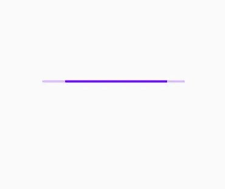
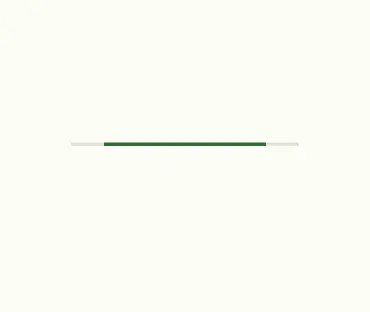
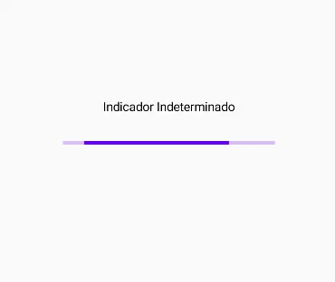
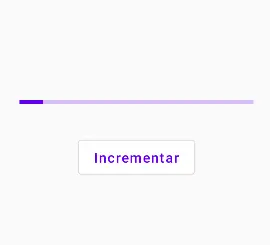
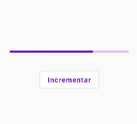
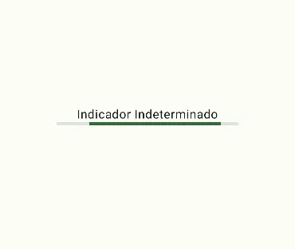
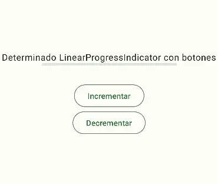
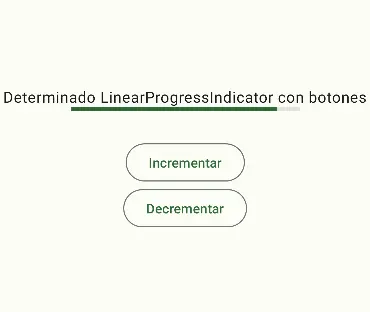

import { Tabs, TabItem } from '@astrojs/starlight/components';

[comment]: <> (La ruta siempre será assets/nombeComponente/componente-header.webp)

| Material  | Material3 |
|-----------|-----------|
|  |  |

Es una barra horizontal que se llena de izquierda a derecha.
Los indicadores de progreso muestran visualmente el estado de una operación. Usan el movimiento para llamar la atención del usuario sobre qué tan cerca se encuentra el proceso (por ejemplo, cargar o procesar datos). 

También pueden indicar que el procesamiento se está llevando a cabo, sin hacer referencia a qué tan cerca está de completarse.

## Implementación

### Definición del componente

[comment]: <> (Añade un `TabItem` por cada tipo de implementación que tenga)

<Tabs>
<TabItem label="Material">

```kotlin frame="terminal"
@Composable
fun LinearProgressIndicator(
    progress: @FloatRange(from = 0.0, to = 1.0) Float,
    modifier: Modifier = Modifier,
    color: Color = MaterialTheme.colors.primary,
    backgroundColor: Color = color.copy(alpha = IndicatorBackgroundOpacity),
    strokeCap: StrokeCap = StrokeCap.Butt
)
```
|   Atributo    |   Descripción |
|---------------|---------------|
| progress | Es el progreso de este indicador, donde "0.0" representa ningún progreso y "1.0" representa el progreso completo. Los valores fuera de este rango son forzados a entrar en el rango. |
| modifier | Modificador que implementará el composable. |
| color | Color del indicador. |
| backgroundColor | Color del fondo detras del indicador, visible cuando el progreso aun no ha rellenado el area del indicador. |
| strokeCap | Capa para usar en los extremos del indicador. |
</TabItem>
<TabItem label="Material 3">

```kotlin frame="terminal"
@Composable
fun LinearProgressIndicator(
    progress: @FloatRange(from = 0.0, to = 1.0) Float,
    modifier: Modifier ,
    color: Color ,
    trackColor: Color ,
    strokeCap: StrokeCap 
)
```
|   Atributo    |   Descripción |
|---------------|---------------|
| progress | Es el progreso actual que muestra el indicador. Pasa un Float entre "0.0" y "1.0". |
| modifier | Modificador que implementará el composable. |
| color | Es el color del indicador real. Es decir, la parte del componente que refleja el progreso y que abarca por completo el componente cuando se completa el progreso. |
| trackColor | El color del recorrido sobre el que se dibuja el indicador. |
| strokeCap | Capa de trazado para usar en los extremos del indicador. |
</TabItem>
</Tabs>

[comment]: <> (No modifiques el tip)

:::tip[Fuente]
Puedes acceder a la documentación oficial de Google
[desde aquí](https://developer.android.com/reference/kotlin/androidx/compose/runtime/package-summary).
:::

### Ejemplos

<Tabs>
<TabItem label="Material">
#### Indeterminados
Se realiza la animación de forma continua sin tener en cuenta el progreso.


```kotlin frame="terminal"
@Composable
fun IndeterminateInidicator() {
    Text("Indicador Indeterminado")
    Spacer(modifier = Modifier.height(30.dp))
    LinearProgressIndicator()
}
```
#### Determinados
Muestra exactamente cuánto progreso se realizó.
| Inicio  | Cambio  |
|---------|---------|
|  |  |
```kotlin frame="terminal"
@Composable
fun MyIndicator(){
    var progress by remember { mutableStateOf(0.1f) }
    val animatedProgress by animateFloatAsState(
        targetValue = progress,
        animationSpec = ProgressIndicatorDefaults.ProgressAnimationSpec, label = "label"
    )
    LinearProgressIndicator(progress = progress)
    Spacer(modifier = Modifier.height(30.dp))
    OutlinedButton(
        onClick = {
            if (progress < 1f) progress += 0.1f
        }
    ) {
        Text("Incrementar")
    }
}
```
</TabItem>
<TabItem label="Material3">
#### Indeterminados
Se realiza la animación de forma continua sin tener en cuenta el progreso.


```kotlin frame="terminal"
@Composable
fun IndeterminateIndicator() {
    Text("Indicador Indeterminado")
    LinearProgressIndicator()
}
```
#### Determinados
Muestra exactamente cuánto progreso se realizó.
| Inicio  | Cambio  |
|---------|---------|
|  |  |
```kotlin frame="terminal"
@Composable
fun DeterminateLinearProgressIniciador() {
    var progress by remember { mutableStateOf(0.1f) }
    val animatedProgress = animateFloatAsState(
        targetValue = progress,
        animationSpec = ProgressIndicatorDefaults.ProgressAnimationSpec
    ).value
    Column(horizontalAlignment = Alignment.CenterHorizontally) {
        Spacer(modifier = Modifier.height(30.dp))
        Text("Determinado LinearProgressIndicator con botones")
        LinearProgressIndicator(progress = progress)
        Spacer(modifier = Modifier.height(30.dp))
        OutlinedButton(
            onClick = {
                if (progress < 1f) progress += 0.1f
            }) {
            Text("Incrementar")
        }
        OutlinedButton(
            onClick = {
                if (progress > 0f) progress -= 0.1f
            }
        ) {
            Text("Decrementar")
        }
    }
}
```
</TabItem>
</Tabs>