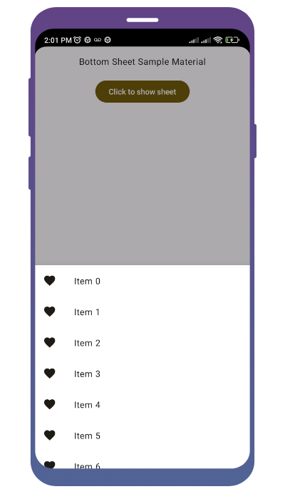
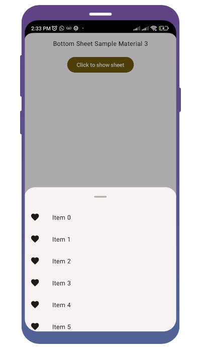

import { Tabs, TabItem } from "@astrojs/starlight/components";

[comment]: <> (La ruta siempre será assets/nombreComponente/componente-header.webp)

| Material| Material 3| 
| :----------------: | :------: |
|               |  | 

El `BottomSheet` es un componente que se desliza desde la parte inferior de la pantalla para mostrar contenido adicional. Es útil para presentar opciones, información adicional o controles que están relacionados con la interfaz principal pero que no necesitan estar visibles todo el tiempo.

## Implementación

### Definición del componente

[comment]: <> (Añade un ``TabItem`` por cada tipo de implementación que tenga)

<Tabs>
<TabItem label="Material">

```kotlin frame="terminal"
@Composable
@ExperimentalMaterialApi
fun ModalBottomSheetLayout(
    sheetContent: @Composable ColumnScope.() -> Unit,
    modifier: Modifier = Modifier,
    sheetState: ModalBottomSheetState =
        rememberModalBottomSheetState(Hidden),
    sheetShape: Shape = MaterialTheme.shapes.large,
    sheetElevation: Dp = ModalBottomSheetDefaults.Elevation,
    sheetBackgroundColor: Color = MaterialTheme.colors.surface,
    sheetContentColor: Color = contentColorFor(sheetBackgroundColor),
    scrimColor: Color = ModalBottomSheetDefaults.scrimColor,
    content: @Composable () -> Unit
)
```

Atributo | Descripción
------ | -----------
sheetContent | El contenido del bottom sheet.
modifier | Modificador opcional para todo el componente.
sheetState | El estado del bottom sheet.
sheetShape | La forma del bottom sheet.
sheetElevation | La elevación del bottom sheet.
sheetBackgroundColor | El color de fondo del bottom sheet.
sheetContentColor | El color de contenido preferido proporcionado por el bottom sheet a sus hijos. Por defecto, es el color de contenido que coincide con sheetBackgroundColor, o si no es un color del tema, mantendrá el mismo color de contenido establecido sobre el bottom sheet.
scrimColor | El color del velo que se aplica al resto de la pantalla cuando el bottom sheet es visible. Si el color pasado es Color.Unspecified, entonces no se aplicará un velo y el bottom sheet no bloqueará la interacción con el resto de la pantalla cuando sea visible.
content | El contenido del resto de la pantalla.

[comment]: <> (No modifiques el tip)

:::tip[Fuente]
Puedes acceder a la documentación oficial de Google
[desde aquí](https://developer.android.com/reference/kotlin/androidx/compose/material/package-summary#ModalBottomSheetLayout(kotlin.Function1,androidx.compose.ui.Modifier,androidx.compose.material.ModalBottomSheetState,kotlin.Boolean,androidx.compose.ui.graphics.Shape,androidx.compose.ui.unit.Dp,androidx.compose.ui.graphics.Color,androidx.compose.ui.graphics.Color,androidx.compose.ui.graphics.Color,kotlin.Function0)).
:::

</TabItem>
<TabItem label="Material 3">

```kotlin frame="terminal"
@Composable
@ExperimentalMaterial3Api
fun ModalBottomSheet(
    onDismissRequest: () -> Unit,
    modifier: Modifier = Modifier,
    sheetState: SheetState = rememberSheetState(),
    shape: Shape = if (sheetState.targetValue == Hidden) BottomSheetDefaults.MinimizedShape
        else BottomSheetDefaults.ExpandedShape,
    containerColor: Color = BottomSheetDefaults.ContainerColor,
    contentColor: Color = contentColorFor(containerColor),
    tonalElevation: Dp = BottomSheetDefaults.Elevation,
    scrimColor: Color = BottomSheetDefaults.ScrimColor,
    dragHandle: @Composable (() -> Unit)? = { BottomSheetDefaults.DragHandle() },
    content: @Composable ColumnScope.() -> Unit,
) 
```

Atributo | Descripción
------ | -----------
onDismissRequest | Se ejecuta cuando el usuario hace clic fuera del bottom sheet, después de que la hoja se anime a estado Oculto.
modifier | Modificador opcional para el bottom sheet.
sheetState | El estado del bottom sheet.
shape | La forma del bottom sheet. Por defecto, la forma cambia de BottomSheetDefaults.MinimizedShape a BottomSheetDefaults.ExpandedShape cuando la hoja apunta a estados Ocultos y no ocultos respectivamente.
containerColor | El color utilizado para el fondo de este bottom sheet.
contentColor | El color preferido para el contenido dentro de este bottom sheet. Por defecto, es el color de contenido que coincide con containerColor, o el LocalContentColor actual si containerColor no es un color del tema.
tonalElevation | La elevación tonal de este bottom sheet.
scrimColor | Color del velo que oscurece el contenido cuando el bottom sheet está abierto.
dragHandle | Marcador visual opcional para deslizar el bottom sheet.
content | El contenido que se mostrará dentro del bottom sheet.

[comment]: <> (No modifiques el tip)

:::tip[Fuente]
Puedes acceder a la documentación oficial de Google
[desde aquí](https://developer.android.com/jetpack/compose/components/bottom-sheets).
:::

</TabItem>
</Tabs>


### Ejemplos 

<Tabs>
<TabItem label="Material">

<center></center>

```kotlin frame="terminal"
@Composable
@OptIn(ExperimentalMaterialApi::class)
fun ModalBottomSheetMaterialSample() {
    val state = rememberModalBottomSheetState(ModalBottomSheetValue.Hidden)
    val scope = rememberCoroutineScope()
    ModalBottomSheetLayout(
        sheetState = state,
        sheetContent = {
            LazyColumn {
                items(50) {
                    ListItem(
                        text = { Text("Item $it") },
                        icon = {
                            Icon(
                                Icons.Default.Favorite,
                                contentDescription = "Localized description"
                            )
                        }
                    )
                }
            }
        }
    ) {
        Column(
            modifier = Modifier
                .fillMaxSize()
                .padding(16.dp),
            horizontalAlignment = Alignment.CenterHorizontally
        ) {
            Text("Bottom Sheet Sample Material")
            Spacer(Modifier.height(20.dp))
            Button(onClick = { scope.launch { state.show() } }) {
                Text("Click to show sheet")
            }
        }
    }
}
```

</TabItem>
<TabItem label="Material 3">

<center></center>

```kotlin frame="terminal"
@Composable
@OptIn(ExperimentalMaterial3Api::class, ExperimentalMaterialApi::class)
fun ModalBottomSheetMaterial3Sample() {
    val sheetState = rememberSheetState()
    val scope = rememberCoroutineScope()

    Column(
        modifier = Modifier
            .fillMaxSize()
            .padding(16.dp),
        horizontalAlignment = Alignment.CenterHorizontally
    ) {
        Text("Bottom Sheet Sample Material 3")
        Spacer(Modifier.height(20.dp))
        Button(onClick = { scope.launch { sheetState.show() } }) {
            Text("Click to show sheet")
        }
    }
    if (sheetState.isVisible) {
        ModalBottomSheet(
            sheetState = sheetState,
            onDismissRequest = {
                scope.launch {
                    sheetState.hide()
                }
            },
        ) {
            LazyColumn {
                items(50) {
                    ListItem(
                        text = { Text("Item $it") },
                        icon = {
                            Icon(
                                Icons.Default.Favorite,
                                contentDescription = "Localized description"
                            )
                        }
                    )
                }
            }
        }
    }
}
```

</TabItem>
</Tabs>