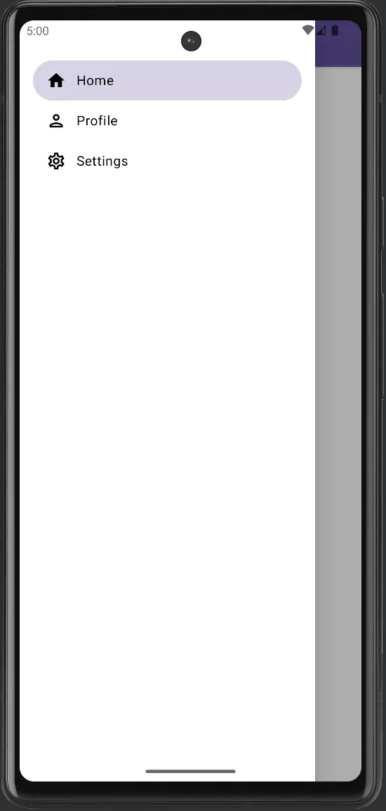
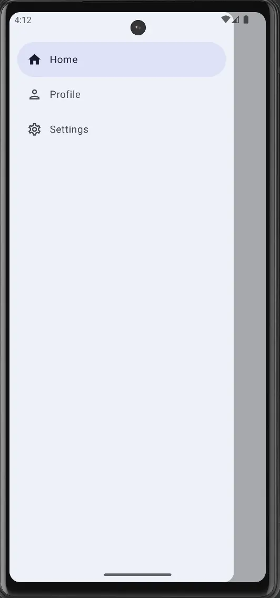

import { Tabs, TabItem } from "@astrojs/starlight/components";


|                                             Material                                             |                                             Material 3                                              |
|:------------------------------------------------------------------------------------------------:|:---------------------------------------------------------------------------------------------------:|
|  |  |

El `Side Sheet` es un panel deslizante que aparece desde un lado
de la pantalla (generalmente desde la derecha o la izquierda).
Se utiliza para mostrar información adicional o opciones sin
salir de la pantalla actual.

## Implementación

### Definición del componente


<Tabs>
<TabItem label="Material">

```kotlin frame="terminal"
@Composable
fun ModalDrawer(
    drawerContent: @Composable ColumnScope.() -> Unit,
    modifier: Modifier = Modifier,
    drawerState: DrawerState = rememberDrawerState(DrawerValue.Closed),
    gesturesEnabled: Boolean = true,
    drawerShape: Shape = DrawerDefaults.shape,
    drawerElevation: Dp = DrawerDefaults.Elevation,
    drawerBackgroundColor: Color = DrawerDefaults.backgroundColor,
    drawerContentColor: Color = contentColorFor(drawerBackgroundColor),
    scrimColor: Color = DrawerDefaults.scrimColor,
    content: @Composable () -> Unit
): Unit
```

| Atributo              | Descripción                                                                                                                                                                                                                                                    |
|-----------------------|----------------------------------------------------------------------------------------------------------------------------------------------------------------------------------------------------------------------------------------------------------------|
| drawerContent         | Contenido dentro del side sheet.                                                                                                                                                                                                                               |
| modifier              | Modificador opcional para todo el componente.                                                                                                                                                                                                                  |
| drawerState           | El estado del componente.                                                                                                                                                                                                                                      |
| gesturesEnabled       | Indica si se puede usar el componente con gestos.                                                                                                                                                                                                              |
| drawerShape           | Indica la forma del componente.                                                                                                                                                                                                                                |
| drawerElevation       | Indica la elevación del componente.                                                                                                                                                                                                                            |
| drawerBackgroundColor | Indica el color de fondo del contenedor.                                                                                                                                                                                                                       |
| drawerContentColor    | El color de contenido preferido proporcionado por el componente a sus hijos. Por defecto, es el color de contenido que coincide con sheetBackgroundColor, o si no es un color del tema, mantendrá el mismo color de contenido establecido sobre el componente. |
| scrimColor            | El color del velo que se aplica al resto de la pantalla cuando el componente es visible.                                                                                                                                                                       |
| content               | El contenido del resto de la interfaz.                                                                                                                                                                                                                         |


:::tip[Fuente]
Puedes acceder a la documentación oficial de Google
[desde aquí](https://developer.android.com/reference/kotlin/androidx/compose/material/package-summary#ModalDrawer(kotlin.Function1,androidx.compose.ui.Modifier,androidx.compose.material.DrawerState,kotlin.Boolean,androidx.compose.ui.graphics.Shape,androidx.compose.ui.unit.Dp,androidx.compose.ui.graphics.Color,androidx.compose.ui.graphics.Color,androidx.compose.ui.graphics.Color,kotlin.Function0)).
:::

</TabItem>
<TabItem label="Material 3">

```kotlin frame="terminal"
@Composable
fun ModalNavigationDrawer(
    drawerContent: @Composable () -> Unit,
    modifier: Modifier = Modifier,
    drawerState: DrawerState = rememberDrawerState(DrawerValue.Closed),
    gesturesEnabled: Boolean = true,
    scrimColor: Color = DrawerDefaults.scrimColor,
    content: @Composable () -> Unit
): Unit
```

| Atributo        | Descripción                                                                              |
|-----------------|------------------------------------------------------------------------------------------|
| drawerContent   | Contenido dentro del side sheet.                                                         |
| modifier        | Modificador opcional para todo el componente.                                            |
| drawerState     | El estado del componente.                                                                |
| gesturesEnabled | Indica si se puede usar el componente con gestos.                                        |
| scrimColor      | El color del velo que se aplica al resto de la pantalla cuando el componente es visible. |
| content         | El contenido del resto de la interfaz.                                                   |


:::tip[Fuente]
Puedes acceder a la documentación oficial de Google
[desde aquí](https://developer.android.com/reference/kotlin/androidx/compose/material3/package-summary#ModalNavigationDrawer(kotlin.Function0,androidx.compose.ui.Modifier,androidx.compose.material3.DrawerState,kotlin.Boolean,androidx.compose.ui.graphics.Color,kotlin.Function0)).
:::

</TabItem>
</Tabs>


### Ejemplos

<Tabs>
<TabItem label="Material">

<center></center>

```kotlin frame="terminal"
package com.example.sidesheet

import android.os.Bundle
import androidx.activity.ComponentActivity
import androidx.activity.compose.setContent
import androidx.activity.enableEdgeToEdge
import androidx.compose.foundation.background
import androidx.compose.foundation.clickable
import androidx.compose.foundation.layout.Box
import androidx.compose.foundation.layout.Column
import androidx.compose.foundation.layout.Row
import androidx.compose.foundation.layout.Spacer
import androidx.compose.foundation.layout.fillMaxSize
import androidx.compose.foundation.layout.fillMaxWidth
import androidx.compose.foundation.layout.padding
import androidx.compose.foundation.layout.width
import androidx.compose.foundation.shape.RoundedCornerShape
import androidx.compose.material.icons.Icons
import androidx.compose.material.icons.filled.Home
import androidx.compose.material.icons.filled.Menu
import androidx.compose.material.icons.filled.Person
import androidx.compose.material.icons.filled.Settings
import androidx.compose.material.icons.outlined.Home
import androidx.compose.material.icons.outlined.Person
import androidx.compose.material.icons.outlined.Settings
import androidx.compose.material.DrawerValue
import androidx.compose.material.Icon
import androidx.compose.material.IconButton
import androidx.compose.material.MaterialTheme
import androidx.compose.material.ModalDrawer
import androidx.compose.material.Scaffold
import androidx.compose.material.Surface
import androidx.compose.material.Text
import androidx.compose.material.TopAppBar
import androidx.compose.material.rememberDrawerState
import androidx.compose.runtime.Composable
import androidx.compose.runtime.getValue
import androidx.compose.runtime.mutableIntStateOf
import androidx.compose.runtime.remember
import androidx.compose.runtime.rememberCoroutineScope
import androidx.compose.runtime.setValue
import androidx.compose.ui.Alignment
import androidx.compose.ui.Modifier
import androidx.compose.ui.draw.clip
import androidx.compose.ui.graphics.Color
import androidx.compose.ui.graphics.vector.ImageVector
import androidx.compose.ui.unit.dp
import com.example.sidesheet.ui.theme.SideSheetTheme
import kotlinx.coroutines.launch

data class NavigationItem(
    val title: String,
    val selectedIcon: ImageVector,
    val unselectedIcon: ImageVector,
    val badgeCount: Int? = null
)

class MainActivity : ComponentActivity() {
    override fun onCreate(savedInstanceState: Bundle?) {
        super.onCreate(savedInstanceState)
        enableEdgeToEdge()
        setContent {
            SideSheetTheme {
                val items = listOf(
                    NavigationItem(
                        title = "Home",
                        selectedIcon = Icons.Filled.Home,
                        unselectedIcon = Icons.Outlined.Home
                    ), NavigationItem(
                        title = "Profile",
                        selectedIcon = Icons.Filled.Person,
                        unselectedIcon = Icons.Outlined.Person
                    ), NavigationItem(
                        title = "Settings",
                        selectedIcon = Icons.Filled.Settings,
                        unselectedIcon = Icons.Outlined.Settings
                    )
                )
                Surface(
                    modifier = Modifier.fillMaxSize(), color = MaterialTheme.colors.background
                ) {
                    val drawerState = rememberDrawerState(initialValue = DrawerValue.Closed)
                    val scope = rememberCoroutineScope()
                    var selectedItem by remember { mutableIntStateOf(0) }
                    ModalDrawer(
                        drawerContent = {
                            Column(modifier = Modifier.padding(vertical = 48.dp, horizontal = 16.dp)) {
                                items.forEachIndexed { index, item ->
                                    NavigationDrawerItem(label = {
                                        Text(text = item.title, color = Color.Black)
                                    }, onClick = {
                                        selectedItem = index
                                        scope.launch {
                                            drawerState.close()
                                        }
                                    }, icon = {
                                        Icon(
                                            imageVector = if (index == selectedItem) item.selectedIcon else item.unselectedIcon,
                                            contentDescription = item.title,
                                            tint = Color.Black
                                        )
                                    }, selected = index == selectedItem
                                    )
                                }
                            }
                        },
                        drawerState = drawerState,
                    ) {
                        Scaffold(topBar = {
                            TopAppBar(title = {
                                Text(text = "Side Shee Example")
                            }, navigationIcon = {
                                IconButton(onClick = {
                                    scope.launch {
                                        drawerState.open()
                                    }
                                }) {
                                    Icon(
                                        imageVector = Icons.Default.Menu,
                                        contentDescription = "Menu"
                                    )
                                }
                            })
                        }) { paddingValues ->
                            Box(
                                modifier = Modifier
                                    .padding(paddingValues)
                                    .padding(horizontal = 16.dp)
                            ) {
                                Text(text = "Hello World")
                            }
                        }
                    }
                }
            }
        }
    }
}

@Composable
fun NavigationDrawerItem(
    label: @Composable () -> Unit,
    onClick: () -> Unit,
    icon: @Composable () -> Unit,
    modifier: Modifier = Modifier,
    selected: Boolean = false,
) {

    Row(
        modifier = modifier
            .fillMaxWidth()
            .clip(shape = RoundedCornerShape(24.dp))
            .background(color = if (selected) MaterialTheme.colors.primary.copy(alpha = 0.25f) else Color.Transparent)
            .padding(vertical = 12.dp, horizontal = 16.dp)
            .clickable(onClick = onClick),
        verticalAlignment = Alignment.CenterVertically,
    ) {
        icon()
        Spacer(Modifier.width(12.dp))
        label()
    }
}
```

</TabItem>
<TabItem label="Material 3">

<center></center>

```kotlin frame="terminal"
package com.example.sidesheet

import android.os.Bundle
import androidx.activity.ComponentActivity
import androidx.activity.compose.setContent
import androidx.activity.enableEdgeToEdge
import androidx.compose.foundation.layout.Box
import androidx.compose.foundation.layout.Spacer
import androidx.compose.foundation.layout.fillMaxSize
import androidx.compose.foundation.layout.height
import androidx.compose.foundation.layout.padding
import androidx.compose.material.icons.Icons
import androidx.compose.material.icons.filled.Home
import androidx.compose.material.icons.filled.Menu
import androidx.compose.material.icons.filled.Person
import androidx.compose.material.icons.filled.Settings
import androidx.compose.material.icons.outlined.Home
import androidx.compose.material.icons.outlined.Person
import androidx.compose.material.icons.outlined.Settings
import androidx.compose.material3.DrawerValue
import androidx.compose.material3.ExperimentalMaterial3Api
import androidx.compose.material3.Icon
import androidx.compose.material3.IconButton
import androidx.compose.material3.MaterialTheme
import androidx.compose.material3.ModalDrawerSheet
import androidx.compose.material3.ModalNavigationDrawer
import androidx.compose.material3.NavigationDrawerItem
import androidx.compose.material3.NavigationDrawerItemDefaults
import androidx.compose.material3.Scaffold
import androidx.compose.material3.Surface
import androidx.compose.material3.Text
import androidx.compose.material3.TopAppBar
import androidx.compose.material3.rememberDrawerState
import androidx.compose.runtime.getValue
import androidx.compose.runtime.mutableIntStateOf
import androidx.compose.runtime.remember
import androidx.compose.runtime.rememberCoroutineScope
import androidx.compose.runtime.setValue
import androidx.compose.ui.Modifier
import androidx.compose.ui.graphics.vector.ImageVector
import androidx.compose.ui.unit.dp
import com.example.sidesheet.ui.theme.SideSheetTheme
import kotlinx.coroutines.launch

data class NavigationItem(
    val title: String,
    val selectedIcon: ImageVector,
    val unselectedIcon: ImageVector,
    val badgeCount: Int? = null
)

class MainActivity : ComponentActivity() {
    @OptIn(ExperimentalMaterial3Api::class)
    override fun onCreate(savedInstanceState: Bundle?) {
        super.onCreate(savedInstanceState)
        enableEdgeToEdge()
        setContent {
            SideSheetTheme {
                val items = listOf(
                    NavigationItem(
                        title = "Home",
                        selectedIcon = Icons.Filled.Home,
                        unselectedIcon = Icons.Outlined.Home
                    ),
                    NavigationItem(
                        title = "Profile",
                        selectedIcon = Icons.Filled.Person,
                        unselectedIcon = Icons.Outlined.Person
                    ),
                    NavigationItem(
                        title = "Settings",
                        selectedIcon = Icons.Filled.Settings,
                        unselectedIcon = Icons.Outlined.Settings
                    )
                )
                Surface(
                    modifier = Modifier.fillMaxSize(),
                    color = MaterialTheme.colorScheme.background
                ) {
                    val drawerState = rememberDrawerState(initialValue = DrawerValue.Closed)
                    val scope = rememberCoroutineScope()
                    var selectedItem by remember { mutableIntStateOf(0) }
                    ModalNavigationDrawer(
                        drawerContent = {
                            ModalDrawerSheet {
                                Spacer(modifier = Modifier.height(24.dp))
                                items.forEachIndexed { index, item ->
                                    NavigationDrawerItem(
                                        label = {
                                            Text(text = item.title)
                                        },
                                        selected = index == selectedItem,
                                        onClick = {
                                            selectedItem = index
                                            scope.launch {
                                                drawerState.close()
                                            }
                                        },
                                        icon = {
                                            Icon(
                                                imageVector = if (index == selectedItem) item.selectedIcon else item.unselectedIcon,
                                                contentDescription = item.title
                                            )
                                        },
                                        badge = {
                                            item.badgeCount?.let {
                                                Text(text = item.badgeCount.toString())
                                            }
                                        },
                                        modifier = Modifier.padding(NavigationDrawerItemDefaults.ItemPadding)
                                    )
                                }
                            }
                        },
                        drawerState = drawerState,
                    ) {
                        Scaffold(
                            topBar = {
                                TopAppBar(
                                    title = {
                                        Text(text = "Side Shee Example")
                                    },
                                    navigationIcon = {
                                        IconButton(onClick = {
                                            scope.launch {
                                                drawerState.open()
                                            }
                                        }) {
                                            Icon(
                                                imageVector = Icons.Default.Menu,
                                                contentDescription = "Menu"
                                            )
                                        }
                                    }
                                )
                            }
                        ) { paddingValues ->
                            Box(
                                modifier = Modifier
                                    .padding(paddingValues)
                                    .padding(horizontal = 16.dp)
                            ) {
                                Text(text = "Hello World")
                            }
                        }

                    }
                }
            }
        }
    }
}
```
</TabItem>
</Tabs>
