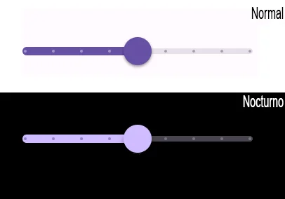

import { Tabs, TabItem } from '@astrojs/starlight/components';

[comment]: <> (La ruta siempre será assets/nombeComponente/componente-header.webp)



Un Jetpack Compose Slider es un componente que permite al usuario seleccionar un valor continuo entre dos extremos. El valor seleccionado se puede usar para controlar una función en la aplicación.

## Implementación

### Definición del componente

[comment]: <> (Añade un ``TabItem`` por cada tipo de implementación que tenga)

<Tabs>
<TabItem label="Material">

```kotlin frame="terminal"
@Composable
fun SliderComposable() {
// DOS OPCIONES DE VARIABLES PARA QUE FUNCIONE:
    var sliderStepPosition by remember { mutableFloatStateOf(0f) }
    //var sliderStepPosition by remember { mutableStateOf(0f) }
    Column {
        Slider(
            value = sliderStepPosition,
            onValueChange = { sliderStepPosition = it },
            steps = 7,
            valueRange = 0f..10f,
            colors = SliderDefaults.colors(
                thumbColor = MaterialTheme.colorScheme.primary,
                activeTrackColor = MaterialTheme.colorScheme.primary,
                inactiveTrackColor = MaterialTheme.colorScheme.secondaryContainer,
            )
        )
    }
}
```

- value: Valor actual del Slider (inicializado en 0f en este caso).
- onValueChange: Cuando el valor del Slider cambia actualiza sliderStepPosition (var sliderStepPosition by remember).
- steps: Divide el rango de valores en pequeños puntos visibles en la barra, permitiendo solo valores específicos.
- valueRange: Establece el rango de valores inicial y final.
- colors (Personaliza los colores del Slider)
- - thumbColor: Color del círculo que se arrastra para ajustar el valor.
  - activeTrackColor: Color de la parte activa de la barra del Slider.
  - inactiveTrackColor: Color de la parte inactiva de la barra.


</TabItem>

[comment]: <> (No modifiques el tip)

:::tip[Fuente]
Puedes acceder a la documentación oficial de Google
[desde aquí](https://developer.android.com/jetpack/compose/components/slider?hl=en).
:::

### Ejemplos

<Tabs>
<TabItem label="Material">

```kotlin frame="terminal"
@Composable
fun SliderComposableEjemplo1() {
// DOS OPCIONES DE VARIABLES PARA QUE FUNCIONE:
    var sliderStepPosition by remember { mutableFloatStateOf(0f) }
    //var sliderStepPosition by remember { mutableStateOf(0f) }
    Column {
        Slider(
            value = sliderStepPosition,
            onValueChange = { sliderStepPosition = it },
            colors = SliderDefaults.colors(
                thumbColor = MaterialTheme.colorScheme.secondary,
                activeTrackColor = MaterialTheme.colorScheme.secondary,
                inactiveTrackColor = MaterialTheme.colorScheme.secondaryContainer,
            ),
            steps = 3,
            valueRange = 0f..10f
        )
    }
}
```

</TabItem>

