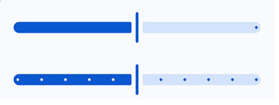

import { Tabs, TabItem } from '@astrojs/starlight/components';

[comment]: <> (La ruta siempre será assets/nombeComponente/componente-header.webp)

| Material| Material 3| 
| :----------------: | :------: |
|              |  | 

Los `slider` es un componente que permite al usuario seleccionar un valor continuo entre dos extremos. El valor seleccionado se puede usar para controlar una función en la aplicación.

## Implementación

### Definición del componente

[comment]: <> (Añade un ``TabItem`` por cada tipo de implementación que tenga)

<Tabs>
<TabItem label="Material">

```kotlin frame="terminal"
@Composable
fun Slider(
  value: Float,
  onValueChange: (Float) -> Unit,
  modifier: Modifier = Modifier,
  enabled: Boolean = true,
  valueRange: ClosedFloatingPointRange = 0f..1f,
  steps: Int = 0,
  onDragStarted: () -> Unit = {},
  onDragStopped: () -> Unit = {},
  colors: SliderColors = SliderDefaults.colors(),
  trackShape: Shape = SliderDefaults.trackShape,
  thumbShape: Shape = SliderDefaults.thumbShape,
  tickShape: Shape = SliderDefaults.tickShape,
  tickPositions: List<Float> = emptyList(),
  tickLabelFormatter: (Float) -> String = { it.toString() },
  label: @Composable (Float) -> Unit = {},
)
```
Atributo | Descripción
------ | -----------
value | Valor actual del slider.
onValueChange | Función lambda que se ejecutará cuando el usuario cambie el valor del slider.
modifier | Modificador que implementará el composable.
enabled | Habilita o deshabilita el slider.
valueRange | Rango de valores que el usuario puede seleccionar.
steps | Número de pasos discretos en los que se puede mover el slider.
onDragStarted | Función lambda que se ejecutará cuando el usuario comience a arrastrar el thumb del slider.
onDragStopped | Función lambda que se ejecutará cuando el usuario detenga el arrastre del thumb del slider.
colors | Permite modificar los colores del slider.
trackShape | Define la forma de la pista del slider.
thumbShape | Define la forma del thumb del slider.
tickShape | Define la forma de las marcas del slider.
tickPositions | Lista de posiciones de las marcas del slider.
tickLabelFormatter | Función lambda que formatea el texto de las marcas del slider.
label | Función lambda que muestra una etiqueta junto al slider.
</TabItem>
<TabItem label="Material 3">

```kotlin frame="terminal"
@Composable
fun Slider(
  value: Float,
  onValueChange: (Float) -> Unit,
  modifier: Modifier = Modifier,
  enabled: Boolean = true,
  valueRange: ClosedFloatingPointRange = 0f..1f,
  steps: Int = 0,
  onDragStarted: () -> Unit = {},
  onDragStopped: () -> Unit = {},
  colors: SliderColors = SliderDefaults.colors(),
  trackShape: Shape = SliderDefaults.trackShape,
  thumbShape: Shape = SliderDefaults.thumbShape,
  tickShape: Shape = SliderDefaults.tickShape,
  tickPositions: List<Float> = emptyList(),
  tickLabelFormatter: (Float) -> String = { it.toString() },
  label: @Composable (Float) -> Unit = {},
)
```

Atributo | Descripción
------ | -----------
value | Valor actual del slider.
onValueChange | Función lambda que se ejecutará cuando el usuario cambie el valor del slider.
modifier | Modificador que implementará el composable.
enabled | Habilita o deshabilita el slider.
valueRange | Rango de valores que el usuario puede seleccionar.
steps | Número de pasos discretos en los que se puede mover el slider.
onDragStarted | Función lambda que se ejecutará cuando el usuario comience a arrastrar el thumb del slider.
onDragStopped | Función lambda que se ejecutará cuando el usuario detenga el arrastre del thumb del slider.
colors | Permite modificar los colores del slider.
trackShape | Define la forma de la pista del slider.
thumbShape | Define la forma del thumb del slider.
tickShape | Define la forma de

</TabItem>
</Tabs>

[comment]: <> (No modifiques el tip)

:::tip[Fuente]
Puedes acceder a la documentación oficial de Google
[desde aquí](https://developer.android.com/reference/kotlin/androidx/compose/runtime/package-summary).
:::

### Ejemplos 

<Tabs>
<TabItem label="Material">

<center></center>

```kotlin frame="terminal"
@Composable
fun SliderExample() {
  var sliderValue by remember { mutableStateOf(0.5f) }  
  Slider(
    value = sliderValue,
    onValueChange = { sliderValue = it },
  )
}
```

</TabItem>
<TabItem label="Material 3">

<center></center>

```kotlin frame="terminal"
@Composable
fun SliderExample() {
  var sliderValue by remember { mutableStateOf(0.5f) }
  
  Slider(
    value = sliderValue,
    onValueChange = { sliderValue = it },
  )
}
```
</TabItem>
</Tabs>