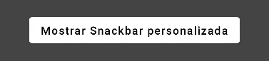

import { Tabs, TabItem } from '@astrojs/starlight/components';

[comment]: <> (La ruta siempre será assets/nombeComponente/componente-header.webp)
| Material  | Material3 |
|-----------|-----------|
|  |  |

El componente de `Snackbar` funciona como una breve notificación que se muestra en la parte inferior de la pantalla. 
Proporciona comentarios sobre una operación o acción sin interrumpir la experiencia del usuario. 

Los Snackbars desaparecen después de unos segundos. El usuario también puede descartarlo con una acción, como presionar un botón.

## Implementación

### Definición del componente

[comment]: <> (Añade un ``TabItem`` por cada tipo de implementación que tenga)

<Tabs>
<TabItem label="Material">

```kotlin frame="terminal"
@Composable
fun Snackbar(
    modifier: Modifier,
    action: @Composable() (() -> Unit)
    actionOnNewLine: Boolean,
    shape: Shape,
    backgroundColor: Color,
    contentColor: Color,
    elevation: Dp,
    content: @Composable () -> Unit
)
```
| Parametro | Descripción |
|-----------|-------------|
| modifier | Modificador que implementará el composable. |
| action | Componente de acción/botón para agregar como acción al `Snackbar`. Considere usar SnackbarDefaults. |
| actionOnNewLine | Si la acción debe colocarse o no en una línea separada. Recomendado para acciones con texto de acción largo. |
| shape | Define la forma del `Snackbar` así como su sombra. |
| backgroundColor | Color de fondo del `Snackbar`. |
| contentColor | Color del contenido que se utilizará dentro del `Snackbar`. |
| elevation | La coordenada "z" en la que colocar el `SnackBar`. Esto controla el tamaño de la sombra debajo del `SnackBar`. |
| content | Contenido para mostrar información sobre un proceso que una aplicación ha realizado o realizará. |

</TabItem>
<TabItem label="Material 3">

```kotlin frame="terminal"
@Composable
fun Snackbar(
    modifier: Modifier,
    action: @Composable() (() -> Unit),
    dismissAction: @Composable() (() -> Unit),
    actionOnNewLine: Boolean,
    shape: Shape,
    containerColor: Color,
    contentColor: Color,
    actionContentColor: Color,
    dismissActionContentColor: Color,
    content: @Composable () -> Unit
)
```
| Parametro | Descripción |
|-----------|-------------|
| modifier | Modificador que implementará el composable. |
| action | Componente de acción/botón para agregar como acción al `Snackbar`. Considere usar SnackbarDefaults. |
| dismissAction | Componente de acción/botón que se agrega como acción de cierre adicional cuando un `Snackbar` no se desprecia a sí mismo. |
| actionOnNewLine | Si la acción debe colocarse o no en una línea separada. Recomendado para acciones con texto de acción largo. |
| shape | Define la forma del contenedor de este `Snackbar`. |
| containerColor | Color utilizado para el fondo de este `Snackbar`. Utilice Color.Transparent para no tener color. |
| contentColor | Color para el contenido dentro de este `Snackbar`. |
| actionContentColor | Color de contenido para la acción opcional dentro del `Snackbar` |
| dismissActionContentColor | Color de contenido para la dismissAction opcional dentro del `Snackbar`. |
| content | Contenido para mostrar información sobre un proceso que una aplicación ha realizado o realizará. |
</TabItem>
</Tabs>

[comment]: <> (No modifiques el tip)

:::tip[Fuente]
Puedes acceder a la documentación oficial de Google
[desde aquí](https://developer.android.com/reference/kotlin/androidx/compose/runtime/package-summary).
:::

### Ejemplos

<Tabs>
<TabItem label="Material">
#### Genérico
| Inicio  | Resultado  |
|---------|-----------|
|  |  |

Esta versión del `Snackbar` está diseñada para trabajar con el SnackbarData provista por el SnackbarHost, el cual normalmente es usado dentro del Scaffold.

Este componente provee solo la visualización del `Snackbar`. 
Si necesitas mostrar el `Snackbar` genérico en la pantalla, usa ScaffoldState.snackbarHostState y SnackbarHostState.showSnackbar:
```kotlin frame="terminal"
@Composable
fun MySnackbar() {
    val scope = rememberCoroutineScope()
    val snackbarHostState = remember { SnackbarHostState() }
    Scaffold(
        snackbarHost = {
            SnackbarHost(hostState = snackbarHostState)
        },
        floatingActionButton = {
            ExtendedFloatingActionButton(
                text = { Text("Mostrar Snackbar") },
                icon = { Icon(Icons.Filled.Add, contentDescription = "") },
                onClick = {
                    scope.launch {
                        snackbarHostState.showSnackbar(
                            "Esto es un Snackbar",
                            actionLabel = "Acción",
                            duration = SnackbarDuration.Indefinite
                        )
                    }
                }
            )
        }
    ) { contentPadding -> // show content
    }
}
```
#### Snackbar Personalizado
| Inicio  | Resultado  |
|---------|-----------|
|  |  |

Si quieres personalizar la apariencia del `Snackbar`, puedes pasar tu propia versión como un componente hijo del SnackbarHost al Scaffold.
```kotlin frame="terminal"
@Composable
fun CustomSnackbar() {
    Snackbar(
        elevation = 0.dp,
        backgroundColor = Color.Transparent
    ) {
        Box(
            modifier = Modifier
                .fillMaxSize()
                .wrapContentHeight()
        ) {
            Column(
                modifier = Modifier
                    .padding(top = 16.dp)
                    .fillMaxWidth()
                    .clip(RoundedCornerShape(10.dp))
                    .background(
                        Brush.verticalGradient(
                            colors = listOf(
                                Color(color = android.graphics.Color.parseColor("#f4b07d")),
                                Color(color = android.graphics.Color.parseColor("#91301b"))
                            )
                        )
                    )
                    .padding(start = 95.dp, top = 8.dp, bottom = 12.dp, end = 8.dp),
                horizontalAlignment = Alignment.Start
            ) {
                Text(
                    text = "Titulo de Snackbar",
                    color = Color.White,
                    fontWeight = FontWeight.Bold,
                    fontSize = 20.sp
                )
                Spacer(modifier = Modifier.padding(vertical = 4.dp))
                Text(
                    text = "Contenido del Snackbar",
                    color = Color.White,
                    fontWeight = FontWeight.SemiBold,
                    fontSize = 15.sp
                )
            }
            Column(
                modifier = Modifier.padding(start = 16.dp),
                horizontalAlignment = Alignment.CenterHorizontally
            ) {
                Card(
                    elevation = 6.dp,
                    shape = RoundedCornerShape(8.dp)
                ) {
                    Button(
                        onClick = { /*TODO*/ },
                        shape = RoundedCornerShape(50)
                    ) {
                        Text("Boton")
                    }
                }
            }
        }
    }
}
@Composable
fun MyCustomSnackbar() {
    val context = LocalContext.current
    val snackbarState = remember { SnackbarHostState() }
    val scope = rememberCoroutineScope()
    Surface(
        color = Color.DarkGray,
        modifier = Modifier.fillMaxSize()
    ) {
        Box(
            modifier = Modifier.fillMaxSize()
        ) {
            Button(
                modifier = Modifier.align(Alignment.Center),
                onClick = {
                    scope.launch {
                        snackbarState.showSnackbar("")
                    }
                },
                colors = ButtonDefaults.buttonColors(
                    backgroundColor = Color.White,
                    contentColor = Color.Black
                )
            ) {
                Text(text = "Mostrar Snackbar personalizada", fontSize = 16.sp)
            }
            SnackbarHost(
                modifier = Modifier.align(Alignment.BottomCenter),
                hostState = snackbarState
            ) {
                CustomSnackbar()
            }
        }
    }
}
```

</TabItem>
<TabItem label="Material 3">
#### Genérico
| Inicio  | Resultado |
|---------|-----------|
|  |  |

Esta versión del `Snackbar` está diseñada para trabajar con el SnackbarData provista por el SnackbarHost, el cual normalmente es usado dentro del Scaffold.

Este componente provee solo la visualización del `Snackbar`. 
Si necesitas mostrar el `Snackbar` genérico en la pantalla, usa ScaffoldState.snackbarHostState y SnackbarHostState.showSnackbar:

```kotlin frame="terminal"
@Composable
fun DefaultSnackbar() {
    val scope = rememberCoroutineScope()
    val snackbarHostState = remember { SnackbarHostState() }
    Scaffold(
        snackbarHost = { SnackbarHost(hostState = snackbarHostState) },
        floatingActionButton = {
            ExtendedFloatingActionButton(
                //text = { Text("Show snackbar") },
                onClick = {
                    scope.launch {
                        val result = snackbarHostState.showSnackbar(
                            message = "Snackbar",
                            actionLabel = "Acción",
                            duration = SnackbarDuration.Long
                        )
                        when (result) {
                            SnackbarResult.ActionPerformed -> {
                                //Si presiono la acción del snackbar
                            }
                            SnackbarResult.Dismissed -> {
                                // Si ignoras el snackbar
                            }
                        }
                    }
                }
            ) {
                Text("Mostrar Snackbar")
            }
        }
    ) { contentPadding ->
        {
            //do something
        }
    }
}
```

#### Personalizado

| Inicio  | Resultado |
|---------|-----------|
|  |  |

Si quieres personalizar la apariencia del `Snackbar`, puedes pasar tu propia versión como un componente hijo del SnackbarHost al Scaffold.
```kotlin frame="terminal"
@Composable
fun CustomSnackbar() {
    Snackbar(
        containerColor = MaterialTheme.colorScheme.onTertiaryContainer,
        shape = RoundedCornerShape(25)
    ) {
        Box(
            modifier = Modifier
                .fillMaxWidth()
                .wrapContentHeight()
        ) {
            Column(
                modifier = Modifier
                    .padding(10.dp)
                    .fillMaxWidth(),
            ) {
                Text("Titulo")
                Spacer(modifier = Modifier.height(4.dp))
                Text("Tienes una nueva notificación")
            }
            Column(modifier = Modifier.align(Alignment.CenterEnd)) {
                Button(onClick = { /*TODO*/ }) {
                    Text("Acción")
                }
            }


        }
    }
}
@Composable
fun MyCustomSnackbar() {
    val context = LocalContext.current
    val snackbarState = remember { SnackbarHostState() }
    val coroutineScope = rememberCoroutineScope()
    Surface(
        color = Color.DarkGray,
        modifier = Modifier.fillMaxSize()
    ) {
        Box(modifier = Modifier.fillMaxSize()) {
            Button(
                modifier = Modifier.align(Alignment.Center),
                onClick = {
                    coroutineScope.launch {
                        snackbarState.showSnackbar("")
                    }
                }
            ) {
                Text("Mostrar custom snackbar")
            }
            SnackbarHost(
                modifier = Modifier.align(Alignment.BottomCenter),
                hostState = snackbarState
            ) {
                CustomSnackbar()
            }
        }
    }
}
```

</TabItem>
</Tabs>