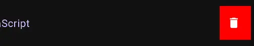
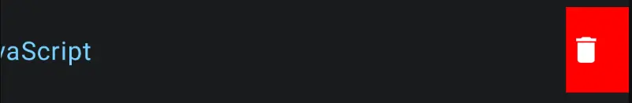

import { Tabs, TabItem } from '@astrojs/starlight/components';

|                                                         Material                                                         |                                                         Material 3                                                         |
|:------------------------------------------------------------------------------------------------------------------------:|:--------------------------------------------------------------------------------------------------------------------------:|
|  |  |

El componente `SwipeToDismiss` permite a los usuarios realizar acciones en un elemento
de la lista deslizando horizontalmente sobre él (generalmente hacia la izquierda o la derecha).
Aunque comúnmente se utiliza para eliminar elementos, este componente también puede configurarse
para llevar a cabo otras acciones como archivar, marcar como leído/no leído, agregar a favoritos,
entre otros. Esta interacción mejora la experiencia del usuario al proporcionar una forma rápida y
eficiente de manejar elementos en una lista.

## Implementación

### Definición del componente
<Tabs>
<TabItem label="Material">
```kotlin frame="terminal"
@Composable
fun SwipeToDismiss(
    state: DismissState,
    background: @Composable RowScope.() -> Unit,
    dismissContent: @Composable RowScope.() -> Unit,
    modifier: Modifier = Modifier,
    directions: Set<DismissDirection> = setOf(EndToStart, StartToEnd),
    dismissThresholds: (DismissDirection) -> ThresholdConfig = {
        FixedThreshold(DISMISS_THRESHOLD)
    },
)
```

Atributo | Descripción
------ | -----------
state| Estado que controla el deslizamiento del elemento, indicando si ha sido descartado o no.
background | Función lambda que define el contenido que se muestra detrás del elemento mientras se está deslizando.
dismissContent | Función lambda que define el contenido principal del elemento que se puede deslizar.
modifier | Modificador opcional para personalizar el estilo y el diseño del componente.
directions | Conjunto de direcciones en las que se permite el deslizamiento del elemento (por defecto, de derecha a izquierda y de izquierda a derecha).
dismissThresholds | Configura que tanto deber ser deslizado un elemento para realizar una acción.

:::tip[Fuente]
Puedes acceder a la documentación oficial de Google
[desde aquí](https://developer.android.com/reference/kotlin/androidx/compose/material/package-summary#SwipeToDismiss(androidx.compose.material.DismissState,androidx.compose.ui.Modifier,kotlin.collections.Set,kotlin.Function1,kotlin.Function1,kotlin.Function1)).
:::
</TabItem>

<TabItem label="Material 3">
```kotlin frame="terminal"
@Composable
fun SwipeToDismissBox(
    state: SwipeToDismissBoxState,
    backgroundContent: @Composable RowScope.() -> Unit,
    modifier: Modifier = Modifier,
    enableDismissFromStartToEnd: Boolean = true,
    enableDismissFromEndToStart: Boolean = true,
    gesturesEnabled: Boolean = true,
    content: @Composable RowScope.() -> Unit
): Unit
```

Atributo | Descripción
------ | -----------
state| Estado que controla el deslizamiento del elemento, indicando si ha sido descartado o no.
backgroundContent | Función lambda que define el contenido que se muestra detrás del elemento mientras se está deslizando.
modifier | Modificador opcional para personalizar el estilo y el diseño del componente.
enableDismissFromStartToEnd | Indica si se puede deslizar de izquierda a derecha
enableDismissFromEndToStart | Indica si se puede delizar de derecha a izquierda
gesturesEnabled | Indica si se puede interactuar con gestos
content | Función lambda que define el contenido principal del elemento que se puede deslizar.

:::tip[Fuente]
Puedes acceder a la documentación oficial de Google
[desde aquí](https://developer.android.com/reference/kotlin/androidx/compose/material3/package-summary#SwipeToDismissBox(androidx.compose.material3.SwipeToDismissBoxState,kotlin.Function1,androidx.compose.ui.Modifier,kotlin.Boolean,kotlin.Boolean,kotlin.Boolean,kotlin.Function1)).
:::
</TabItem>
</Tabs>
### Ejemplos

<Tabs>

<TabItem label="Material">

<center></center>

```kotlin frame="terminal"
@file:OptIn(ExperimentalMaterialApi::class)

package com.example.swipes

import android.os.Bundle
import androidx.activity.ComponentActivity
import androidx.activity.compose.setContent
import androidx.activity.enableEdgeToEdge
import androidx.compose.animation.AnimatedVisibility
import androidx.compose.animation.core.tween
import androidx.compose.animation.fadeOut
import androidx.compose.animation.shrinkVertically
import androidx.compose.foundation.background
import androidx.compose.foundation.layout.Box
import androidx.compose.foundation.layout.fillMaxSize
import androidx.compose.foundation.layout.fillMaxWidth
import androidx.compose.foundation.layout.padding
import androidx.compose.foundation.lazy.LazyColumn
import androidx.compose.foundation.lazy.items
import androidx.compose.material.icons.Icons
import androidx.compose.material.icons.filled.Delete
import androidx.compose.material.DismissDirection
import androidx.compose.material.DismissState
import androidx.compose.material.DismissValue
import androidx.compose.material.ExperimentalMaterialApi
import androidx.compose.material.Icon
import androidx.compose.material.MaterialTheme
import androidx.compose.material.Scaffold
import androidx.compose.material.Surface
import androidx.compose.material.SwipeToDismiss
import androidx.compose.material.Text
import androidx.compose.material.TopAppBar
import androidx.compose.material.rememberDismissState
import androidx.compose.runtime.Composable
import androidx.compose.runtime.LaunchedEffect
import androidx.compose.runtime.getValue
import androidx.compose.runtime.mutableStateListOf
import androidx.compose.runtime.mutableStateOf
import androidx.compose.runtime.remember
import androidx.compose.runtime.saveable.Saver
import androidx.compose.runtime.saveable.listSaver
import androidx.compose.runtime.saveable.rememberSaveable
import androidx.compose.runtime.setValue
import androidx.compose.ui.Alignment
import androidx.compose.ui.Modifier
import androidx.compose.ui.graphics.Color
import androidx.compose.ui.unit.dp
import com.example.swipes.ui.theme.SwipesTheme
import kotlinx.coroutines.delay

class MainActivity : ComponentActivity() {
    override fun onCreate(savedInstanceState: Bundle?) {
        super.onCreate(savedInstanceState)
        enableEdgeToEdge()
        setContent {
            SwipesTheme {
                Surface(
                    modifier = Modifier
                        .fillMaxSize()
                        .background(MaterialTheme.colors.background),
                    color = MaterialTheme.colors.background
                ) {
                    val programmingLanguages = rememberSaveable(
                    saver = ListSaver
                    ) {
                        mutableStateListOf(
                            "Kotlin",
                            "C++",
                            "C#",
                            "Java",
                            "JavaScript",
                            "Swift",
                            "Python"
                        )
                    }
                    Scaffold (
                        topBar = {
                            TopAppBar(
                                title = {
                                    Text(text = "Programming Languages")
                                }
                            )
                        }
                    ){padding ->
                        LazyColumn(
                            modifier = Modifier
                                .fillMaxSize()
                                .padding(padding)
                        ) {
                            items(items = programmingLanguages, key = { it }) { language ->
                                SwipeToDeleteContainer(
                                    item = language,
                                    onDelete = { programmingLanguages.remove(language) }) { item ->
                                    Text(
                                        text = item,
                                        modifier = Modifier
                                            .fillMaxWidth()
                                            .background(MaterialTheme.colors.background)
                                            .padding(16.dp),
                                        color = MaterialTheme.colors.primary
                                    )
                                }
                            }
                        }
                    }
                }
            }
        }
    }
}

@Composable
fun <T> SwipeToDeleteContainer(
    item: T,
    onDelete: (T) -> Unit,
    animationDuration: Int = 500,
    content: @Composable (T) -> Unit
) {
    var isRemoved by remember { mutableStateOf(false) }
    val dismissState = rememberDismissState(confirmStateChange = { value ->
        if (value == DismissValue.DismissedToStart) {
            isRemoved = true
            true
        } else {
            false
        }
    })

    LaunchedEffect(key1 = isRemoved) {
        if (isRemoved) {
            delay(animationDuration.toLong())
            onDelete(item)
        }
    }

    AnimatedVisibility(
        visible = !isRemoved,
        exit = shrinkVertically(
        animationSpec = tween(durationMillis = animationDuration),
        shrinkTowards = Alignment.Top
        ) + fadeOut()
    ) {
        SwipeToDismiss(
            state = dismissState,
            background = {
            DeleteBackground(swipeDismissState = dismissState)
            },
            dismissContent = { content(item) },
            directions = setOf(DismissDirection.EndToStart)
        )
    }
}

@Composable
fun DeleteBackground(
swipeDismissState: DismissState
) {
    val color = if (swipeDismissState.dismissDirection == DismissDirection.EndToStart) {
    Color.Red
    } else Color.Transparent

    Box(
        modifier = Modifier
            .fillMaxSize()
            .background(color)
            .padding(16.dp),
        contentAlignment = Alignment.CenterEnd
    ) {
        Icon(
            imageVector = Icons.Default.Delete,
            contentDescription = null,
            tint = Color.White
        )
    }
}

val ListSaver: Saver<MutableList<String>, Any> = listSaver(
    save = { stateList ->
        stateList.toList()
    },
    restore = { list ->
        mutableStateListOf<String>().apply { addAll(list) }
    }
)
```

</TabItem>

<TabItem label = "Material 3">

<center></center>

```kotlin frame="terminal"
@file:OptIn(ExperimentalMaterial3Api::class)

package com.example.swipes

import android.os.Bundle
import androidx.activity.ComponentActivity
import androidx.activity.compose.setContent
import androidx.activity.enableEdgeToEdge
import androidx.compose.animation.AnimatedVisibility
import androidx.compose.animation.animateColorAsState
import androidx.compose.animation.core.tween
import androidx.compose.animation.fadeOut
import androidx.compose.animation.shrinkVertically
import androidx.compose.foundation.background
import androidx.compose.foundation.layout.Box
import androidx.compose.foundation.layout.fillMaxSize
import androidx.compose.foundation.layout.fillMaxWidth
import androidx.compose.foundation.layout.padding
import androidx.compose.foundation.lazy.LazyColumn
import androidx.compose.foundation.lazy.items
import androidx.compose.material.icons.Icons
import androidx.compose.material.icons.filled.Delete
import androidx.compose.material3.ExperimentalMaterial3Api
import androidx.compose.material3.Icon
import androidx.compose.material3.MaterialTheme
import androidx.compose.material3.Scaffold
import androidx.compose.material3.Surface
import androidx.compose.material3.SwipeToDismissBox
import androidx.compose.material3.SwipeToDismissBoxState
import androidx.compose.material3.SwipeToDismissBoxValue
import androidx.compose.material3.Text
import androidx.compose.material3.TopAppBar
import androidx.compose.material3.rememberSwipeToDismissBoxState
import androidx.compose.runtime.Composable
import androidx.compose.runtime.LaunchedEffect
import androidx.compose.runtime.getValue
import androidx.compose.runtime.mutableStateListOf
import androidx.compose.runtime.mutableStateOf
import androidx.compose.runtime.remember
import androidx.compose.runtime.saveable.Saver
import androidx.compose.runtime.saveable.listSaver
import androidx.compose.runtime.saveable.rememberSaveable
import androidx.compose.runtime.setValue
import androidx.compose.ui.Alignment
import androidx.compose.ui.Modifier
import androidx.compose.ui.graphics.Color
import androidx.compose.ui.unit.dp
import com.example.swipes.ui.theme.SwipesTheme
import kotlinx.coroutines.delay

class MainActivity : ComponentActivity() {
    override fun onCreate(savedInstanceState: Bundle?) {
        super.onCreate(savedInstanceState)
        enableEdgeToEdge()
        setContent {
            SwipesTheme {
                Surface(
                    modifier = Modifier
                        .fillMaxSize()
                        .background(MaterialTheme.colorScheme.background),
                    color = MaterialTheme.colorScheme.background
                ) {
                    val programmingLanguages = rememberSaveable(
                        saver = ListSaver
                    ) {
                        mutableStateListOf(
                            "Kotlin",
                            "C++",
                            "C#",
                            "Java",
                            "JavaScript",
                            "Swift",
                            "Python"
                        )
                    }
                    Scaffold (
                        topBar = {
                            TopAppBar(
                                title = {
                                    Text(text = "Programming Languages")
                                }
                            )
                        }
                    ){padding ->
                        LazyColumn(
                            modifier = Modifier
                                .fillMaxSize()
                                .padding(padding)
                            ) {
                            items(items = programmingLanguages, key = { it }) { language ->
                                SwipeToDeleteContainer(
                                    item = language,
                                    onDelete = { programmingLanguages.remove(language) }) { item ->
                                    Text(
                                        text = item,
                                        modifier = Modifier
                                            .fillMaxWidth()
                                            .background(MaterialTheme.colorScheme.background)
                                            .padding(16.dp),
                                        color = MaterialTheme.colorScheme.primary
                                    )
                                }
                            }
                        }
                    }
                }
            }
        }
    }
}

@Composable
fun <T> SwipeToDeleteContainer(
    item: T,
    onDelete: (T) -> Unit,
    animationDuration: Int = 500,
    content: @Composable (T) -> Unit
    ) {
    var isRemoved by remember { mutableStateOf(false) }
    val dismissState = rememberSwipeToDismissBoxState(confirmValueChange = { value ->
        if (value == SwipeToDismissBoxValue.EndToStart) {
            isRemoved = true
            true
        } else {
            false
        }
    })

    LaunchedEffect(key1 = isRemoved) {
        if (isRemoved) {
            delay(animationDuration.toLong())
            onDelete(item)
        }
    }

    AnimatedVisibility(
        visible = !isRemoved,
        exit = shrinkVertically(
            animationSpec = tween(durationMillis = animationDuration),
            shrinkTowards = Alignment.Top
        ) + fadeOut()
    ) {
        SwipeToDismissBox(
            state = dismissState,
            backgroundContent = {
                DeleteBackground(swipeDismissState = dismissState)
            },
            content = { content(item) },
            enableDismissFromStartToEnd = false,
        )
    }
}

@Composable
fun DeleteBackground(
swipeDismissState: SwipeToDismissBoxState
) {
    val color by animateColorAsState(
        when (swipeDismissState.targetValue) {
        SwipeToDismissBoxValue.Settled -> Color.LightGray
        SwipeToDismissBoxValue.StartToEnd -> Color.Green
        SwipeToDismissBoxValue.EndToStart -> Color.Red
        }, label = ""
    )

        Box(
            modifier = Modifier
                .fillMaxSize()
                .background(color)
                .padding(16.dp),
            contentAlignment = Alignment.CenterEnd
        ) {
        Icon(
            imageVector = Icons.Default.Delete,
            contentDescription = null,
            tint = Color.White
        )
    }
}

val ListSaver: Saver<MutableList<String>, Any> = listSaver(
    save = { stateList ->
        stateList.toList()
    },
    restore = { list ->
        mutableStateListOf<String>().apply { addAll(list) }
    }
)
```

</TabItem>

</Tabs>
