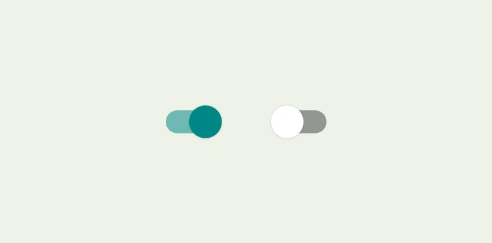
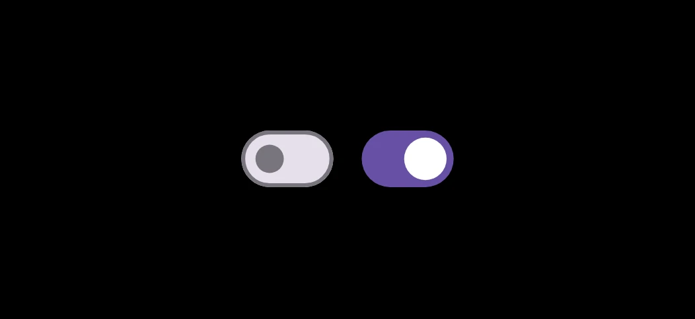
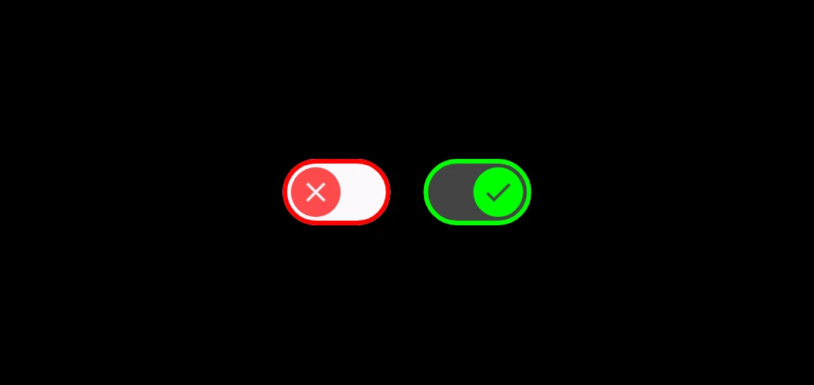

import { Tabs, TabItem } from "@astrojs/starlight/components";


El componente `Switch` permite a los usuarios alternar entre dos estados: **marcado** y **desmarcado**. Se puede usar un interruptor (`Switch`) para permitir que el usuario realice por ejemplo, alguna de las siguientes acciones:

- Activar o desactivar un parámetro de configuración.
- Habilitar o inhabilitar una función en la app.
- Seleccionar una opción.

El componente tiene dos partes: el círculo(*Thumb*) y la pista(*Track*). El círculo es la parte arrastrable del interruptor, y la pista es el fondo. El usuario puede arrastrar el pulgar hacia la izquierda o la derecha para cambiar el estado del interruptor. También pueden presionar el interruptor y lograr el mismo resultado.

![Estructura del Switch [Switch]](../../../assets/switch/switch-structure.webp)

## Implementación 

### Definición del componente

<Tabs>

<TabItem label="Material">

```kotlin frame="terminal"
@Composable
Switch(
    checked: Boolean,
    onCheckedChange: ((Boolean) -> Unit)?,
    modifier: Modifier = Modifier,
    enabled: Boolean = true,
    interactionSource: MutableInteractionSource = remember { MutableInteractionSource() },
    colors: SwitchColors = SwitchDefaults.colors()
)
```

- **checked**: Es el estado inicial del interruptor.
- **onCheckedChange**: Es una devolución de llamada a la que se llama cuando cambia el estado del interruptor.
- **modifier**: Modificador que implementará el composable (_Opcional_).
- **enabled**: Indica si el interruptor está habilitado o inhabilitado.
- **interactionSource**: Usa esta opción para personalizar el color de la ruta y el círculo. _(Representa un flujo de interacciones correspondientes a eventos emitidos por un componente)_
- **colors**: Los colores que se usaron para el cambio.

</TabItem>

<TabItem label="Material 3">

```kotlin frame="terminal"
@Composable
Switch(
    checked: Boolean,
    onCheckedChange: ((Boolean) -> Unit)?,
    modifier: Modifier,
    thumbContent: (@Composable () -> Unit)?,
    enabled: Boolean,
    colors: SwitchColors,
    interactionSource: MutableInteractionSource
)
```

- **checked**: Es el estado inicial del interruptor.
- **onCheckedChange**: Es una devolución de llamada a la que se llama cuando cambia el estado del interruptor.
- **modifier**: Modificador que implementará el composable (_Opcional_).
- **thumbContent**: Úsalo para personalizar la apariencia del círculo cuando está marcado.
- **enabled**: Indica si el interruptor está habilitado o inhabilitado.
- **colors**: Los colores que se usaron para el cambio.
- **interactionSource**: Usa esta opción para personalizar el color de la ruta y el círculo. _(Representa un flujo de interacciones correspondientes a eventos emitidos por un componente)_

</TabItem>

</Tabs>

:::tip[Fuente]
Puedes acceder a la documentación oficial del componente
[desde aquí](https://developer.android.com/jetpack/compose/components/switch?hl=es-419).
:::

### Ejemplos

<Tabs>

<TabItem label="Material">

```kotlin "androidx.compose.material.Switch" title="SwitchM2Default" frame="terminal"
import androidx.compose.material.Switch
@Composable
fun SwitchDefault() {
    val checkedState = remember { mutableStateOf(true) }
    Switch(
        checked = checkedState.value,
        onCheckedChange = { checkedState.value = it }
    )
}
```

<center>

</center>

</TabItem>

<TabItem label="Material 3">

```kotlin "androidx.compose.material3.Switch" title="SwitchM3Default" frame="terminal"
import androidx.compose.material3.Switch
@Composable
fun SwitchDefault() {
    val checkedState = remember { mutableStateOf(true) }
    Switch(
        checked = checkedState.value,
        onCheckedChange = { checkedState.value = it }
    )
}
```

<center>

</center>

</TabItem>
{/* <TabItem label="Material 3">

```kotlin "androidx.compose.material3.Switch" title="SwitchM3WithIcon" frame="terminal"
import androidx.compose.material3.Switch
@Composable
fun SwitchWithIcon() {
    var switchCheckedState by remember { mutableStateOf(false) }

    Switch(
        checked = switchCheckedState,
        enabled = false,
        onCheckedChange = { switchCheckedState = it },
        thumbContent = {
            Icon(
                imageVector = if (switchCheckedState) Icons.Filled.Check else Icons.Filled.Close,
                contentDescription = null,
                modifier = Modifier.size(SwitchDefaults.IconSize)
            )
        },
        colors = SwitchDefaults.colors(
            checkedThumbColor = Color.Green,
            checkedIconColor = Color.DarkGray,
            uncheckedThumbColor = Color.Red,
            uncheckedIconColor = Color.LightGray,
            disabledCheckedThumbColor = Color.Green.copy(alpha = 0.7f),
            disabledUncheckedThumbColor = Color.Red.copy(alpha = 0.7f),
            disabledUncheckedBorderColor = Color.Red,
        )
    )
}
```

<center>

</center>

</TabItem> */}
</Tabs>

:::note
Puedes pasar cualquier elemento componible para el parámetro `thumbContent` (Material 3) a fin de crear una miniatura personalizada:
<center>

</center>
:::
