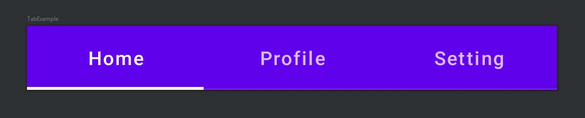
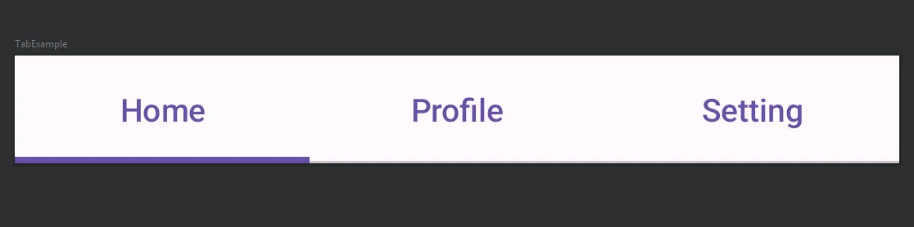

import { Tabs, TabItem } from "@astrojs/starlight/components";

[comment]: <> (La ruta siempre será assets/nombeComponente/componente-header.webp)

|                                         Material                                         |                                         Material 3                                          |
| :--------------------------------------------------------------------------------------: | :-----------------------------------------------------------------------------------------: |
|  |  |

El componente `Tab`, también conocido como pestaña de navegación. Organiza el contenido en diferentes pantallas, conjuntos de datos y otras interacciones.

Un tab representa una sola página de contenido mediante una etiqueta de texto y/o un icono. Representa su estado seleccionado teniendo la etiqueta de texto y/o la imagen con la propiedad **selectedContentColor**.

## Implementación

### Definición del componente

[comment]: <> (Añade un `TabItem` por cada tipo de implementación que tenga)

<Tabs>
<TabItem label="Material">

```kotlin frame="terminal"
@Composable
fun Tab(
    selected: Boolean,
    onClick: () -> Unit,
    modifier: Modifier = Modifier,
    enabled: Boolean = true,
    text: (@Composable () -> Unit)? = null,
    icon: (@Composable () -> Unit)? = null,
    interactionSource: MutableInteractionSource? = null,
    selectedContentColor: Color = LocalContentColor.current,
    unselectedContentColor: Color = selectedContentColor.copy(alpha = ContentAlpha.medium)
): Unit
```

| Atributo                | Descripción |
| ------------ |---------------------- |
| selected               | Si el Tab esta seleccionado o no. |
| onClick                | Se llama cuando se hace clic en este tab.|
| modifier               | Modificador opcional para este Tab.  |
| enabled                | Controla el estado habilitado del tab. Cuando esta en falso este componente no responderá a la interaccion del usuario y aparecera visualmente deshabilitado. |
| text                   | El texto que se mostrará en el tab.   |
| icon                   | El icono que se mostrará en el tab.   |
| interactionSource      | Representa el flujo de interacciones del usuario con el tab como dar click o deslizar. Podemos crear animaciones, efectos visuales y comportamientos personalizados en respuesta a las interacciones. | 
| selectedContentColor:  | Define el color para el contenido del tab cuando está seleccionado, y el color de la ondulación (ripple). |
| unselectedContentColor | El color del contenido del tab cuando no esta seleccionado.|
</TabItem>
<TabItem label="Material 3">

```kotlin frame="terminal"
@Composable
fun Tab(
    selected: Boolean,
    onClick: () -> Unit,
    modifier: Modifier = Modifier,
    enabled: Boolean = true,
    text: (@Composable () -> Unit)? = null,
    icon: (@Composable () -> Unit)? = null,
    selectedContentColor: Color = LocalContentColor.current,
    unselectedContentColor: Color = selectedContentColor,
    interactionSource: MutableInteractionSource = remember { MutableInteractionSource() }
): Unit
```

|  Atributo  | Descripción |
| ------------ | ----------- |
| selected               | Si el Tab esta seleccionado o no.  |
| onClick                | Se llama cuando se hace clic en este tab.  |
| modifier               | Modificador que implementará el composable.   |
| enabled                | Controla el estado habilitado del tab. Cuando esta en falso este componente no responderá a la interaccion del usuario y aparecera visualmente deshabilitado. |
| text                   | El texto que se mostrará en el tab.   |
| icon                   | El icono que se mostrará en el tab.   |
| selectedContentColor   | Define el color para el contenido del tab cuando está seleccionado, y el color de la ondulación (ripple).  |
| unselectedContentColor | El color del contenido del tab cuando no esta seleccionado. |
| interactionSource      | Representa el flujo de interacciones del usuario con el tab como dar click o deslizar. Podemos crear animaciones, efectos visuales y comportamientos personalizados en respuesta a las interacciones.  |

</TabItem>
</Tabs>

[comment]: <> (No modifiques el tip)

:::tip[Fuente]
Puedes acceder a la documentación oficial de Google
[desde aquí](<https://developer.android.com/reference/kotlin/androidx/compose/material3/package-summary#Tab(kotlin.Boolean,kotlin.Function0,androidx.compose.ui.Modifier,kotlin.Boolean,kotlin.Function0,kotlin.Function0,androidx.compose.ui.graphics.Color,androidx.compose.ui.graphics.Color,androidx.compose.foundation.interaction.MutableInteractionSource)>).
:::

### Ejemplos

<Tabs>
<TabItem label="Material">

<center>
  
</center>

```kotlin frame="terminal"
@Composable
fun TabExample() {

    val tabs = listOf("Home", "Profile", "Setting")
    val selectedTab = remember { mutableStateOf(0) }

    TabRow(selectedTabIndex = selectedTab.value) {
        tabs.forEachIndexed { index, title ->
            Tab(
                selected = selectedTab.value == index,
                onClick = { selectedTab.value = index },
                text = { Text(text = title) },
            )
        }
    }
}

```

<center>
  
</center>

```kotlin frame="terminal"
fun TabExample() {
    val tabs = listOf(
        TabData("Home", Icons.Filled.Home),
        TabData("Profile", Icons.Filled.Person),
        TabData("Setting", Icons.Filled.Settings)
    )
    val selectedTab = remember { mutableStateOf(0) }

    Column {
        TabRow(selectedTabIndex = selectedTab.value) {
            tabs.forEachIndexed { index, tab ->
                Tab(
                    selected = selectedTab.value == index,
                    onClick = { selectedTab.value = index },
                    text = { Text(text = tab.title) },
                    icon = { Icon(
                        imageVector = tab.icon,
                        contentDescription = null // Provide a content description if needed
                    )}
                )
            }
        }

        // Contenido para cada tab
        when (selectedTab.value) {
            0 -> HomeScreen()
            1 -> ProfileScreen()
            2 -> SettingScreen()
        }
    }
}

//Creamos una data class para el texto y el titulo del Tab
data class TabData(val title: String, val icon: ImageVector)

@Composable
fun HomeScreen() {
    // Contenido pantalla Home
}

@Composable
fun ProfileScreen() {
    // Contenido pantalla Profile
}

@Composable
fun SettingScreen() {
    // Contenido pantalla Setting
}

```

</TabItem>
<TabItem label="Material 3">

<center>
  
</center>

```kotlin frame="terminal"
@Composable
fun TabExample() {

    val tabs = listOf("Home", "Profile", "Setting")
    val selectedTab = remember { mutableStateOf(0) }

    TabRow(selectedTabIndex = selectedTab.value) {
        tabs.forEachIndexed { index, title ->
            Tab(
                selected = selectedTab.value == index,
                onClick = { selectedTab.value = index },
                text = { Text(text = title) },
            )
        }
    }
}
```

<center>
  
</center>

```kotlin frame="terminal"
@Composable
fun TabExample() {
    val tabs = listOf(
        TabData("Home", Icons.Filled.Home),
        TabData("Profile", Icons.Filled.Person),
        TabData("Setting", Icons.Filled.Settings)
    )
    val selectedTab = remember { mutableStateOf(0) }

    Column {
        TabRow(selectedTabIndex = selectedTab.value) {
            tabs.forEachIndexed { index, tab ->
                Tab(
                    selected = selectedTab.value == index,
                    onClick = { selectedTab.value = index },
                    text = { Text(text = tab.title) },
                    icon = { Icon(
                        imageVector = tab.icon,
                        contentDescription = null // Provide a content description if needed
                    )}
                )
            }
        }

        // Contenido para cada tab
        when (selectedTab.value) {
            0 -> HomeScreen()
            1 -> ProfileScreen()
            2 -> SettingScreen()
        }
    }
}

//Creamos una data class para el texto y el titulo del Tab
data class TabData(val title: String, val icon: ImageVector)

@Composable
fun HomeScreen() {
    // Contenido pantalla Home
}

@Composable
fun ProfileScreen() {
    // Contenido pantalla Profile
}

@Composable
fun SettingScreen() {
    // Contenido pantalla Setting
}
```

</TabItem>
</Tabs>
