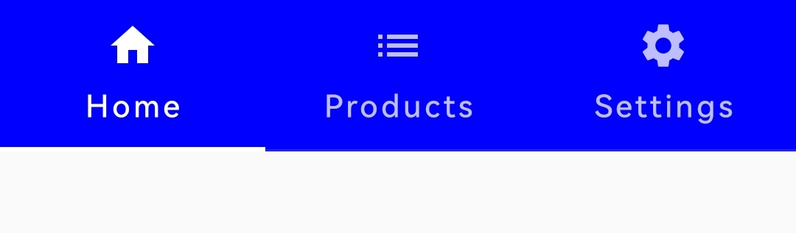
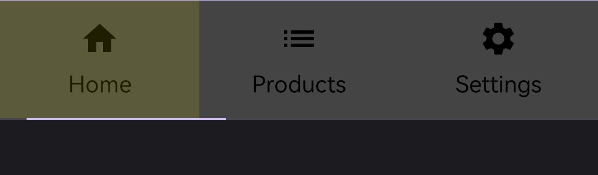

import { Tabs, TabItem } from '@astrojs/starlight/components';

[comment]: <> (La ruta siempre será assets/nombeComponente/componente-header.webp)

| Material| Material 3| 
| :----------------: | :------: |
|               |  | 

Los `TabRow` en Jetpack Compose, un TabRow es un contenedor que mantiene una fila de pestañas.
se puede personalizar para cambiar el color de fondo, el color del contenido, el indicador de la pestaña seleccionada y la separación entre las pestañas.
## Implementación

### Definición del componente

[comment]: <> (Añade un ``TabItem`` por cada tipo de implementación que tenga)

<Tabs>
<TabItem label="Material">

```kotlin frame="terminal"
@Composable
fun TabRow(
    selectedTabIndex = tabIndex,
    modifier = Modifier,
    backgroundColor = Color.Blue,
    indicator = {},
    divider = {},
    contentColor= Color.White
    ){}
```
Atributo | Descripción
------ | -----------
selectedTabIndex | Índice de la pestaña seleccionada actualmente.
modifier | Modificador que implementará el composable.
backgroundColor | Color de fondo del `TabRow`.
indicator | Función lambda que define el indicador que resalta la pestaña seleccionada.
contentColor | Color del contenido.

</TabItem>
<TabItem label="Material 3">

```kotlin frame="terminal"
@Composable
fun TabRow(
    selectedTabIndex = tabIndex,
    modifier = Modifier,
    containerColor = Color.DarkGray,
    contentColor = Color.Yellow,
    indicator = {},
    divider = {}
    ){}
```

Atributo | Descripción
------ | -----------
selectedTabIndex | Índice de la pestaña seleccionada actualmente.
modifier | Modificador que implementará el composable.
containerColor | Color de fondo del `TabRow`.
indicator | Función lambda que define el indicador que resalta la pestaña seleccionada.
contentColor | Color de fondo al dar click en una pestaña.
divider | Función lambda que se utiliza para establecer el divisor entre las pestañas. Si no se especifica, se utiliza un divisor predeterminado. 
</TabItem>
</Tabs>

[comment]: <> (No modifiques el tip)

:::tip[Fuente]
Puedes acceder a la documentación oficial de Google
[desde aquí](https://developer.android.com/reference/kotlin/androidx/compose/runtime/package-summary).
:::

### Ejemplos 

<Tabs>
<TabItem label="Material">

<center></center>

```kotlin frame="terminal"
@Composable
fun MyTabScreen() {
  
    var tabIndex by remember { mutableIntStateOf(0) }
    val tabs = listOf("Home", "Products", "Settings")

    Column(modifier = Modifier.fillMaxWidth()) {
        TabRow(
            selectedTabIndex = tabIndex,
            modifier = Modifier,
            backgroundColor = Color.Blue,
            contentColor = Color.White,
            indicator = { tabPositions ->
                TabRowDefaults.apply {
                Divider(Modifier
                        .height(2.dp)
                        .padding(horizontal = 16.dp)
                        .tabIndicatorOffset(tabPositions[tabIndex]),
                        color = MaterialTheme.colors.primary
                    )
                }
            },
            divider ={}
        ) {
            tabs.forEachIndexed { index, title ->
                Tab(text = { Text(title) },
                    selected = tabIndex == index,
                    onClick = { tabIndex = index },
                    icon = {
                        when (index) {
                            0 -> Icon(imageVector = Icons.Default.Home, contentDescription = null)
                            1 -> Icon(imageVector = Icons.Default.List, contentDescription = null)
                            2 -> Icon(imageVector = Icons.Default.Settings, contentDescription = null)
                        }
                    }
                )
            }
        }

        when (tabIndex) {
            0 -> HomeScreen()
            1 -> ProductsScreen()
            2 -> SettingsScreen()
        }
    }
}

@Composable
fun HomeScreen() {
    Column(
        Modifier.fillMaxSize(),
        verticalArrangement = Arrangement.Center,
        horizontalAlignment = Alignment.CenterHorizontally
    ) {
        Text(text = "Home", fontSize = 25.sp)
    }
}

@Composable
fun ProductsScreen() {
    Column(
        Modifier.fillMaxSize(),
        verticalArrangement = Arrangement.Center,
        horizontalAlignment = Alignment.CenterHorizontally
    ) {
        Text(text = "Products", fontSize = 25.sp)
    }
}

@Composable
fun SettingsScreen() {
    Column(
        Modifier.fillMaxSize(),
        verticalArrangement = Arrangement.Center,
        horizontalAlignment = Alignment.CenterHorizontally
    ) {
        Text(text = "Settings", fontSize = 25.sp)
    }
}
```

</TabItem>
<TabItem label="Material 3">

<center></center>

```kotlin frame="terminal"
@Composable
fun MyTabScreen() {

    var tabIndex by remember { mutableIntStateOf(0) }
    val tabs = listOf("Home", "Products", "Settings")

    Column(modifier = Modifier.fillMaxWidth()) {
        TabRow(
            selectedTabIndex = tabIndex,
            modifier = Modifier,
            containerColor = Color.DarkGray,
            contentColor = Color.Yellow,
            indicator = { tabPositions ->
                TabRowDefaults.apply {
                Divider(Modifier
                        .height(2.dp)
                        .padding(horizontal = 16.dp)
                        .tabIndicatorOffset(tabPositions[tabIndex]),
                        color = MaterialTheme.colorScheme.primary
                    )
                }
            },
            divider ={}
        ) {
            tabs.forEachIndexed { index, title ->
                Tab(text = { Text(title) },
                    selected = tabIndex == index,
                    onClick = { tabIndex = index },
                    icon = {
                        when (index) {
                            0 -> Icon(imageVector = Icons.Default.Home, contentDescription = null)
                            1 -> Icon(imageVector = Icons.Default.List, contentDescription = null)
                            2 -> Icon(imageVector = Icons.Default.Settings,contentDescription = null)
                        }
                    }
                )
            }
        }

        when (tabIndex) {
            0 -> HomeScreen()
            1 -> ProductsScreen()
            2 -> SettingsScreen()
        }
    }
}

@Composable
fun HomeScreen() {
    Column(
        Modifier.fillMaxSize(),
        verticalArrangement = Arrangement.Center,
        horizontalAlignment = Alignment.CenterHorizontally
    ) {
        Text(text = "Home", fontSize = 25.sp)
    }
}

@Composable
fun ProductsScreen() {
    Column(
        Modifier.fillMaxSize(),
        verticalArrangement = Arrangement.Center,
        horizontalAlignment = Alignment.CenterHorizontally
    ) {
        Text(text = "Products", fontSize = 25.sp)
    }
}

@Composable
fun SettingsScreen() {
    Column(
        Modifier.fillMaxSize(),
        verticalArrangement = Arrangement.Center,
        horizontalAlignment = Alignment.CenterHorizontally
    ) {
        Text(text = "Settings", fontSize = 25.sp)
    }
}
```

</TabItem>
</Tabs>