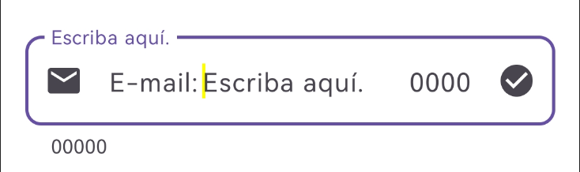

import { Tabs, TabItem } from '@astrojs/starlight/components';

[comment]: <> (La ruta siempre será assets/nombeComponente/componente-header.webp)

| Material| Material 3| 
| :----------------: | :------: |
|               |  | 

Los `OutlinedTextField` son una variación de los TextField destacando por tener un contorno marcado que cambia de color al ser seleccionado, con fondo tranparente, se ve más elegante.

## Implementación

### Definición del componente

[comment]: <> (Añade un ``TabItem`` por cada tipo de implementación que tenga)

<Tabs>
<TabItem label="Material">

```kotlin frame="terminal"
@Composable
fun OutlinedTextField(
    value = "",
    onValueChange = { },
    modifier = Modifier,
    enabled = true,
    readOnly = true,
    textStyle = TextStyle(), 
    label = { },
    placeholder = { },
    leadingIcon = { },
    trailingIcon = { },
    isError = true,
    visualTransformation = PasswordVisualTransformation(),
    keyboardOptions = KeyboardOptions(),
    keyboardActions = KeyboardActions(),
    singleLine = true,
    maxLines = 1,
    minLines = 1,
    interactionSource = MutableInteractionSource(),
    shape = RoundedCornerShape(),
    colors = TextFieldDefaults.textFieldColors()
        )
```
Atributo | Descripción
------ | -----------
value | Evalúa el contenido del texto.
onValueChange | Aquí se evalúa el texto que se introdujo en value y se activa con cada cambio en value.
modifier | Se utiliza para personalizar el componente, como tamaño, fondo, etc.
enabled | Esta propiedad es para poner habilitado o no el componente, poder escribir o no.
readOnly | Propiedad para solo lectura se usan para mostrar formularios precargados que un usuario no puede editar.
textStyle | Propiedad para personalizar el texto, color, tamaño, fondo, etc.
label | Se utiliza para dejar un texto de fondo en la caja de texto.
placeholder | Actúa como el label la diferencia es que no se mueve como el label, pero se borra al empezar a escribir.
leadingIcon |  Colocar un icono a la izquierda.
trailingIcon | Colocar un icono a la derecha.
isError | Propiedad que pinta la caja para indicar si el valor está mal o no  (false o true).
visualTransformation | Se utiliza para ocultar el texto, es más usado en campo contraseña junto con trailingIcon.
keyboardOptions |  Especifica el tipo de texto a escribir o tipo de teclado a mostrar, phone, email, number, etc. También se utiliza para otras funciones.
keyboardActions | Se utiliza para definir la acción y ejecutar cuando se presione enter en el teclado. En este caso es una búsqueda.
singleLine | Indicar que solo será una línea de texto.
maxLines |  Indica el número máximo de líneas de texto.
minLines | Indica el número mínimo de líneas de texto.
interactionSource | Sirve para permitir agregar interacciones nuevas al flujo y  para controlar las interacciones del usuario.
shape | Nos ayuda a redondear las esquinas.
colors | Para personalizar los colores del componente  OutlinedTextField ejemplo texto, borde, colores de estado.
            
</TabItem>
<TabItem label="Material 3">

```kotlin frame="terminal"
@Composable
fun OutlinedTextField(
    value = "",
    onValueChange = { },
    modifier = Modifier,
    enabled = true,
    readOnly = true, 
    textStyle = TextStyle(),
    label = { },
    placeholder = { }, 
    leadingIcon = { },
    trailingIcon = { },
    prefix = { },
    suffix = { },
    supportingText = { },
    isError = true,
    visualTransformation = PasswordVisualTransformation(),
    keyboardOptions = KeyboardOptions(),
    keyboardActions = KeyboardActions(),
    singleLine = true,
    maxLines = 1,
    minLines = 1,
    interactionSource = MutableInteractionSource(),
    shape = RoundedCornerShape(10.dp),
    colors = TextFieldDefaults.colors()
        )
```

Atributo | Descripción
------ | -----------
value | Se coloca el valor a evaluar.
onValueChange =| Aquí se evalúa el texto que se introdujo en value y se activa con cada cambio en value.
modifier | Se utiliza para personalizar el componente, como tamaño, fondo, etc.
enabled | Esta propiedad es para poner habilitado o no el componente, poder escribir o no.
readOnly | Propiedad para solo lectura se usan para mostrar formularios precargados que un usuario no puede editar.
textStyle | Propiedad para personalizar el texto, color, tamaño, fondo, etc.
label | Se utiliza para dejar un texto de fondo en la caja de texto.
placeholder | Actúa como el label la diferencia es que no se mueve como el label, pero se borra al empezar a escribir.
leadingIcon |  Colocar un icono a la izquierda.
trailingIcon | Colocar un icono a la derecha.
prefix | Coloca un texto atrás del texto que se escriba.
suffix | Coloca un texto adelante del texto que se escriba.
supportingText |Coloca un texto pequeño debajo de la caja de texto.
isError | Propiedad que pinta la caja para indicar si el valor está mal o no  (false o true).
visualTransformation | Se utiliza para ocultar el texto, es más usado en campo contraseña junto con trailingIcon.
keyboardOptions | Especifica el tipo de texto a escribir o tipo de teclado a mostrar, phone, email, number, etc. También se utiliza para otras funciones.
keyboardActions | Se utiliza para definir la acción y ejecutar cuando se presione enter en el teclado. En este caso es una búsqueda.
singleLine | Indicar que solo será una línea de texto.
maxLines | Indica el número máximo de líneas de texto.
minLines | Indica el número mínimo de líneas de texto.
interactionSource | Sirve para permitir agregar interacciones nuevas al flujo y  para controlar las interacciones del usuario.
shape | Para definir la forma que le queramos poner al  OutlinedTextField, redondear las esquinas.
colors | Para personalizar los colores del componente  OutlinedTextField ejemplo texto, borde, colores de estado.
             
</TabItem>
</Tabs>

[comment]: <> (No modifiques el tip)

:::tip[Fuente]
Puedes acceder a la documentación oficial de Google
[desde aquí](https://developer.android.com/reference/kotlin/androidx/compose/runtime/package-summary).
:::

### Ejemplos 

<Tabs>
<TabItem label="Material">

<center></center>

```kotlin frame="terminal"
@Composable
fun OutlinedTextFieldExample() {
    OutlinedTextField(
    value = valueInput,
    onValueChange = { it ->
        valueInput = it
    },
    modifier = Modifier,
    enabled = true,
    readOnly = true,
    textStyle = TextStyle(color = Color.Cyan), 
    label = { Text(text = "Escriba aquí.") },
    placeholder = { Text(text = "Escriba aquí.") },
    leadingIcon = {
        Icon(imageVector = Icons.Default.Email, contentDescription = "")
    },
    trailingIcon = {
        Icon(imageVector = Icons.Default.CheckCircle, contentDescription = "")
    },
    isError = true,
    visualTransformation = PasswordVisualTransformation(),
    keyboardOptions = KeyboardOptions(keyboardType = KeyboardType.Email),
    keyboardActions = KeyboardActions(onSearch = {}),
    singleLine = true,
    maxLines = 1,
    minLines = 1,
    interactionSource = MutableInteractionSource(),
    shape = RoundedCornerShape(10.dp),
    colors = TextFieldDefaults.textFieldColors(
        textColor = Color.Green,
        disabledTextColor = Color.DarkGray,
        cursorColor = Color.Yellow )
    )
}
```

</TabItem>
<TabItem label="Material 3">

<center></center>

```kotlin frame="terminal"
@Composable
fun OutlinedTextFieldExample() {
    OutlinedTextField(
    value = valueInput,
    onValueChange = { it ->
        valueInput = it
    },
    modifier = Modifier, 
    enabled = true,
    readOnly = true, 
    textStyle = TextStyle(color = Color.Cyan),
    label = { Text(text = "Escriba aquí.") },
    placeholder = { Text(text = "Escriba aquí.") },
    leadingIcon = {
        Icon(imageVector = Icons.Default.Email, contentDescription = "")
    },
    trailingIcon = {
        Icon(imageVector = Icons.Default.CheckCircle, contentDescription = "")
    },
    prefix = { Text(text = "E-mail:") },
    suffix = { Text(text = "0000") },
    supportingText = { Text(text = "00000") },
    isError = true,
    visualTransformation = PasswordVisualTransformation(),
    keyboardOptions = KeyboardOptions(keyboardType = KeyboardType.Email),
    keyboardActions = KeyboardActions(onSearch = {}),
    singleLine = true,
    maxLines = 1,
    minLines = 1,
    interactionSource = interactionSource,
    shape = RoundedCornerShape(10.dp),
    colors = TextFieldDefaults.colors(
        focusedTextColor = Color.Green,
        unfocusedTextColor = Color.Blue,
        disabledTextColor = Color.DarkGray,
        focusedContainerColor = Color.White,
        unfocusedContainerColor = Color.Black,
        cursorColor = Color.Yellow )
    )
}
```

</TabItem>
</Tabs>