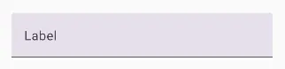

import { Tabs, TabItem } from '@astrojs/starlight/components';

[comment]: <> (La ruta siempre será assets/nombeComponente/componente-header.webp)

| Material| Material 3|
| :----------------: | :------: |
|               |  |

Los `TextField` permiten a los usuarios introducir texto a la UI. Suelen aparecer en formularios y cuadros de diálogo.

Estos tienen dos variaciones:
* `FilledTextField`
* `OutlinedTextField`

Por defecto, los `TextField` siempre son del tipo `FilledTextField`.

:::tip[Info]
Los `FilledTextField` son una variación de los `TextField` que destacan por tener más énfasis visual que los `OutlinedTextField`, lo que los hace destacar cuando están rodeados de otros contenidos y componentes.
:::

## Implementación

### Definición del componente

[comment]: <> (Añade un ``TabItem`` por cada tipo de implementación que tenga)

<Tabs>
<TabItem label="Material">

```kotlin frame="terminal"
@Composable
fun TextField(
    value: String,
    onValueChange: (String) -> Unit,
    modifier: Modifier = Modifier,
    enabled: Boolean = true,
    readOnly: Boolean = false,
    textStyle: TextStyle = LocalTextStyle.current,
    label: (@Composable () -> Unit)? = null,
    placeholder: (@Composable () -> Unit)? = null,
    leadingIcon: (@Composable () -> Unit)? = null,
    trailingIcon: (@Composable () -> Unit)? = null,
    isError: Boolean = false,
    visualTransformation: VisualTransformation = VisualTransformation.None,
    keyboardOptions: KeyboardOptions = KeyboardOptions.Default,
    keyboardActions: KeyboardActions = KeyboardActions(),
    singleLine: Boolean = false,
    maxLines: Int = if (singleLine) 1 else Int.MAX_VALUE,
    minLines: Int = 1,
    interactionSource: MutableInteractionSource? = null,
    shape: Shape = TextFieldDefaults.TextFieldShape,
    colors: TextFieldColors = TextFieldDefaults.textFieldColors()
): Unit
```
Atributo | Descripción
------ | -----------
value | El texto que se mostrará en el campo de texto
onValueChange | La devolución de llamada que se activa cuando se actualiza el texto, pasando el mismo texto actualizado por parámetro
modifier | El modificador de este campo
enabled | Permite habilitar o deshabilitar el campo. Cuando es `false` el campo no se puede ni editar, ni hacer focus, ni copiar su texto
readOnly | Controla si el campo es editable o no. Cuando es `true`, el campo no se puede editar, pero si se puede hacer focus y copiar su texto
textStyle | El estilo que se aplicará al texto: color, tamaño, fondo, etc.
label | Etiqueta opcional que se muestra dentro del campo de texto
placeholder | Texto provisional que se muestra cuando el campo de texto está seleccionado y su contenido está vacío
leadingIcon |  Imagen opcional que se muestra al inicio del contenedor del campo de texto
trailingIcon | Imagen opcional que se muestra al final del contenedor del campo de texto
isError | Indica si el valor del campo de texto está mal o no. Cuando es `true` pinta de rojo algunas partes del contenedor
visualTransformation | Transforma la representación visual del texto. Se suele usar en campos de tipo contraseña para ocultar el texto
keyboardOptions |  Especifica el tipo de texto a escribir o tipo de teclado a mostrar, phone, email, number, etc. También se utiliza para otras funciones
keyboardActions | Se utiliza para definir la acción y ejecutar cuando se presione enter en el teclado. En este caso es una búsqueda
singleLine | Indica si el texto debe ocupar una sola línea. Cuando es `true`, el campo de texto se convierte en un campo con scroll horizontal en vez de ajustarse a varias líneas
maxLines |  Indica el número máximo de líneas de texto visibles
minLines | Indica el número mínimo de líneas de texto visibles
interactionSource | Sirve para permitir agregar interacciones nuevas al flujo y  para controlar las interacciones del usuario
shape | Define la forma del contenedor del campo de texto
colors | Colores usados para pintar el los elementos del campo de texto (text, label, placeholder, leadingIcon, trailingIcon, etc.)

</TabItem>
<TabItem label="Material 3">

```kotlin frame="terminal"
@Composable
fun TextField(
    value: String,
    onValueChange: (String) -> Unit,
    modifier: Modifier = Modifier,
    enabled: Boolean = true,
    readOnly: Boolean = false,
    textStyle: TextStyle = LocalTextStyle.current,
    label: (@Composable () -> Unit)? = null,
    placeholder: (@Composable () -> Unit)? = null,
    leadingIcon: (@Composable () -> Unit)? = null,
    trailingIcon: (@Composable () -> Unit)? = null,
    prefix: (@Composable () -> Unit)? = null,
    suffix: (@Composable () -> Unit)? = null,
    supportingText: (@Composable () -> Unit)? = null,
    isError: Boolean = false,
    visualTransformation: VisualTransformation = VisualTransformation.None,
    keyboardOptions: KeyboardOptions = KeyboardOptions.Default,
    keyboardActions: KeyboardActions = KeyboardActions.Default,
    singleLine: Boolean = false,
    maxLines: Int = if (singleLine) 1 else Int.MAX_VALUE,
    minLines: Int = 1,
    interactionSource: MutableInteractionSource? = null,
    shape: Shape = TextFieldDefaults.shape,
    colors: TextFieldColors = TextFieldDefaults.colors()
): Unit
```

Atributo | Descripción
------ | -----------
value | El texto que se mostrará en el campo de texto
onValueChange | La devolución de llamada que se activa cuando se actualiza el texto, pasando el mismo texto actualizado por parámetro
modifier | El modificador de este campo
enabled | Permite habilitar o deshabilitar el campo. Cuando es `false` el campo no se puede ni editar, ni hacer focus, ni copiar su texto
readOnly | Controla si el campo es editable o no. Cuando es `true`, el campo no se puede editar, pero si se puede hacer focus y copiar su texto
textStyle | El estilo que se aplicará al texto: color, tamaño, fondo, etc.
label | Etiqueta opcional que se muestra dentro del campo de texto
placeholder | Texto provisional que se muestra cuando el campo de texto está seleccionado y su contenido está vacío
leadingIcon |  Imagen opcional que se muestra al inicio del contenedor del campo de texto
trailingIcon | Imagen opcional que se muestra al final del contenedor del campo de texto
prefix | Prefijo opcional que se muestra antes del contenido del campo de texto
suffix | Sufijo opcional que se muestra después del contenido del campo de texto
supportingText | Texto de soporte opcional que se muestra debajo del campo de texto
isError | Indica si el valor del campo de texto está mal o no. Cuando es `true` pinta de rojo algunas partes del contenedor
visualTransformation | Transforma la representación visual del texto. Se suele usar en campos de tipo contraseña para ocultar el texto
keyboardOptions |  Especifica el tipo de texto a escribir o tipo de teclado a mostrar, phone, email, number, etc. También se utiliza para otras funciones
keyboardActions | Se utiliza para definir la acción y ejecutar cuando se presione enter en el teclado. En este caso es una búsqueda
singleLine | Indica si el texto debe ocupar una sola línea. Cuando es `true`, el campo de texto se convierte en un campo con scroll horizontal en vez de ajustarse a varias líneas
maxLines |  Indica el número máximo de líneas de texto visibles
minLines | Indica el número mínimo de líneas de texto visibles
interactionSource | Sirve para permitir agregar interacciones nuevas al flujo y  para controlar las interacciones del usuario
shape | Define la forma del contenedor del campo de texto
colors | Colores usados para pintar el los elementos del campo de texto (text, label, placeholder, leadingIcon, trailingIcon, etc.)

</TabItem>
</Tabs>

[comment]: <> (No modifiques el tip)

:::tip[Fuente]
Puedes acceder a la documentación oficial de Google
[desde aquí](https://developer.android.com/reference/kotlin/androidx/compose/runtime/package-summary).
:::

### Ejemplos

#### TextField sencillo con una sola línea
<Tabs>
<TabItem label="Material">

<center></center>

```kotlin frame="terminal"
var text by rememberSaveable { mutableStateOf("") }

TextField(
    value = text,
    onValueChange = { text = it },
    label = { Text("Label") },
    singleLine = true
)
```

</TabItem>
<TabItem label="Material 3">

<center></center>

```kotlin frame="terminal"
var text by rememberSaveable { mutableStateOf("") }

TextField(
    value = text,
    onValueChange = { text = it },
    label = { Text("Label") },
    singleLine = true
)
```

</TabItem>
</Tabs>


#### TextField con placeholder
<Tabs>
<TabItem label="Material">

<center></center>

```kotlin frame="terminal"
var text by rememberSaveable { mutableStateOf("") }

TextField(
    value = text,
    onValueChange = { text = it },
    label = { Text("Email") },
    placeholder = { Text("example@gmail.com") }
)
```

</TabItem>
<TabItem label="Material 3">

<center></center>

```kotlin frame="terminal"
var text by rememberSaveable { mutableStateOf("") }

TextField(
    value = text,
    onValueChange = { text = it },
    label = { Text("Email") },
    placeholder = { Text("example@gmail.com") }
)
```

</TabItem>
</Tabs>


#### TextField con leadingIcon y trailingIcon
<Tabs>
<TabItem label="Material">

<center></center>

```kotlin frame="terminal"
var text by rememberSaveable { mutableStateOf("") }

TextField(
    value = text,
    onValueChange = { text = it },
    label = { Text("Label") },
    leadingIcon = { Icon(Icons.Filled.Favorite, contentDescription = "Localized description") },
    trailingIcon = { Icon(Icons.Filled.Info, contentDescription = "Localized description") }
)
```

</TabItem>
<TabItem label="Material 3">

<center></center>

```kotlin frame="terminal"
var text by rememberSaveable { mutableStateOf("") }

TextField(
    value = text,
    onValueChange = { text = it },
    label = { Text("Label") },
    leadingIcon = { Icon(Icons.Filled.Favorite, contentDescription = "Localized description") },
    trailingIcon = { Icon(Icons.Filled.Info, contentDescription = "Localized description") }
)
```

</TabItem>
</Tabs>


#### TextField con un mensaje adicional debajo
<Tabs>
<TabItem label="Material">

<center></center>

```kotlin frame="terminal"
var text by rememberSaveable { mutableStateOf("") }

Column {
    TextField(
        value = text,
        onValueChange = { text = it },
        label = { Text("Label") }
    )
    Text(
        text = "Helper message",
        color = MaterialTheme.colors.onSurface.copy(alpha = ContentAlpha.medium),
        style = MaterialTheme.typography.caption,
        modifier = Modifier.padding(start = 16.dp)
    )
}
```

</TabItem>
<TabItem label="Material 3">

<center></center>

```kotlin frame="terminal"
val errorMessage = "Text input too long"
var text by rememberSaveable { mutableStateOf("") }
var isError by rememberSaveable { mutableStateOf(false) }
val charLimit = 10

fun validate(text: String) {
    isError = text.length > charLimit
}

TextField(
    value = text,
    onValueChange = {
        text = it
        validate(text)
    },
    singleLine = true,
    label = { Text(if (isError) "Username*" else "Username") },
    supportingText = {
        Row {
            Text(if (isError) errorMessage else "", Modifier.clearAndSetSemantics {})
            Spacer(Modifier.weight(1f))
            Text("Limit: ${text.length}/$charLimit")
        }
    },
    isError = isError,
    keyboardActions = KeyboardActions { validate(text) },
    modifier =
        Modifier.semantics {
            // Provide localized description of the error
            if (isError) error(errorMessage)
        }
)
```

</TabItem>
</Tabs>


#### TextField para gestionar contraseña
<Tabs>
<TabItem label="Material">

<center></center>
<center></center>

```kotlin frame="terminal"
var password by rememberSaveable { mutableStateOf("") }
var passwordHidden by rememberSaveable { mutableStateOf(true) }

TextField(
    value = password,
    onValueChange = { password = it },
    singleLine = true,
    label = { Text("Enter password") },
    visualTransformation =
        if (passwordHidden) PasswordVisualTransformation() else VisualTransformation.None,
    keyboardOptions = KeyboardOptions(keyboardType = KeyboardType.Password),
    trailingIcon = {
        IconButton(onClick = { passwordHidden = !passwordHidden }) {
            val visibilityIcon =
                if (passwordHidden) Icons.Filled.Visibility else Icons.Filled.VisibilityOff
            // Please provide localized description for accessibility services
            val description = if (passwordHidden) "Show password" else "Hide password"
            Icon(imageVector = visibilityIcon, contentDescription = description)
        }
    }
)
```

</TabItem>
<TabItem label="Material 3">

<center></center>
<center></center>

```kotlin frame="terminal"
var password by rememberSaveable { mutableStateOf("") }
var passwordHidden by rememberSaveable { mutableStateOf(true) }

TextField(
    value = password,
    onValueChange = { password = it },
    singleLine = true,
    label = { Text("Enter password") },
    visualTransformation =
        if (passwordHidden) PasswordVisualTransformation() else VisualTransformation.None,
    keyboardOptions = KeyboardOptions(keyboardType = KeyboardType.Password),
    trailingIcon = {
        IconButton(onClick = { passwordHidden = !passwordHidden }) {
            val visibilityIcon =
                if (passwordHidden) Icons.Filled.Visibility else Icons.Filled.VisibilityOff
            // Please provide localized description for accessibility services
            val description = if (passwordHidden) "Show password" else "Hide password"
            Icon(imageVector = visibilityIcon, contentDescription = description)
        }
    }
)
```

</TabItem>
</Tabs>