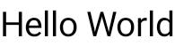
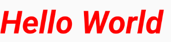
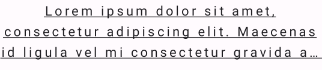

import { Tabs, TabItem } from "@astrojs/starlight/components";


| Material| Material 3| 
| :----------------: | :------: |
| |  | 


`Text` es el componente más básico a la hora de trabajar con Jetpack Compose, nos permite representar información.

## Implementación

### Definición del componente

[comment]: <> (Añade un ``TabItem`` por cada tipo de implementación que tenga)

<Tabs>
<TabItem label="Material">

```kotlin frame="terminal"
@Composable
fun Text(
    text: String,
    modifier: Modifier = Modifier,
    color: Color = Color.Unspecified,
    fontSize: TextUnit = TextUnit.Unspecified,
    fontStyle: FontStyle? = null,
    fontWeight: FontWeight? = null,
    fontFamily: FontFamily? = null,
    letterSpacing: TextUnit = TextUnit.Unspecified,
    textDecoration: TextDecoration? = null,
    textAlign: TextAlign? = null,
    lineHeight: TextUnit = TextUnit.Unspecified,
    overflow: TextOverflow = TextOverflow.Clip,
    softWrap: Boolean = true,
    maxLines: Int = Int.MAX_VALUE,
    minLines: Int = 1,
    onTextLayout: (TextLayoutResult) -> Unit = {},
    style: TextStyle = LocalTextStyle.current
)
```

|Atributo | Descripción
|------ | -----------
|text | Texto a mostrar en el componente.
|modifier | Modificador que implementará el composable.
|color | Color del texto.
|fontSize | Tamaño del texto (representado en `.sp`) Consutar `TextStyle.fontSize`.
|fontStyle | La variante tipográfica que se utilizará al dibujar el texto (ej., cursiva). Consultar `TextStyle.fontStyle`.
|fontWeight | Grosor del tipo de letra.  (e.g., FontWeight.Bold).
|fontFamily | La fuente que se va a usar para mostrar el texto. Consultar `TextStyle.fontFamily`.
|letterSpacing | La cantidad de espacio entre cada letra. Consultar `TextStyle.letterSpacing`.
|textDecoration | La decoración usada para pintar el texto (eje., un subrayado). Consultar `TextStyle.textDecoration`.
|textAlign | La alineación del texto dentro de las líneas del párrafo. Consultar `TextStyle.textAlign`.
|lineHeight | Alto de línea para el párrafo en la unidad TextUnit, representado en `.sp` o `.em`. Consultar `TextStyle.lineHeight`.
|overflow | Como se debería gestionar el desbordamiento del texto.<ul><li>TextOverFlow.Ellipsis, muestra `...` al final del texto</li><li>TextOverFlow.Clip, corta el texto</li><li>TextOverFlow.Visible, aunque no se vea, el texto esta en la pantalla</li></ul>
|softWrap | Si el texto debe dividirse en saltos de línea suaves. Si es falso, las letras del texto se colocarán como si hubiera un espacio horizontal ilimitado. Si softWrap es falso, el desbordamiento (overflow) y alineamiento (TextAlign) pueden tener efectos inesperados.
|maxLines | Limita la cantidad de líneas visibles. Si el texto execede la el número de líneas definido, este se truncará de acuerdo lo definido en los atributos overflow y softWrap.
|minLines | Número mínimo de líneas visibles. Se debe cumplir que  `1 <= minLines <= maxLines`.
|onTextLayout | Callback que se ejecuta cuando se repinta el texto. Un objeto `TextLayoutResult` contiene información de párrafo, tamaño del texto, líneas de base y otros detalles. El Callback se puede utilizar para agregar decoración o funcionalidad adicional al texto. Por ejemplo, para dibujar una selección alrededor del texto.
|style | Configuración de estilo para el texto como color, fuente, altura de línea, etc.


:::tip[Documentación oficial]
Puedes acceder a la documentación de Google
[desde aquí](https://developer.android.com/jetpack/compose/text?hl=es-419).
:::

</TabItem>
<TabItem label="Material 3">

```kotlin frame="terminal"
@Composable
fun Text(
    text: String,
    modifier: Modifier = Modifier,
    color: Color = Color.Unspecified,
    fontSize: TextUnit = TextUnit.Unspecified,
    fontStyle: FontStyle? = null,
    fontWeight: FontWeight? = null,
    fontFamily: FontFamily? = null,
    letterSpacing: TextUnit = TextUnit.Unspecified,
    textDecoration: TextDecoration? = null,
    textAlign: TextAlign? = null,
    lineHeight: TextUnit = TextUnit.Unspecified,
    overflow: TextOverflow = TextOverflow.Clip,
    softWrap: Boolean = true,
    maxLines: Int = Int.MAX_VALUE,
    onTextLayout: (TextLayoutResult) -> Unit = {},
    style: TextStyle = LocalTextStyle.current
)
```

|Atributo | Descripción
|------ | -----------
|text | Texto a mostrar en el componente.
|modifier | Modificador que implementará el composable.
|color | Color del texto.
|fontSize | Tamaño del texto (representado en `.sp`) Consutar `TextStyle.fontSize`.
|fontStyle | La variante tipográfica que se utilizará al dibujar el texto (ej., cursiva). Consultar `TextStyle.fontStyle`.
|fontWeight | Grosor del tipo de letra.  (e.g., FontWeight.Bold).
|fontFamily | La fuente que se va a usar para mostrar el texto. Consultar `TextStyle.fontFamily`.
|letterSpacing | La cantidad de espacio entre cada letra. Consultar `TextStyle.letterSpacing`.
|textDecoration | La decoración usada para pintar el texto (eje., un subrayado). Consultar `TextStyle.textDecoration`.
|textAlign | La alineación del texto dentro de las líneas del párrafo. Consultar `TextStyle.textAlign`.
|lineHeight | Alto de línea para el párrafo en la unidad TextUnit, representado en `.sp` o `.em`. Consultar `TextStyle.lineHeight`.
|overflow | Como se debería gestionar el desbordamiento del texto.<ul><li>TextOverFlow.Ellipsis, muestra `...` al final del texto</li><li>TextOverFlow.Clip, corta el texto</li><li>TextOverFlow.Visible, aunque no se vea, el texto esta en la pantalla</li></ul>
|softWrap | Si el texto debe dividirse en saltos de línea suaves. Si es falso, las letras del texto se colocarán como si hubiera un espacio horizontal ilimitado. Si softWrap es falso, el desbordamiento (overflow) y alineamiento (TextAlign) pueden tener efectos inesperados.
|maxLines | Limita la cantidad de líneas visibles. Si el texto execede la el número de líneas definido, este se truncará de acuerdo lo definido en los atributos overflow y softWrap.
|onTextLayout | Callback que se ejecuta cuando se repinta el texto. Un objeto `TextLayoutResult` contiene información de párrafo, tamaño del texto, líneas de base y otros detalles. El Callback se puede utilizar para agregar decoración o funcionalidad adicional al texto. Por ejemplo, para dibujar una selección alrededor del texto.
|style | Configuración de estilo para el texto como color, fuente, altura de línea, etc.


:::tip[Documentación oficial]
Puedes acceder a la documentación de Google
[desde aquí](https://developer.android.com/jetpack/compose/designsystems/material3?hl=es-419).
:::

</TabItem>
</Tabs>


### Ejemplos

<Tabs>
<TabItem label="Material">


<center></center>

```kotlin frame="terminal"
@Composable
fun SimpleText() {
    Text("Hello World")
}
```


<center></center>

```kotlin frame="terminal"
@Composable
fun SimpleText() {
    text = "Hello World ",
    color = Color.Red,
    fontSize = 32.sp,
    fontStyle = FontStyle.Italic,
    fontWeight = FontWeight.Bold
}
```


<center></center>

```kotlin frame="terminal"
@Composable
fun SimpleText() {
    text = "Lorem ipsum dolor sit amet, consectetur adipiscing elit. Maecenas id ligula vel mi consectetur gravida at a nulla. Aenean finibus pretium imperdiet. Proin varius quam ultrices magna imperdiet, sed facilisis nisl aliquet. Nam blandit nunc id nisl rutrum, id pharetra quam sollicitudin. Integer porttitor eros id tellus varius accumsan. Nam vel sem quis erat sollicitudin dapibus rutrum at diam. Phasellus ac ante ut lacus aliquam dapibus in at ante. Phasellus pellentesque consequat maximus.",
    letterSpacing = 3.sp,
    textDecoration = TextDecoration.Underline,
    textAlign = TextAlign.Center,
    lineHeight = 25.sp,
    overflow = TextOverflow.Ellipsis,
    maxLines = 3
}
```


</TabItem>
<TabItem label="Material 3">


<center></center>

```kotlin frame="terminal"
@Composable
fun SimpleText() {
    Text("Hello World")
}
```


<center></center>

```kotlin frame="terminal"
@Composable
fun SimpleText() {
    text = "Hello World ",
    color = Color.Red,
    fontSize = 32.sp,
    fontStyle = FontStyle.Italic,
    fontWeight = FontWeight.Bold
}
```


<center></center>

```kotlin frame="terminal"
@Composable
fun SimpleText() {
    text = "Lorem ipsum dolor sit amet, consectetur adipiscing elit. Maecenas id ligula vel mi consectetur gravida at a nulla. Aenean finibus pretium imperdiet. Proin varius quam ultrices magna imperdiet, sed facilisis nisl aliquet. Nam blandit nunc id nisl rutrum, id pharetra quam sollicitudin. Integer porttitor eros id tellus varius accumsan. Nam vel sem quis erat sollicitudin dapibus rutrum at diam. Phasellus ac ante ut lacus aliquam dapibus in at ante. Phasellus pellentesque consequat maximus.",
    letterSpacing = 3.sp,
    textDecoration = TextDecoration.Underline,
    textAlign = TextAlign.Center,
    lineHeight = 25.sp,
    overflow = TextOverflow.Ellipsis,
    maxLines = 3
}
```


</TabItem>
</Tabs>


