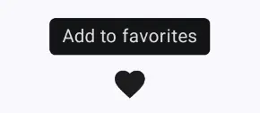

import { Tabs, TabItem } from "@astrojs/starlight/components";

[comment]: <> (La ruta siempre será assets/tooltipbox/tooltipbox-header.webp)

|  Material 3| 
| :------: |
|  | 

El componente `TooltipBox` permite mostrar una breve descripción o ayuda contextual sobre un elemento al pasar el cursor o mantener presionado. Es útil para mejorar la experiencia de usuario proporcionando información sin necesidad de ocupar espacio visual permanente.

## Implementación

### Definición del componente

<Tabs>
<TabItem label="Material 3">

```kotlin frame="terminal"
@Composable
@ExperimentalMaterial3Api
fun TooltipBox(
    positionProvider: PopupPositionProvider,
    tooltip: @Composable CaretScope.() -> Unit,
    state: TooltipState,
    modifier: Modifier = Modifier,
    focusable: Boolean = true,
    enableUserInput: Boolean = true,
    content: @Composable () -> Unit,
)
```

| Atributo            | Descripción |
|---------------------|-------------|
| positionProvider    | Proveedor que determina la posición del tooltip respecto al contenido. Utiliza `PopupPositionProvider`. |
| tooltip             | Contenido a mostrar del tooltip. Se suele usar un `PlainTooltip` para mensajes cortos, o un `RichTooltip` para un contenido más complejo. |
| modifier            | Modificador que implementará el composable. |
| state               | Maneja la visibilidad del tooltip (usualmente con `rememberTooltipState()`). |
| focusable           | Si es `true`, el tooltip podrá recibir foco (útil para accesibilidad) y capturará eventos táctiles mientras esté visible. |
| enableUserInput     | Si es `true`, el tooltip se mostrará automáticamente al mantener pulsado el contenido ancla. |
| content             | Contenido sobre el cual se ancla el tooltip. |

</TabItem>
</Tabs>

:::tip[Fuente]
Puedes acceder a la documentación oficial de Google
[desde aquí](https://developer.android.com/reference/kotlin/androidx/compose/material3/package-summary#TooltipBox(androidx.compose.ui.window.PopupPositionProvider,kotlin.Function1,androidx.compose.material3.TooltipState,androidx.compose.ui.Modifier,kotlin.Function0,kotlin.Boolean,kotlin.Boolean,kotlin.Function0)).
:::

### Ejemplos

<Tabs>

<TabItem label="Material 3">

<center>

</center>

```kotlin frame="terminal"
@OptIn(ExperimentalMaterial3Api::class)
@Composable
fun TooltipBoxExample() {
    val tooltipState = rememberTooltipState()

    TooltipBox(
        positionProvider = TooltipDefaults.rememberPlainTooltipPositionProvider((-5).dp),
        tooltip = {
            PlainTooltip { Text("Add to favorites") }
        },
        state = tooltipState
    ) {
        IconButton(onClick = { print("Add to favorites") }) {
            Icon(
                imageVector = Icons.Filled.Favorite,
                contentDescription = "Add to favorites"
            )
        }
    }
}
```

</TabItem>
</Tabs>